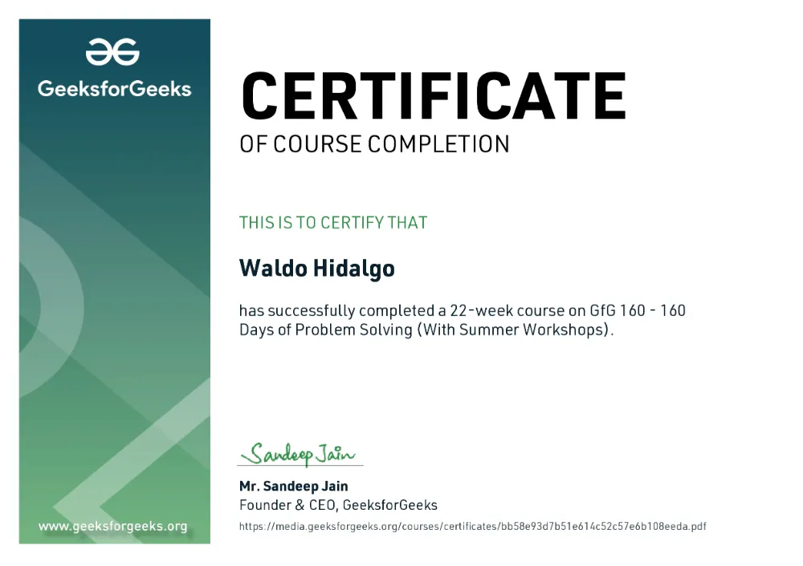

# Challenges Plataforma Geeks For Geeks

Repositorio con el código solución a dos desafíos realizados en la plataforma Geeks For Geeks relacionados al tópico Data Structures and Algorithms(DSA) realizados utilizando solo Python. El primer desafío corresponde al desafío personal de cumplir una racha de 200 días seguidos resolviendo problemas. El segundo desafío corresponde al desafío oficial de la plataforma llamado **GfG 160 - 160 Days of Problem Solving** el cual comenzó el día **16 de Noviembre de 2024** y que finaliza el día **25 de abril de 2025**.

## Tabla de Contenidos

- [Challenges Plataforma Geeks For Geeks](#challenges-plataforma-geeks-for-geeks)
  - [Tabla de Contenidos](#tabla-de-contenidos)
  - [Completion Certificate](#completion-certificate)
  - [Descripción de Problemas y Aprobación de mi Solución](#descripción-de-problemas-y-aprobación-de-mi-solución)
  - [Bonus Problems](#bonus-problems)

## Completion Certificate

[Link de Verificación](https://www.geeksforgeeks.org/certificate/bb58e93d7b51e614c52c57e6b108eeda)

## Descripción de Problemas y Aprobación de mi Solución

- [Readme problemas 1 al 10 ](./day001-010/problem1to10.md)

- [Readme problemas 11 al 20 ](./day011-020/problem11to20.md)

- [Readme problemas 21 al 30 ](./day021-030/problem21to30.md)

- [Readme problemas 31 al 40 ](./day031-040/problem31to40.md)

- [Readme problemas 41 al 50 ](./day041-050/problem41to50.md)

- [Readme problemas 51 al 60 ](./day051-060/problem51to60.md)

- [Readme problemas 61 al 70 ](./day061-070/problem61to70.md)

- [Readme problemas 71 al 80 ](./day071-080/problem71to80.md)

- [Readme problemas 81 al 90 ](./day081-090/problem81to90.md)

- [Readme problemas 91 al 100 ](./day091-100/problem91to100.md)

- [Readme problemas 101 al 110 ](./day101-110/problem101to110.md)

- [Readme problemas 111 al 120](./day111-120/problem111to120.md)

- [Readme problemas 121 al 130](./day121-130/problem121to130.md)

- [Readme problemas 131 al 140](./day131-140/problem131to140.md)

- [Readme problemas 141 al 150](./day141-150/problem141to150.md): Todos los problemas son del tópico Programación Dinámica

- [Readme problemas 151 al 160](./day151-160/problem151to160.md): Todos los problemas son del tópico Programación Dinámica

- [Readme problemas 161 al 170](./day161-170/problem161to170.md)

- [Readme problemas 171 al 180](./day171-180/problem171to180.md): Todos los problemas son del tópico Graph

- [Readme problemas 181 al 190](./day181-190/problem181to190.md)

- [Readme problemas 191 al 200](./day191-200/problem191to200.md)

## Bonus Problems

- [Arrays](./BonusProblem/1Arrays): 4 Problemas

- [String](./BonusProblem/2String): 6 Problemas

- [Sorting](./BonusProblem/3Sorting): 2 Problemas

- [Searching](./BonusProblem/4Searching): 6 Problemas

- [Matrix](./BonusProblem/5Matrix): 4 Problemas

- [Hashing](./BonusProblem/6Hashing): 6 Problemas

- [Two Pointer Technique](./BonusProblem/7Two%20Pointer%20Technique): 7 Problemas

- [Prefix Sum](./BonusProblem/8Prefix%20Sum): 5 Problemas

- [Linked List](./BonusProblem/9Linked%20List): 5 Problemas

- [Recursion and Backtracking](./BonusProblem/10Recursion%20and%20backtracking/): 4 problemas

- [Tree](./BonusProblem/101Tree/): 7 problemas

- [Heap](./BonusProblem/102Heap/): 5 problemas

- [Stack](./BonusProblem/103Stack/): 4 problemas
