# Resolución de los Problemas del día 1 al día 10

## Tabla de Contenidos

- [Resolución de los Problemas del día 1 al día 10](#resolución-de-los-problemas-del-día-1-al-día-10)
  - [Tabla de Contenidos](#tabla-de-contenidos)
  - [Problemas](#problemas)
    - [Problema Día 1: Two Swaps](#problema-día-1-two-swaps)
      - [Description](#description)
      - [Passed](#passed)
    - [Problema Día 2: Split Linked List Alternatingly](#problema-día-2-split-linked-list-alternatingly)
      - [Description](#description-1)
      - [Passed](#passed-1)
    - [Problema Día 3: Single Number](#problema-día-3-single-number)
      - [Description](#description-2)
      - [Passed](#passed-2)
    - [Problema Día 4: Nearest multiple of 10](#problema-día-4-nearest-multiple-of-10)
      - [Description](#description-3)
      - [Passed](#passed-3)
    - [Problema Día 5: Sort a k sorted doubly linked list](#problema-día-5-sort-a-k-sorted-doubly-linked-list)
      - [Description](#description-4)
      - [Passed](#passed-4)
    - [Problema Día 6: Split the Array](#problema-día-6-split-the-array)
      - [Description](#description-5)
      - [Passed](#passed-5)
    - [Problema Día 7: Sub-arrays with equal number of occurences](#problema-día-7-sub-arrays-with-equal-number-of-occurences)
      - [Description](#description-6)
      - [Passed](#passed-6)
    - [Problema Día 8: Find the Sum of Last N nodes of the Linked List](#problema-día-8-find-the-sum-of-last-n-nodes-of-the-linked-list)
      - [Description](#description-7)
      - [Passed](#passed-7)
    - [Problema Día 9: Modify the Array](#problema-día-9-modify-the-array)
      - [Description](#description-8)
      - [Passed](#passed-8)
    - [Problema Día 10: Alternative Sorting](#problema-día-10-alternative-sorting)
      - [Description](#description-9)
      - [Passed](#passed-9)

## Problemas

### Problema Día 1: Two Swaps

#### Description

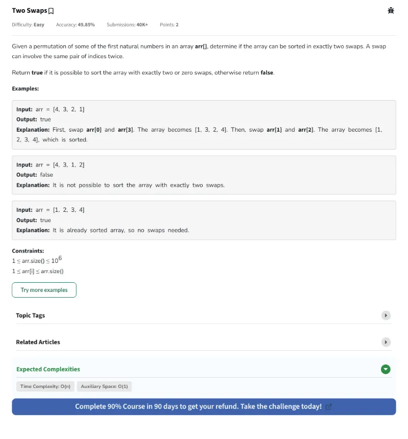

#### Passed

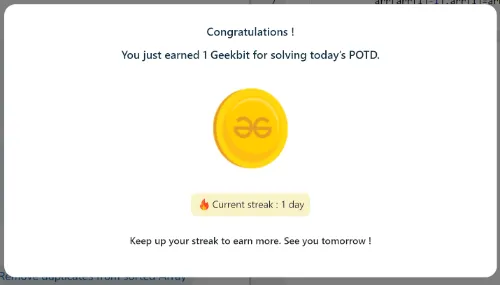

### Problema Día 2: Split Linked List Alternatingly

#### Description

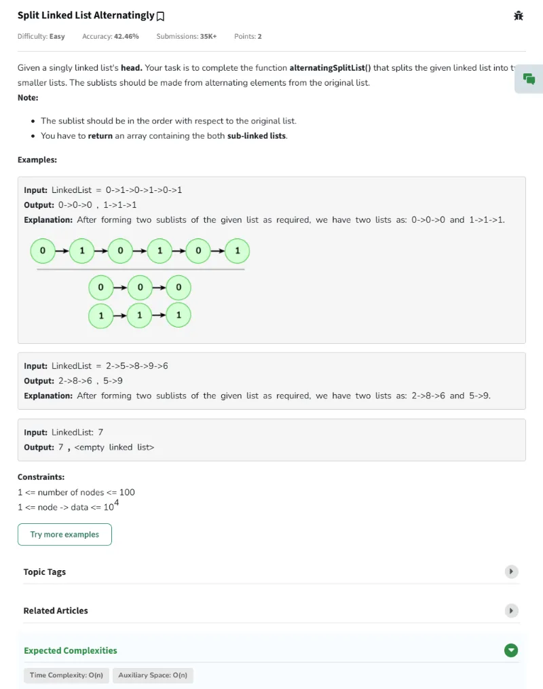

#### Passed

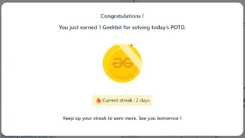

### Problema Día 3: Single Number

#### Description

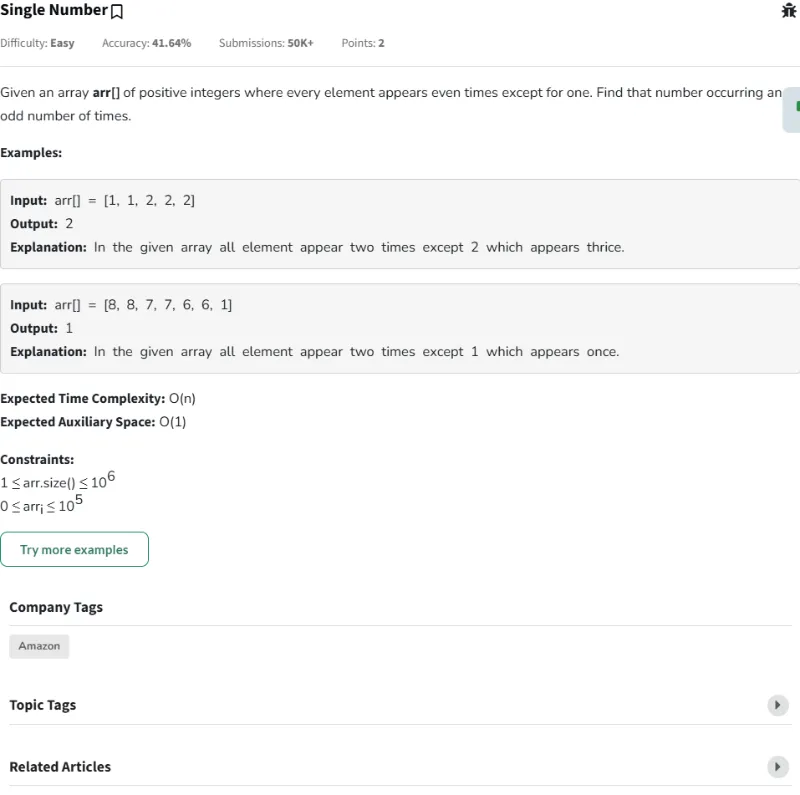

#### Passed

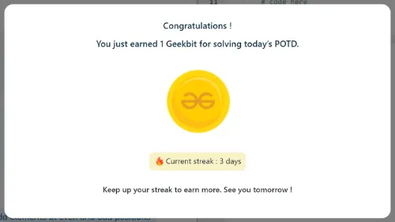

### Problema Día 4: Nearest multiple of 10

#### Description

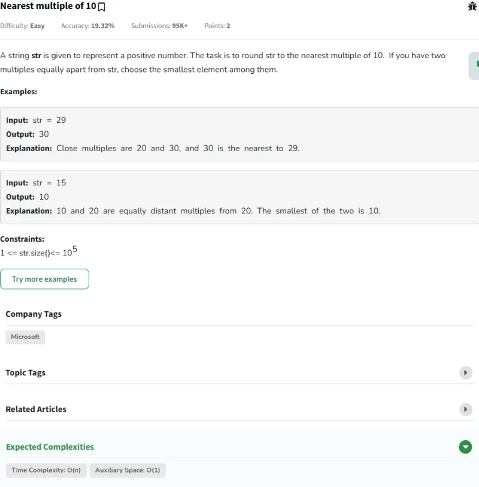

#### Passed

### Problema Día 5: Sort a k sorted doubly linked list

#### Description

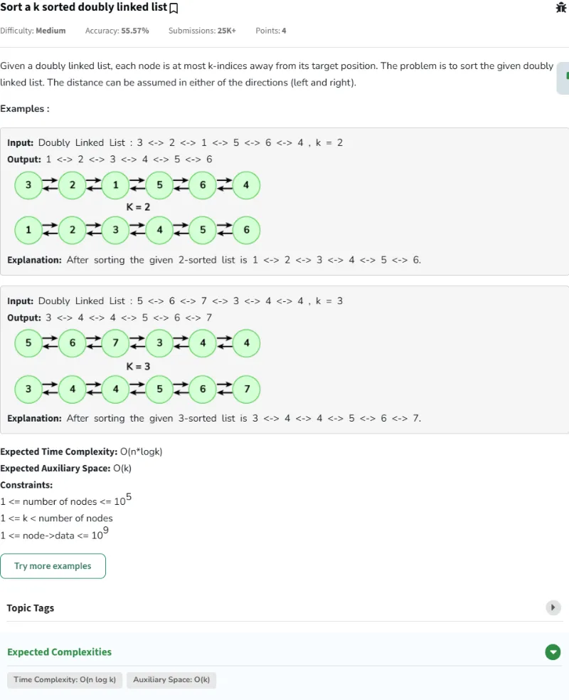

#### Passed

### Problema Día 6: Split the Array

#### Description

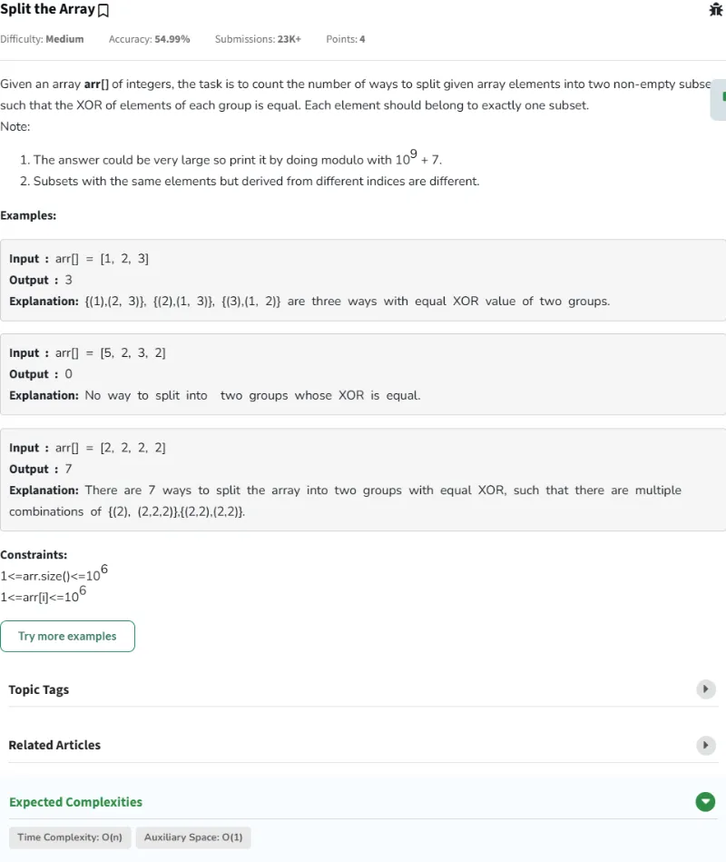

#### Passed

### Problema Día 7: Sub-arrays with equal number of occurences

#### Description

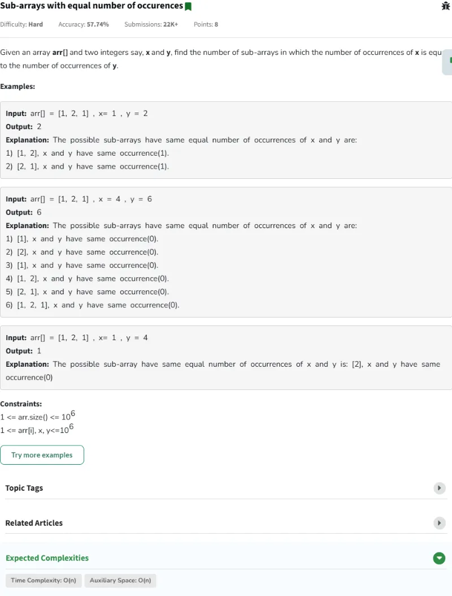

#### Passed

### Problema Día 8: Find the Sum of Last N nodes of the Linked List

#### Description

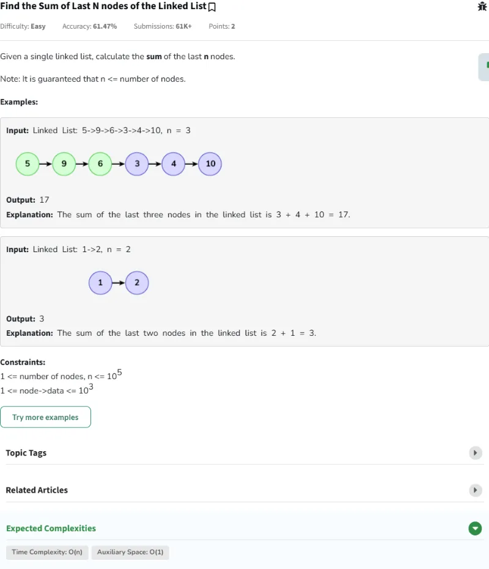

#### Passed

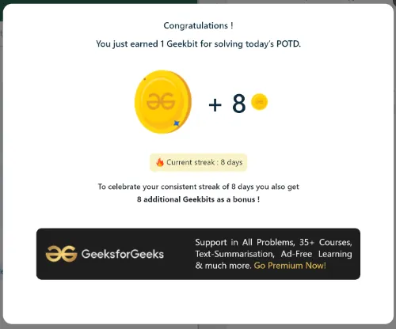

### Problema Día 9: Modify the Array

#### Description

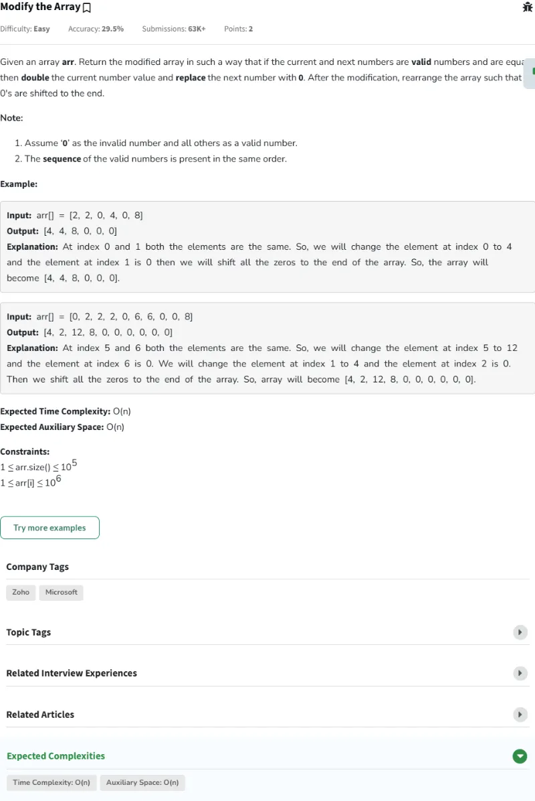

#### Passed

### Problema Día 10: Alternative Sorting

#### Description

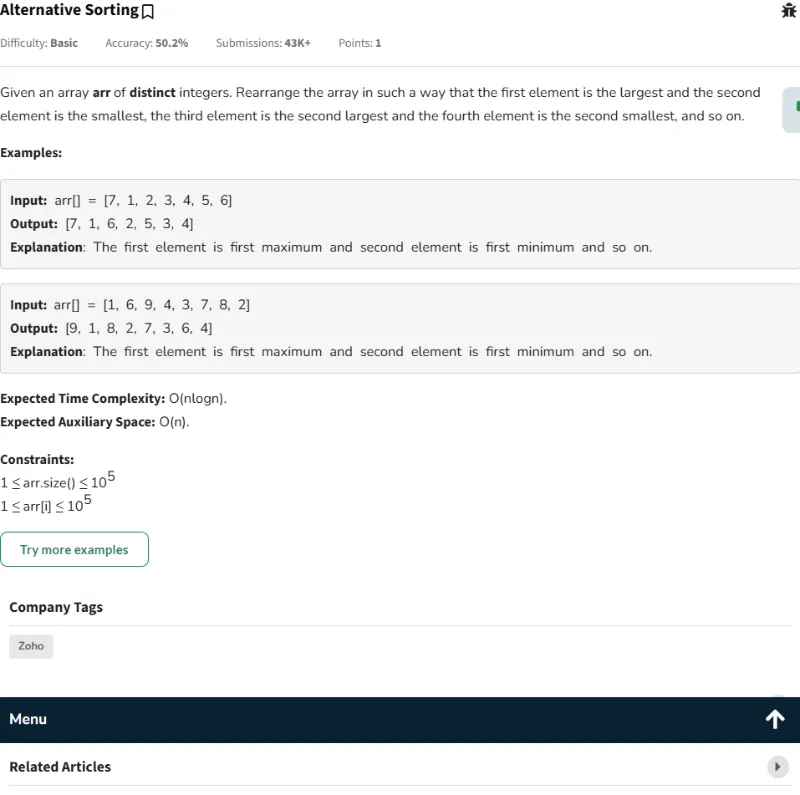

#### Passed

