# Resolución de los Problemas del día 11 al día 20

## Tabla de Contenidos

- [Resolución de los Problemas del día 11 al día 20](#resolución-de-los-problemas-del-día-11-al-día-20)
  - [Tabla de Contenidos](#tabla-de-contenidos)
  - [Problemas](#problemas)
    - [Problema Día 11: Occurence of an integer in a Linked List](#problema-día-11-occurence-of-an-integer-in-a-linked-list)
      - [Description](#description)
      - [Passed](#passed)
    - [Problema Día 12: Triplet Family](#problema-día-12-triplet-family)
      - [Description](#description-1)
      - [Passed](#passed-1)
    - [Problema Día 13: Remove duplicates in array](#problema-día-13-remove-duplicates-in-array)
      - [Description](#description-2)
      - [Passed](#passed-2)
    - [Problema Día 14: Quick Sort on Linked List](#problema-día-14-quick-sort-on-linked-list)
      - [Description](#description-3)
      - [Passed](#passed-3)
    - [Problema Día 15: Pairs with difference k](#problema-día-15-pairs-with-difference-k)
      - [Description](#description-4)
      - [Passed](#passed-4)
    - [Problema Día 16: Insert in Sorted way in a Sorted DLL](#problema-día-16-insert-in-sorted-way-in-a-sorted-dll)
      - [Description](#description-5)
      - [Passed](#passed-5)
    - [Problema Día 17: Swap and Maximize](#problema-día-17-swap-and-maximize)
      - [Description](#description-6)
      - [Passed](#passed-6)
    - [Problema Día 18: Kth distance](#problema-día-18-kth-distance)
      - [Description](#description-7)
      - [Passed](#passed-7)
    - [Problema Día 19: Is Linked List Length Even](#problema-día-19-is-linked-list-length-even)
      - [Description](#description-8)
      - [Passed](#passed-8)
    - [Problema Día 20: Find All Triplets with Zero Sum](#problema-día-20-find-all-triplets-with-zero-sum)
      - [Description](#description-9)
      - [Passed](#passed-9)

## Problemas

### Problema Día 11: Occurence of an integer in a Linked List

#### Description

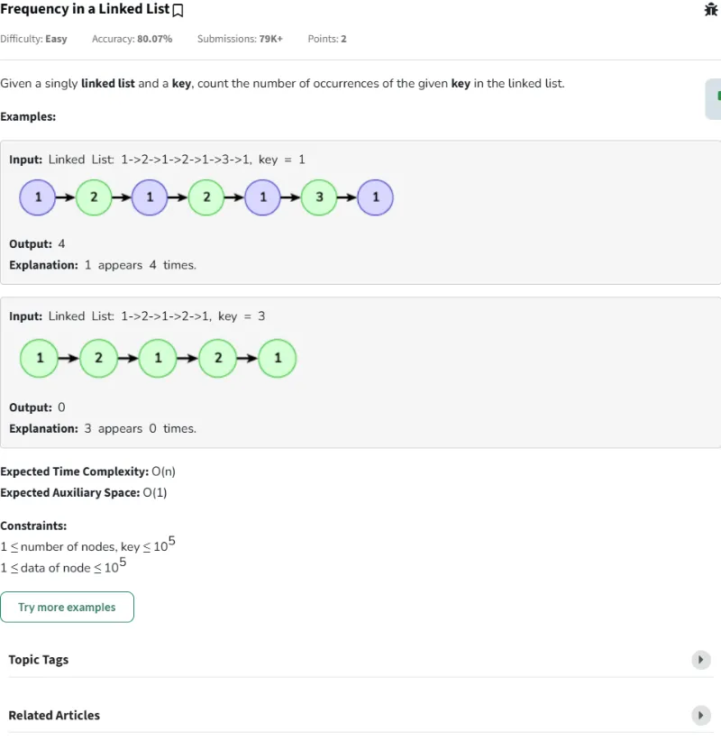

#### Passed

### Problema Día 12: Triplet Family

#### Description

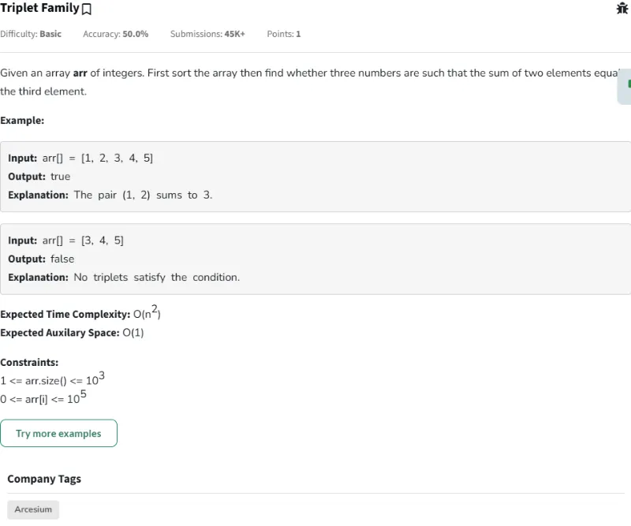

#### Passed

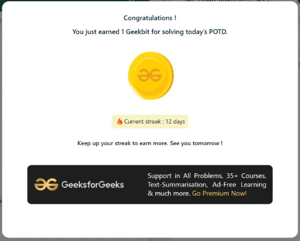

### Problema Día 13: Remove duplicates in array

#### Description

#### Passed

### Problema Día 14: Quick Sort on Linked List

#### Description

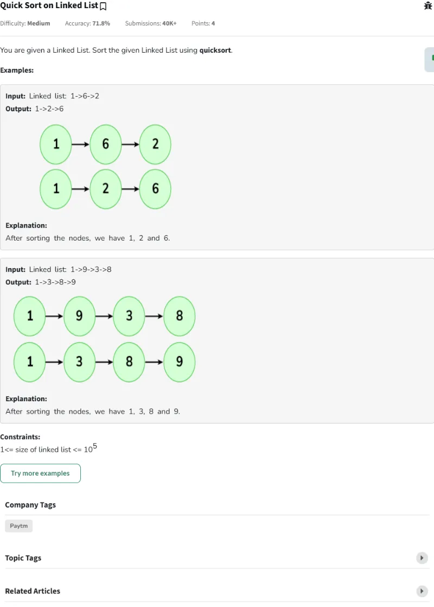

#### Passed

### Problema Día 15: Pairs with difference k

#### Description

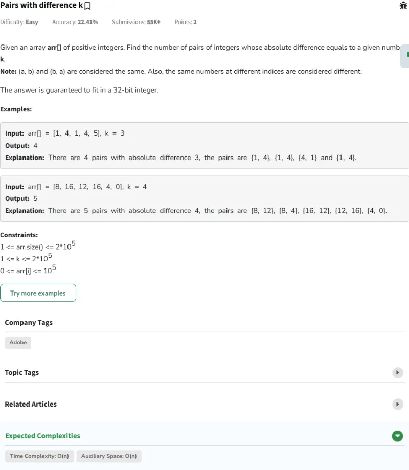

#### Passed

### Problema Día 16: Insert in Sorted way in a Sorted DLL

#### Description

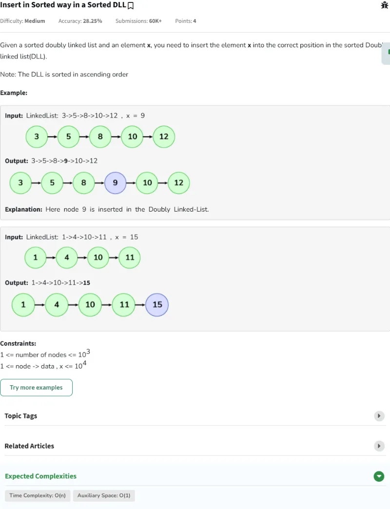

#### Passed

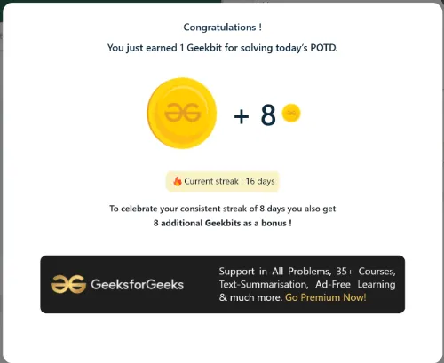

### Problema Día 17: Swap and Maximize

#### Description

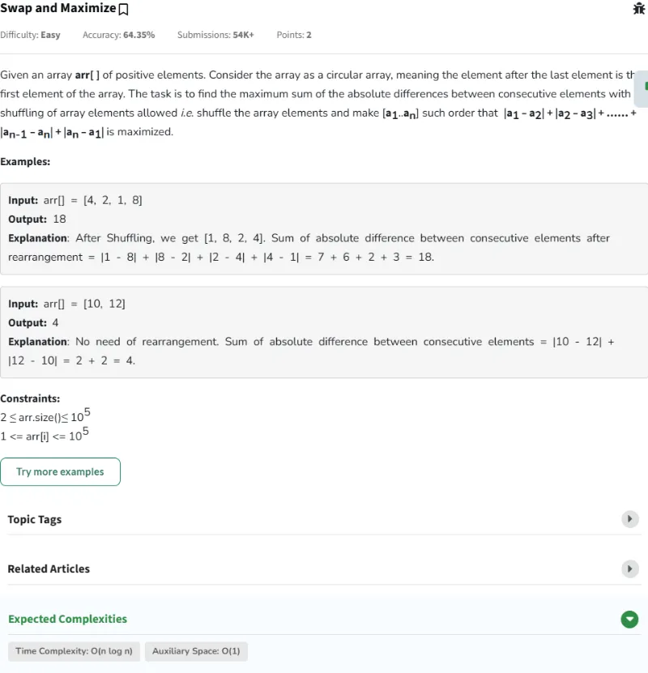

#### Passed

### Problema Día 18: Kth distance

#### Description

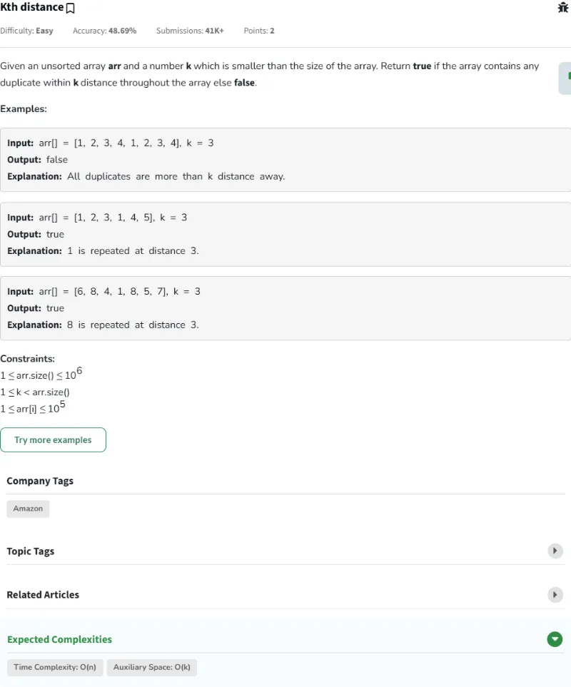

#### Passed

### Problema Día 19: Is Linked List Length Even

#### Description

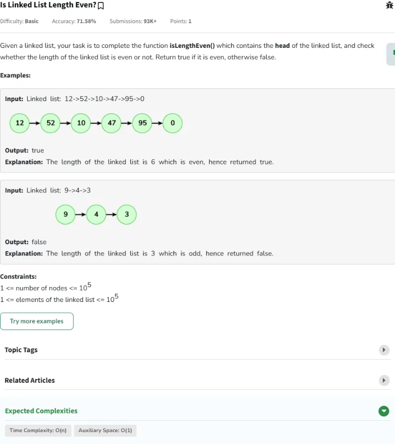

#### Passed

### Problema Día 20: Find All Triplets with Zero Sum

#### Description

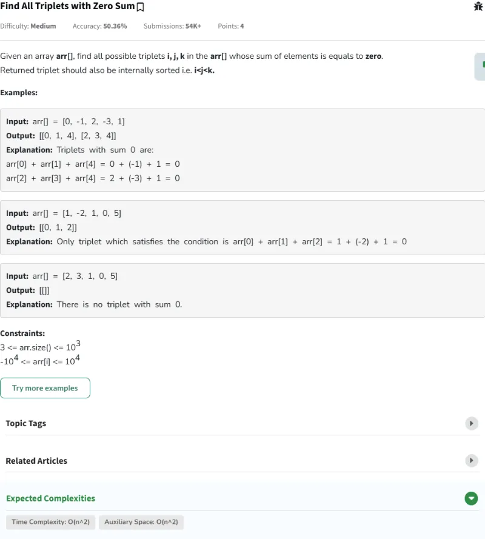

#### Passed

