# Resolución de los Problemas del día 31 al día 40

## Tabla de Contenidos

- [Resolución de los Problemas del día 31 al día 40](#resolución-de-los-problemas-del-día-31-al-día-40)
  - [Tabla de Contenidos](#tabla-de-contenidos)
  - [Problemas](#problemas)
    - [Problema Día 31: Second Largest](#problema-día-31-second-largest)
      - [Description](#description)
    - [Problema Día 32: Move All Zeroes to End](#problema-día-32-move-all-zeroes-to-end)
      - [Description](#description-1)
      - [Passed](#passed)
    - [Problema Día 33: Reverse an Array](#problema-día-33-reverse-an-array)
      - [Description](#description-2)
      - [Passed](#passed-1)
    - [Problema Día 34: Rotate Array](#problema-día-34-rotate-array)
      - [Description](#description-3)
      - [Passed](#passed-2)
    - [Problema Día 35: Next Permutation](#problema-día-35-next-permutation)
      - [Description](#description-4)
      - [Passed](#passed-3)
    - [Problema Día 36: Majority Element II](#problema-día-36-majority-element-ii)
      - [Description](#description-5)
      - [Passed](#passed-4)
    - [Problema Día 37: Stock Buy and Sell – Multiple Transaction Allowed](#problema-día-37-stock-buy-and-sell--multiple-transaction-allowed)
      - [Description](#description-6)
      - [Passed](#passed-5)
    - [Problema Día 38: Stock Buy and Sell – Max one Transaction Allowed](#problema-día-38-stock-buy-and-sell--max-one-transaction-allowed)
      - [Description](#description-7)
      - [Passed](#passed-6)
    - [Problema Día 39: Minimize the Heights II](#problema-día-39-minimize-the-heights-ii)
      - [Description](#description-8)
      - [Passed](#passed-7)
    - [Problema Día 40: Kadane's Algorithm](#problema-día-40-kadanes-algorithm)
      - [Description](#description-9)
      - [Passed](#passed-8)

## Problemas

### Problema Día 31: Second Largest

#### Description

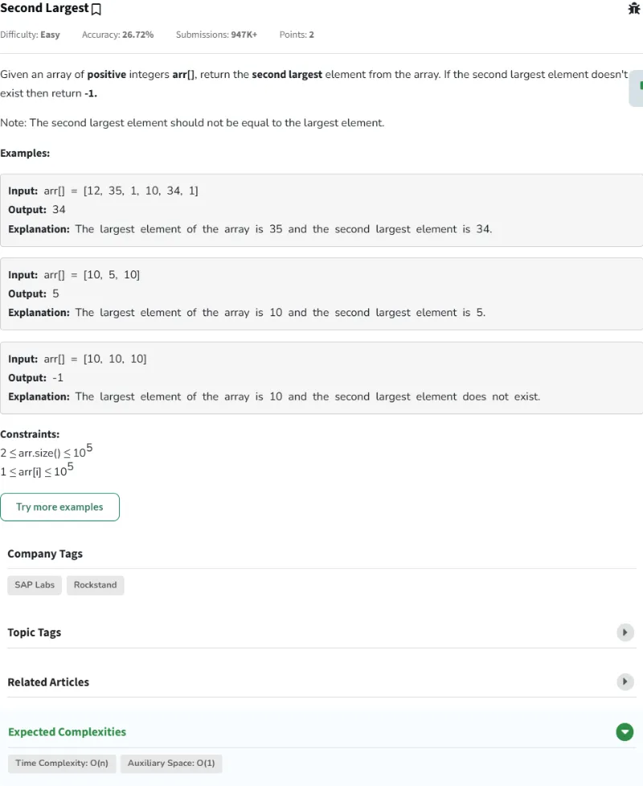

### Problema Día 32: Move All Zeroes to End

#### Description

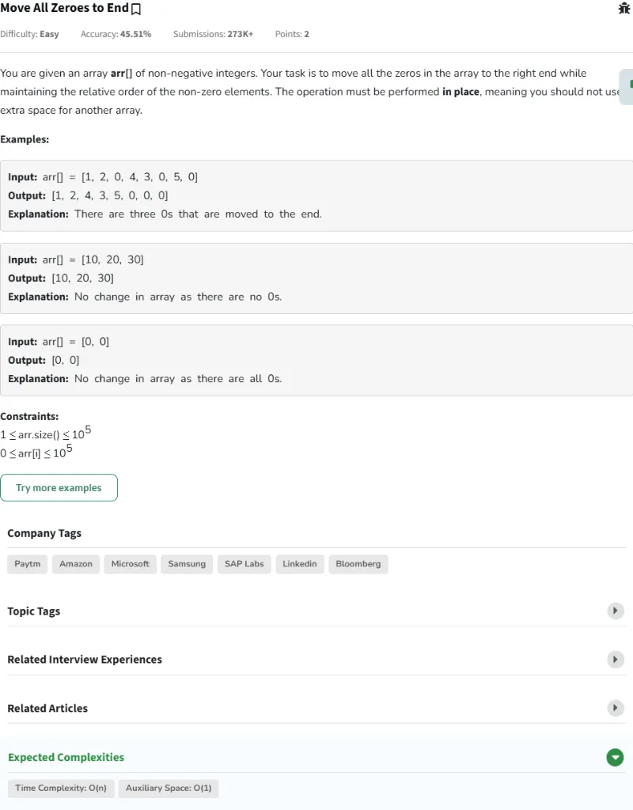

#### Passed

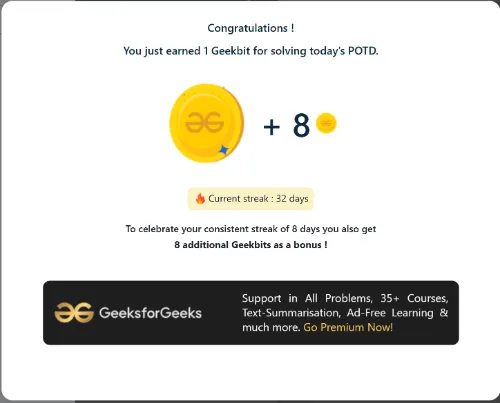

### Problema Día 33: Reverse an Array

#### Description

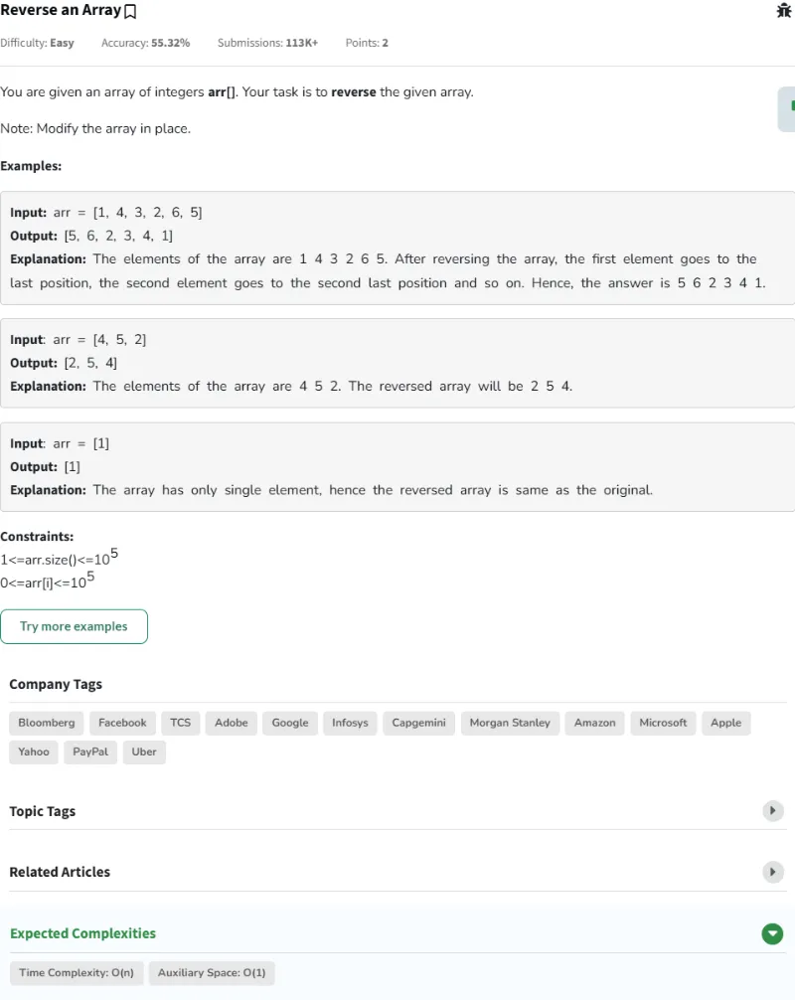

#### Passed

### Problema Día 34: Rotate Array

#### Description

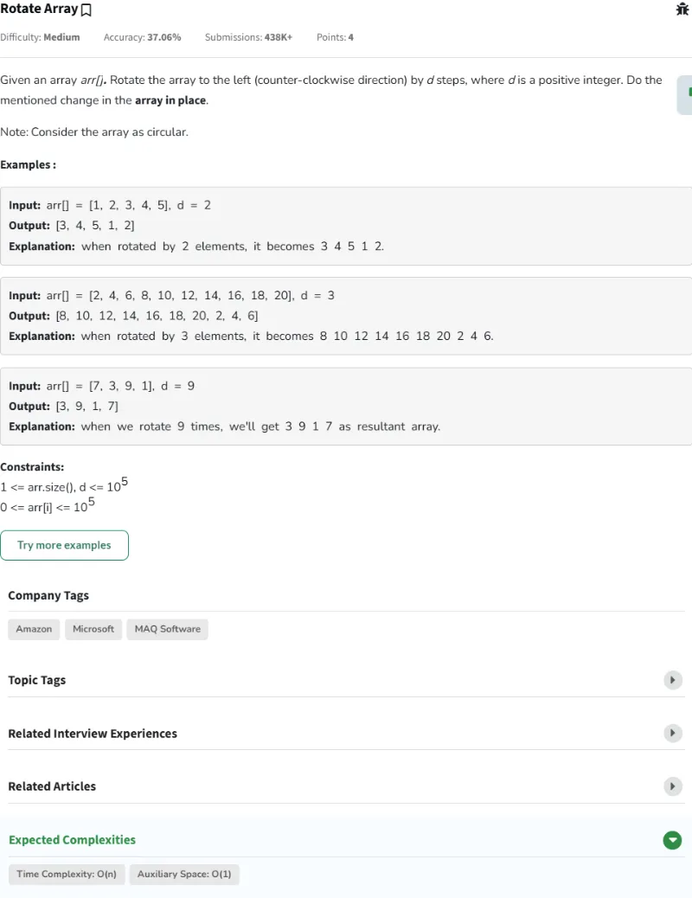

#### Passed

### Problema Día 35: Next Permutation

#### Description

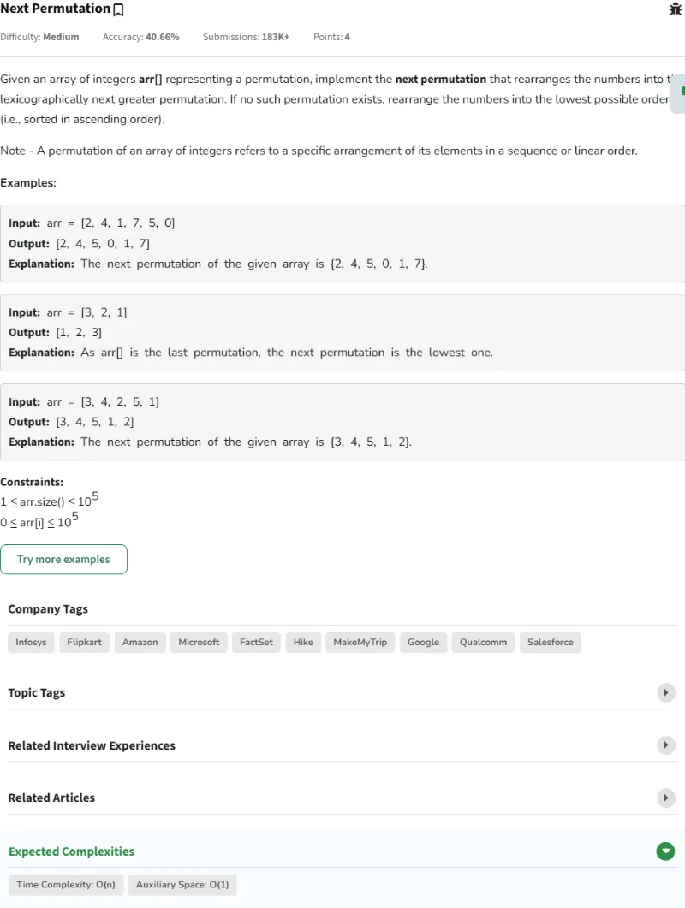

#### Passed

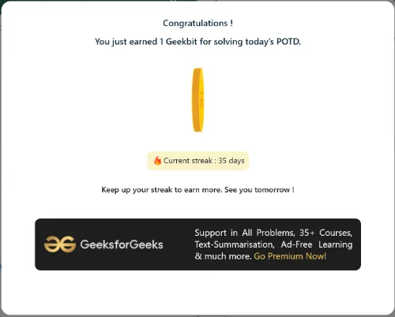

### Problema Día 36: Majority Element II

#### Description

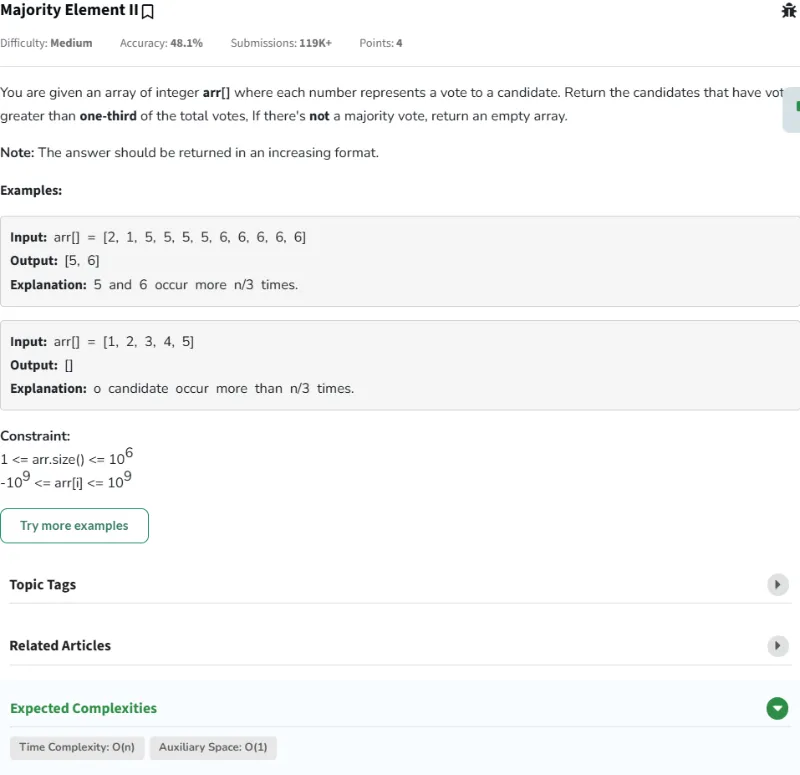

#### Passed

### Problema Día 37: Stock Buy and Sell – Multiple Transaction Allowed

#### Description

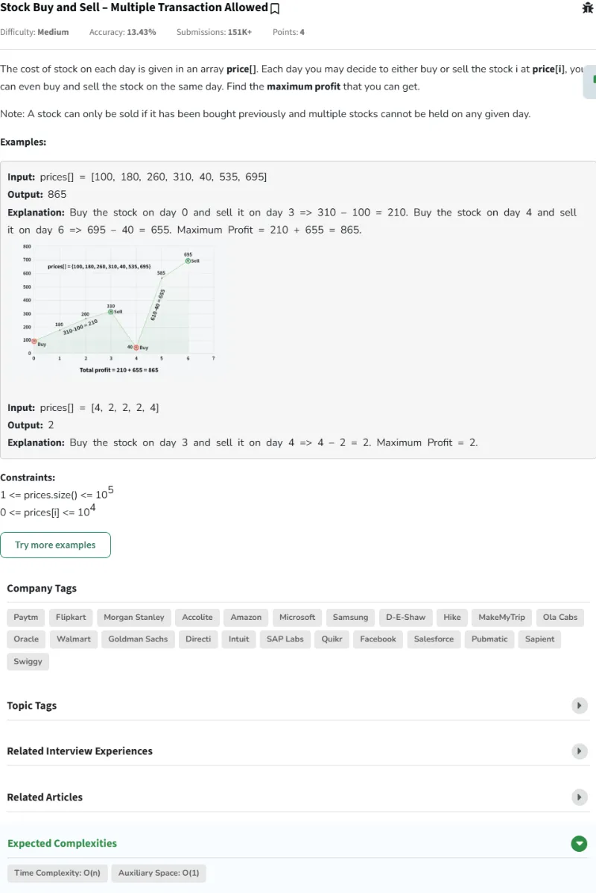

#### Passed

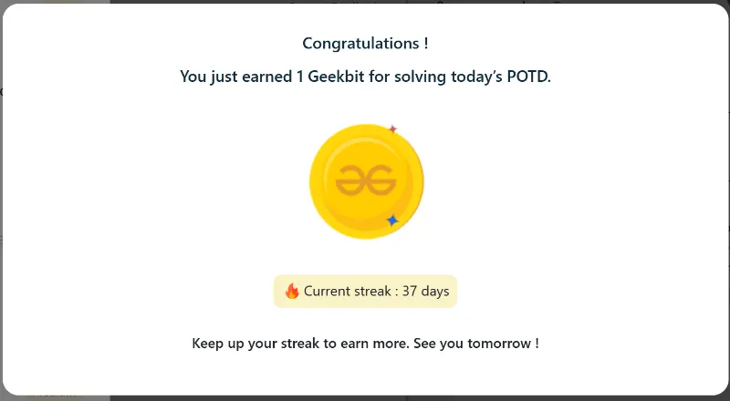

### Problema Día 38: Stock Buy and Sell – Max one Transaction Allowed

#### Description

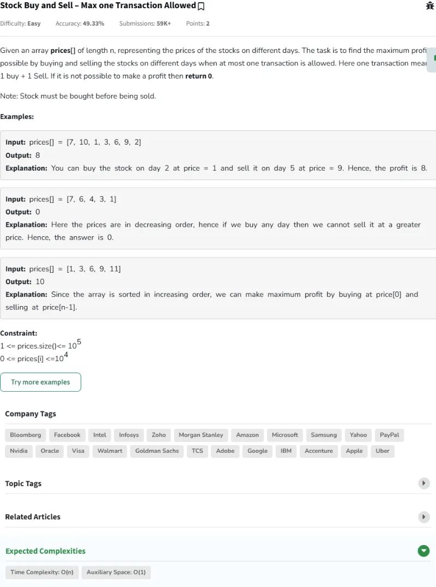

#### Passed

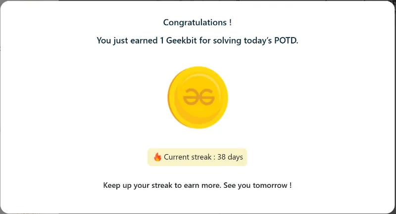

### Problema Día 39: Minimize the Heights II

#### Description

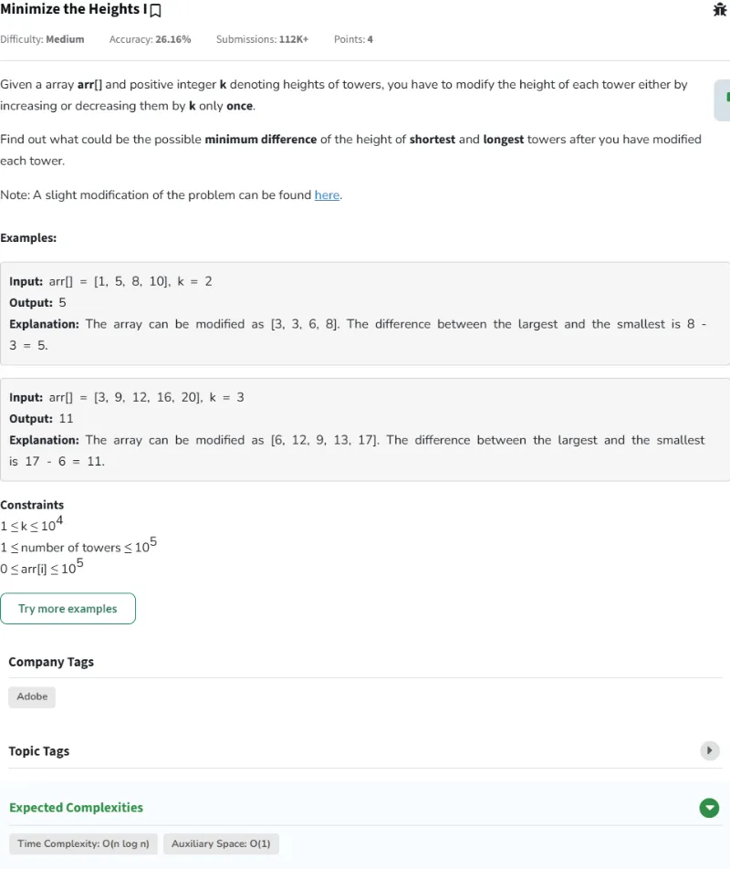

#### Passed

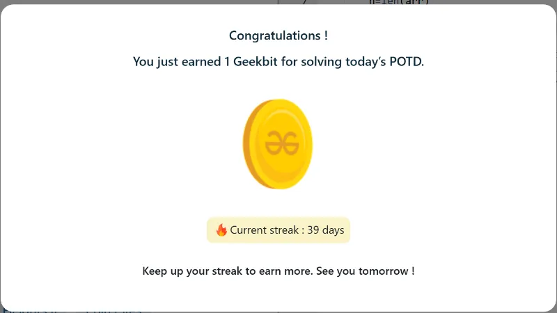

### Problema Día 40: Kadane's Algorithm

#### Description

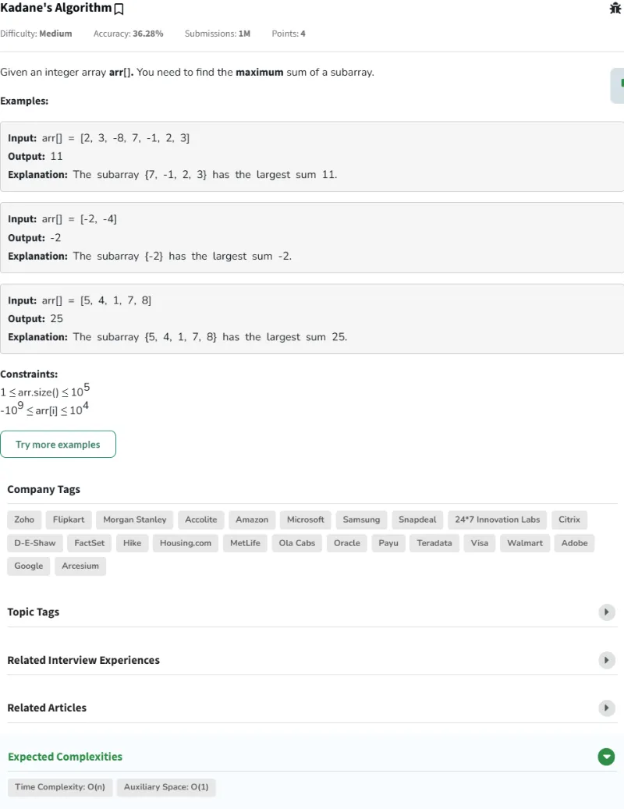

#### Passed

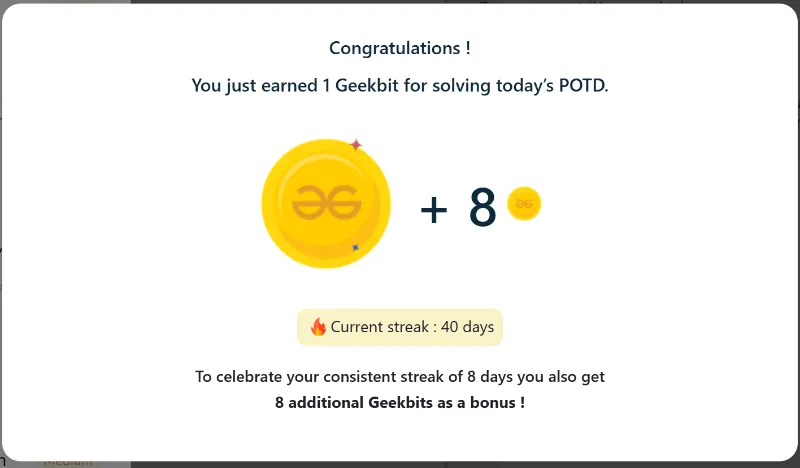
