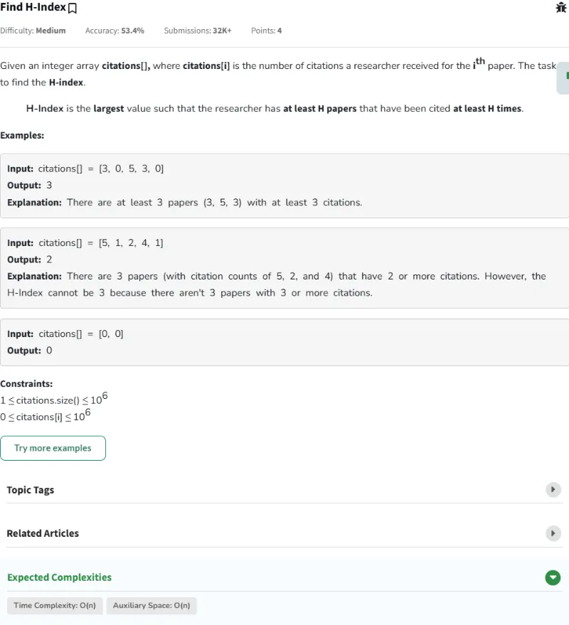

# Resolución de los Problemas del día 51 al día 60

## Tabla de Contenidos

- [Resolución de los Problemas del día 51 al día 60](#resolución-de-los-problemas-del-día-51-al-día-60)
  - [Tabla de Contenidos](#tabla-de-contenidos)
  - [Problemas](#problemas)
    - [Problema Día 51: Sort 0s 1s and 2s](#problema-día-51-sort-0s-1s-and-2s)
      - [Description](#description)
      - [Passed](#passed)
    - [Problema Día 52: Find H-Index](#problema-día-52-find-h-index)
      - [Description](#description-1)
      - [Passed](#passed-1)
    - [Problema Día 53: Count Inversions](#problema-día-53-count-inversions)
      - [Description](#description-2)
      - [Passed](#passed-2)
    - [Problema Día 54: Overlapping Intervals](#problema-día-54-overlapping-intervals)
      - [Description](#description-3)
      - [Passed](#passed-3)
    - [Problema Día 55: Insert Interval](#problema-día-55-insert-interval)
      - [Description](#description-4)
      - [Passed](#passed-4)
    - [Problema Día 56: Non-overlapping Intervals](#problema-día-56-non-overlapping-intervals)
      - [Description](#description-5)
      - [Passed](#passed-5)
    - [Problema Día 57: Merge Without Extra Space](#problema-día-57-merge-without-extra-space)
      - [Description](#description-6)
    - [Problema Día 58: Number of occurrence](#problema-día-58-number-of-occurrence)
      - [Description](#description-7)
      - [Passed](#passed-6)
    - [Problema Día 59: Sorted and Rotated Minimum](#problema-día-59-sorted-and-rotated-minimum)
      - [Description](#description-8)
      - [Passed](#passed-7)
    - [Problema Día 60: Search in Rotated Sorted Array](#problema-día-60-search-in-rotated-sorted-array)
      - [Description](#description-9)
      - [Passed](#passed-8)

## Problemas

### Problema Día 51: Sort 0s 1s and 2s

#### Description

#### Passed

### Problema Día 52: Find H-Index

#### Description

#### Passed

### Problema Día 53: Count Inversions

#### Description

#### Passed

### Problema Día 54: Overlapping Intervals

#### Description

#### Passed

### Problema Día 55: Insert Interval

#### Description

#### Passed

### Problema Día 56: Non-overlapping Intervals

#### Description

#### Passed

### Problema Día 57: Merge Without Extra Space

#### Description

### Problema Día 58: Number of occurrence

#### Description

#### Passed

### Problema Día 59: Sorted and Rotated Minimum

#### Description

#### Passed

### Problema Día 60: Search in Rotated Sorted Array

#### Description

#### Passed

