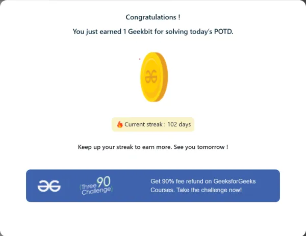

# Resolución de los Problemas del día 101 al día 110

## Tabla de Contenidos

- [Resolución de los Problemas del día 101 al día 110](#resolución-de-los-problemas-del-día-101-al-día-110)
  - [Tabla de Contenidos](#tabla-de-contenidos)
  - [Problemas](#problemas)
    - [Problema Día 101: Detect Loop in linked list](#problema-día-101-detect-loop-in-linked-list)
      - [Description](#description)
      - [Passed](#passed)
    - [Problema Día 102: Find the first node of loop in linked list](#problema-día-102-find-the-first-node-of-loop-in-linked-list)
      - [Description](#description-1)
      - [Passed](#passed-1)
    - [Problema Día 103: Remove loop in Linked List](#problema-día-103-remove-loop-in-linked-list)
      - [Description](#description-2)
      - [Passed](#passed-2)
    - [Problema Día 104: LRU Cache](#problema-día-104-lru-cache)
      - [Description](#description-3)
      - [Passed](#passed-3)
    - [Problema Día 105: Permutations of a String](#problema-día-105-permutations-of-a-string)
      - [Description](#description-4)
      - [Passed](#passed-4)
    - [Problema Día 106: Implement Pow](#problema-día-106-implement-pow)
      - [Description](#description-5)
      - [Passed](#passed-5)
    - [Problema Día 107: N-Queen Problem](#problema-día-107-n-queen-problem)
      - [Description](#description-6)
      - [Passed](#passed-6)
    - [Problema Día 108: Solve the Sudoku](#problema-día-108-solve-the-sudoku)
      - [Description](#description-7)
      - [Passed](#passed-7)
    - [Problema Día 109: Word Search](#problema-día-109-word-search)
      - [Description](#description-8)
      - [Passed](#passed-8)
    - [Problema Día 110: Level order traversal](#problema-día-110-level-order-traversal)
      - [Description](#description-9)
      - [Passed](#passed-9)

## Problemas

### Problema Día 101: Detect Loop in linked list

#### Description

#### Passed

### Problema Día 102: Find the first node of loop in linked list

#### Description

#### Passed

### Problema Día 103: Remove loop in Linked List

#### Description

#### Passed

### Problema Día 104: LRU Cache

#### Description

#### Passed

### Problema Día 105: Permutations of a String

#### Description

#### Passed

### Problema Día 106: Implement Pow

#### Description

#### Passed

### Problema Día 107: N-Queen Problem

#### Description

#### Passed

### Problema Día 108: Solve the Sudoku

#### Description

#### Passed

### Problema Día 109: Word Search

#### Description

#### Passed

### Problema Día 110: Level order traversal

#### Description

#### Passed

