# Resolución de los Problemas del día 111 al día 120

## Tabla de Contenidos

- [Resolución de los Problemas del día 111 al día 120](#resolución-de-los-problemas-del-día-111-al-día-120)
  - [Tabla de Contenidos](#tabla-de-contenidos)
  - [Problemas](#problemas)
    - [Problema Día 111: Height of Binary Tree](#problema-día-111-height-of-binary-tree)
      - [Description](#description)
      - [Passed](#passed)
    - [Problema Día 112: Diameter of a Binary Tree](#problema-día-112-diameter-of-a-binary-tree)
      - [Description](#description-1)
      - [Passed](#passed-1)
    - [Problema Día 113: Mirror Tree](#problema-día-113-mirror-tree)
      - [Description](#description-2)
      - [Passed](#passed-2)
    - [Problema Día 114: Construct Tree from Inorder \& Preorder](#problema-día-114-construct-tree-from-inorder--preorder)
      - [Description](#description-3)
      - [Passed](#passed-3)
    - [Problema Día 115: Inorder Traversal](#problema-día-115-inorder-traversal)
      - [Description](#description-4)
      - [Passed](#passed-4)
    - [Problema Día 116: Tree Boundary Traversal](#problema-día-116-tree-boundary-traversal)
      - [Description](#description-5)
      - [Passed](#passed-5)
    - [Problema Día 117: Maximum path sum from any node](#problema-día-117-maximum-path-sum-from-any-node)
      - [Description](#description-6)
      - [Passed](#passed-6)
    - [Problema Día 118: K Sum Paths](#problema-día-118-k-sum-paths)
      - [Description](#description-7)
      - [Passed](#passed-7)
    - [Problema Día 119: Check for BST](#problema-día-119-check-for-bst)
      - [Description](#description-8)
      - [Passed](#passed-8)
    - [Problema Día 120: k-th Smallest in BST](#problema-día-120-k-th-smallest-in-bst)
      - [Description](#description-9)
      - [Passed](#passed-9)

## Problemas

### Problema Día 111: Height of Binary Tree

#### Description

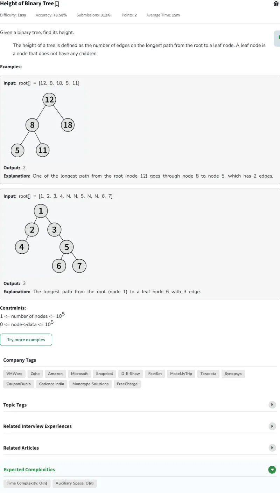

#### Passed

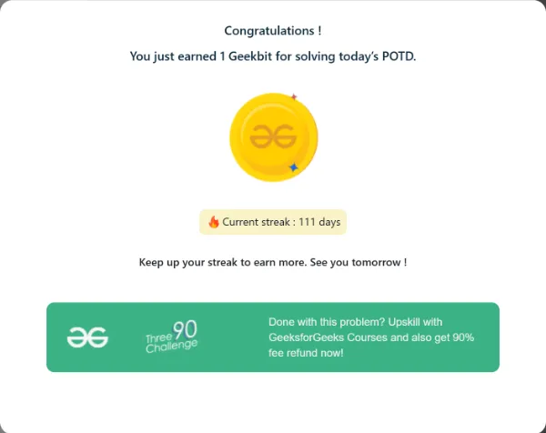

### Problema Día 112: Diameter of a Binary Tree

#### Description

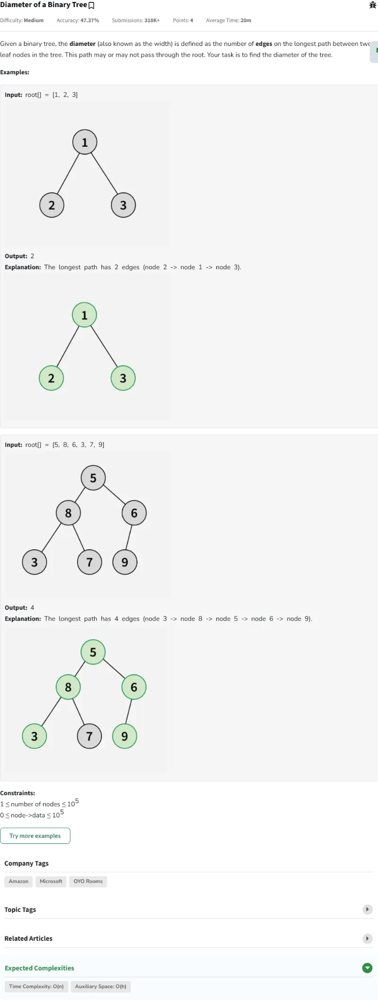

#### Passed

### Problema Día 113: Mirror Tree

#### Description

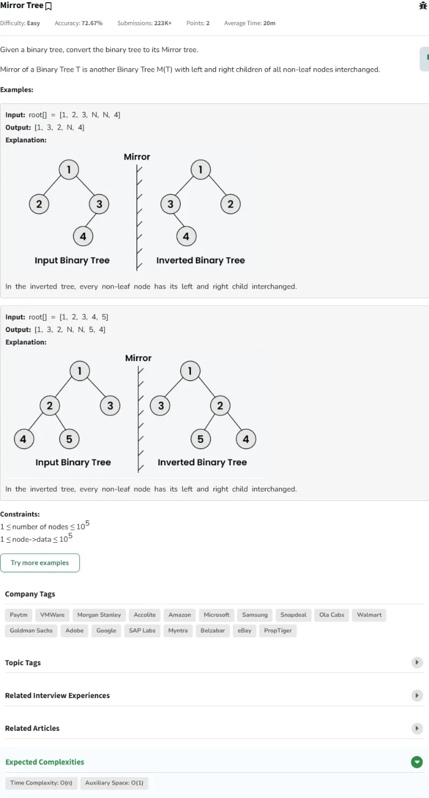

#### Passed

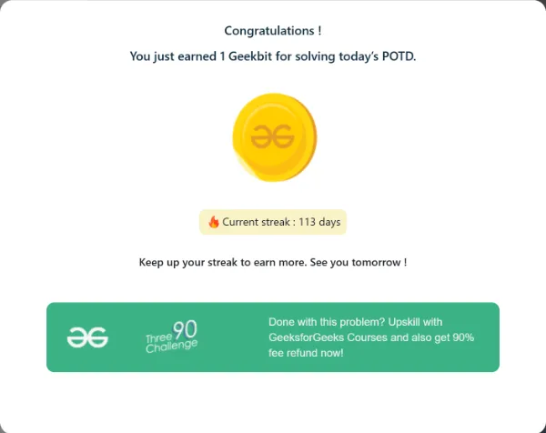

### Problema Día 114: Construct Tree from Inorder & Preorder

#### Description

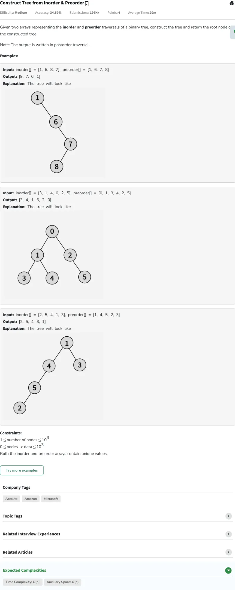

#### Passed

### Problema Día 115: Inorder Traversal

#### Description

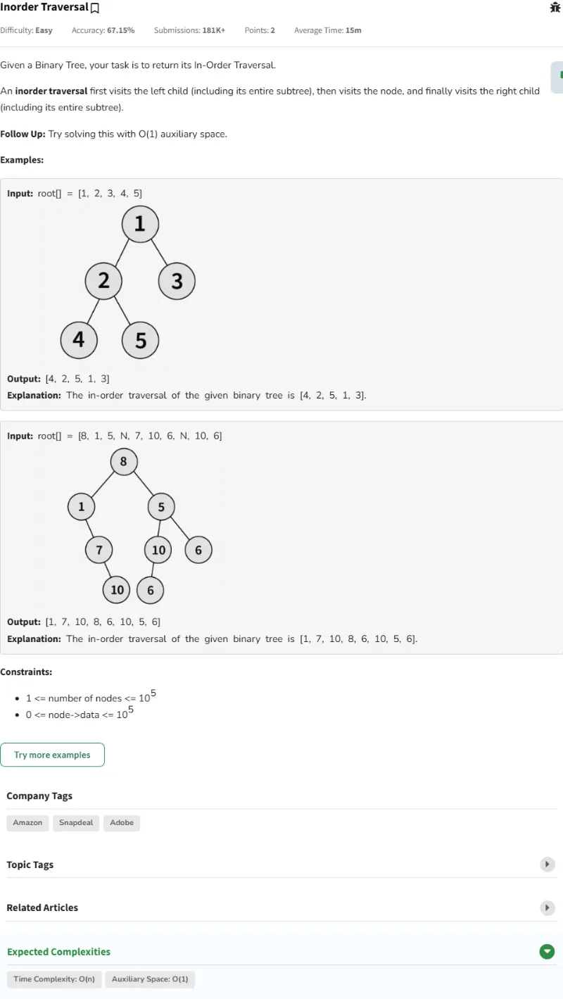

#### Passed

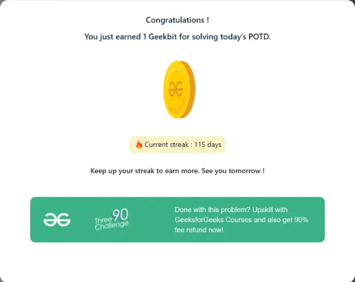

### Problema Día 116: Tree Boundary Traversal

#### Description

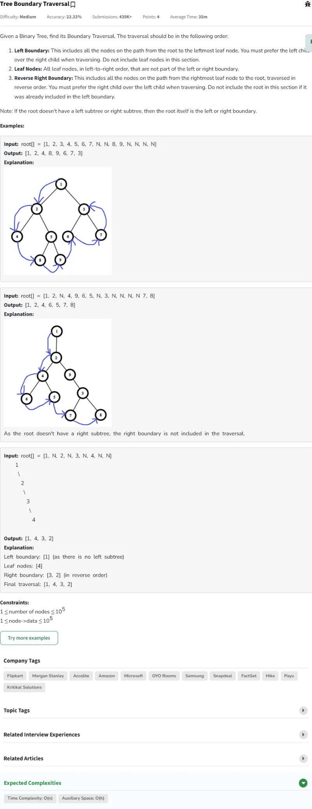

#### Passed

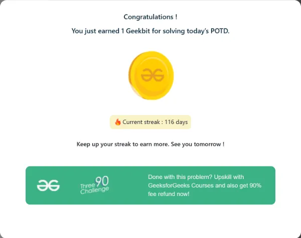

### Problema Día 117: Maximum path sum from any node

#### Description

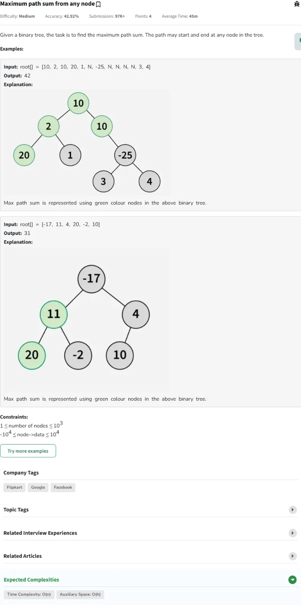

#### Passed

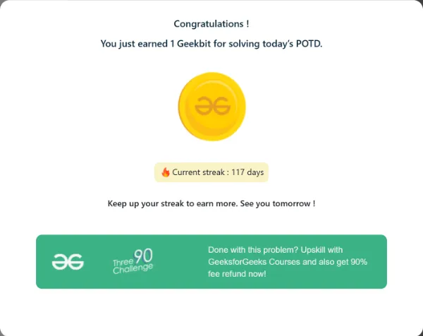

### Problema Día 118: K Sum Paths

#### Description

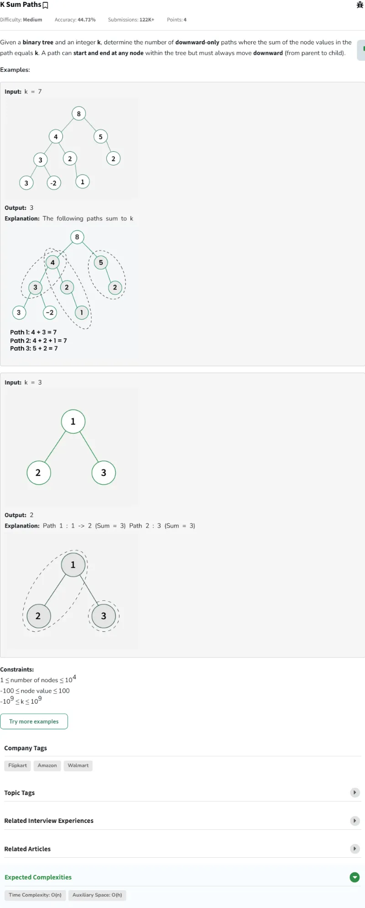

#### Passed

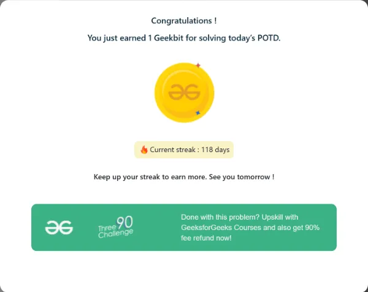

### Problema Día 119: Check for BST

#### Description

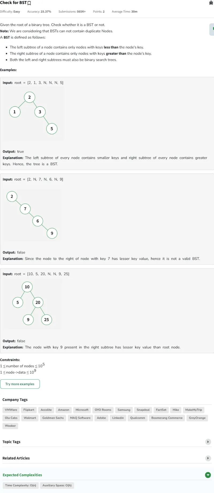

#### Passed

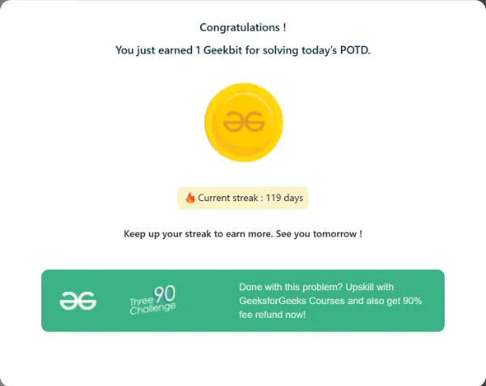

### Problema Día 120: k-th Smallest in BST

#### Description

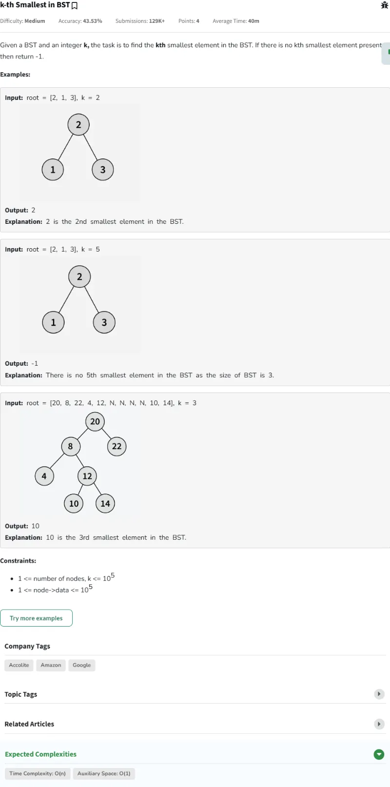

#### Passed

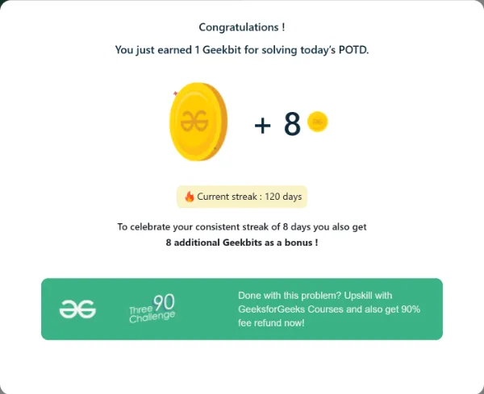
