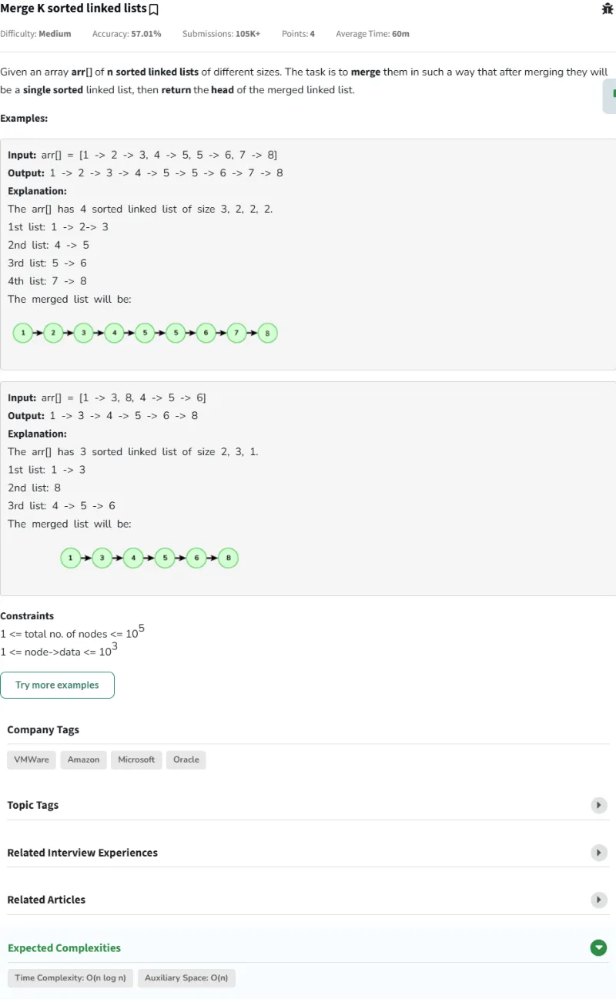
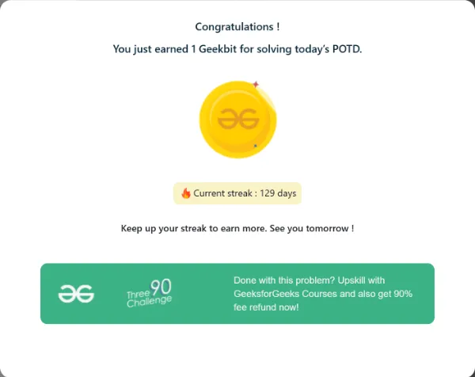

# Resolución de los Problemas del día 121 al día 130

## Tabla de Contenidos

- [Resolución de los Problemas del día 121 al día 130](#resolución-de-los-problemas-del-día-121-al-día-130)
  - [Tabla de Contenidos](#tabla-de-contenidos)
  - [Problemas](#problemas)
    - [Problema Día 121: Pair Sum in BST](#problema-día-121-pair-sum-in-bst)
      - [Description](#description)
      - [Passed](#passed)
    - [Problema Día 122: Fixing Two nodes of a BST](#problema-día-122-fixing-two-nodes-of-a-bst)
      - [Description](#description-1)
      - [Passed](#passed-1)
    - [Problema Día 123: Lowest Common Ancestor in a BST](#problema-día-123-lowest-common-ancestor-in-a-bst)
      - [Description](#description-2)
      - [Passed](#passed-2)
    - [Problema Día 124: Serialize and deserialize a binary tree](#problema-día-124-serialize-and-deserialize-a-binary-tree)
      - [Description](#description-3)
      - [Passed](#passed-3)
    - [Problema Día 125: k largest elements](#problema-día-125-k-largest-elements)
      - [Description](#description-4)
      - [Passed](#passed-4)
    - [Problema Día 126: K Closest Points to Origin](#problema-día-126-k-closest-points-to-origin)
      - [Description](#description-5)
      - [Passed](#passed-5)
    - [Problema Día 127: Merge K sorted linked lists](#problema-día-127-merge-k-sorted-linked-lists)
      - [Description](#description-6)
      - [Passed](#passed-6)
    - [Problema Día 128: Find median in a stream](#problema-día-128-find-median-in-a-stream)
      - [Description](#description-7)
      - [Passed](#passed-7)
    - [Problema Día 129: Parenthesis Checker](#problema-día-129-parenthesis-checker)
      - [Description](#description-8)
      - [Passed](#passed-8)
    - [Problema Día 130: Longest valid Parentheses](#problema-día-130-longest-valid-parentheses)
      - [Description](#description-9)
      - [Passed](#passed-9)

## Problemas

### Problema Día 121: Pair Sum in BST

#### Description

#### Passed

### Problema Día 122: Fixing Two nodes of a BST

#### Description

#### Passed

### Problema Día 123: Lowest Common Ancestor in a BST

#### Description

#### Passed

### Problema Día 124: Serialize and deserialize a binary tree

#### Description

#### Passed

### Problema Día 125: k largest elements

#### Description

#### Passed

### Problema Día 126: K Closest Points to Origin

#### Description

#### Passed

### Problema Día 127: Merge K sorted linked lists

#### Description

#### Passed

### Problema Día 128: Find median in a stream

#### Description

#### Passed

### Problema Día 129: Parenthesis Checker

#### Description

#### Passed

### Problema Día 130: Longest valid Parentheses

#### Description

#### Passed

