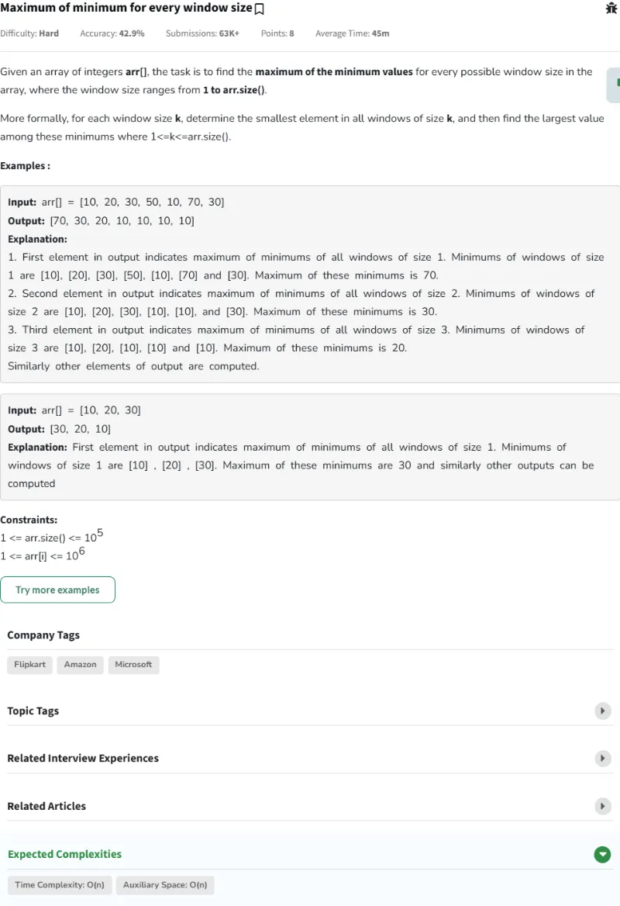

# Resolución de los Problemas del día 131 al día 140

## Tabla de Contenidos

- [Resolución de los Problemas del día 131 al día 140](#resolución-de-los-problemas-del-día-131-al-día-140)
  - [Tabla de Contenidos](#tabla-de-contenidos)
  - [Problemas](#problemas)
    - [Problema Día 131: Next Greater Element](#problema-día-131-next-greater-element)
      - [Description](#description)
      - [Passed](#passed)
    - [Problema Día 132: Stock span problem](#problema-día-132-stock-span-problem)
      - [Description](#description-1)
      - [Passed](#passed-1)
    - [Problema Día 133: Histogram Max Rectangular Area](#problema-día-133-histogram-max-rectangular-area)
      - [Description](#description-2)
      - [Passed](#passed-2)
    - [Problema Día 134: Maximum of minimum for every window size (complejo)](#problema-día-134-maximum-of-minimum-for-every-window-size-complejo)
      - [Description](#description-3)
      - [Passed](#passed-3)
    - [Problema Día 135: Get Min from Stack](#problema-día-135-get-min-from-stack)
      - [Description](#description-4)
      - [Passed](#passed-4)
    - [Problema Día 136: Evaluation of Postfix Expression](#problema-día-136-evaluation-of-postfix-expression)
      - [Description](#description-5)
      - [Passed](#passed-5)
    - [Problema Día 137: Decode the string](#problema-día-137-decode-the-string)
      - [Description](#description-6)
      - [Passed](#passed-6)
    - [Problema Día 138: K Sized Subarray Maximum](#problema-día-138-k-sized-subarray-maximum)
      - [Description](#description-7)
      - [Passed](#passed-7)
    - [Problema Día 139: Longest Bounded-Difference Subarray](#problema-día-139-longest-bounded-difference-subarray)
      - [Description](#description-8)
      - [Passed](#passed-8)
    - [Problema Día 140: Longest Increasing Subsequence](#problema-día-140-longest-increasing-subsequence)
      - [Description](#description-9)
      - [Passed](#passed-9)

## Problemas

### Problema Día 131: Next Greater Element

#### Description

#### Passed

### Problema Día 132: Stock span problem

#### Description

#### Passed

### Problema Día 133: Histogram Max Rectangular Area

#### Description

#### Passed

### Problema Día 134: Maximum of minimum for every window size (complejo)

#### Description

#### Passed

### Problema Día 135: Get Min from Stack

#### Description

#### Passed

### Problema Día 136: Evaluation of Postfix Expression

#### Description

#### Passed

### Problema Día 137: Decode the string

#### Description

#### Passed

### Problema Día 138: K Sized Subarray Maximum

#### Description

#### Passed

### Problema Día 139: Longest Bounded-Difference Subarray

#### Description

#### Passed

### Problema Día 140: Longest Increasing Subsequence

#### Description

#### Passed

