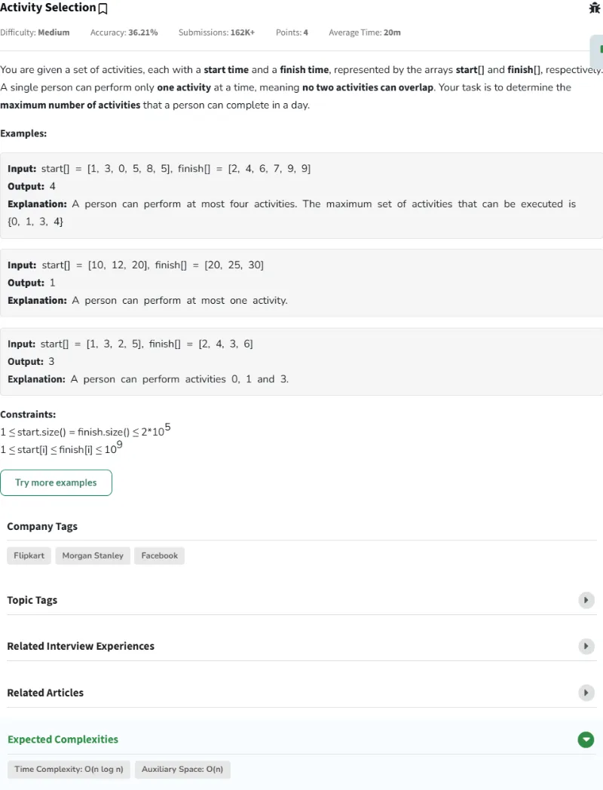

# Resolución de los Problemas del día 161 al día 170

## Tabla de Contenidos

- [Resolución de los Problemas del día 161 al día 170](#resolución-de-los-problemas-del-día-161-al-día-170)
  - [Tabla de Contenidos](#tabla-de-contenidos)
  - [Problemas](#problemas)
    - [Problema Día 161: Boolean Parenthesization](#problema-día-161-boolean-parenthesization)
      - [Description](#description)
      - [Passed](#passed)
    - [Problema Día 162: Word Break](#problema-día-162-word-break)
      - [Description](#description-1)
      - [Passed](#passed-1)
    - [Problema Día 163: Minimum Platforms](#problema-día-163-minimum-platforms)
      - [Description](#description-2)
      - [Passed](#passed-2)
    - [Problema Día 164: Activity Selection](#problema-día-164-activity-selection)
      - [Description](#description-3)
      - [Passed](#passed-3)
    - [Problema Día 165: Job Sequencing Problem](#problema-día-165-job-sequencing-problem)
      - [Description](#description-4)
      - [Passed](#passed-4)
    - [Problema Día 166: Gas Station](#problema-día-166-gas-station)
      - [Description](#description-5)
      - [Passed](#passed-5)
    - [Problema Día 167: Maximize partitions in a String](#problema-día-167-maximize-partitions-in-a-string)
      - [Description](#description-6)
      - [Passed](#passed-6)
    - [Problema Día 168: DFS of Graph](#problema-día-168-dfs-of-graph)
      - [Description](#description-7)
      - [Passed](#passed-7)
    - [Problema Día 169: BFS of graph](#problema-día-169-bfs-of-graph)
      - [Description](#description-8)
      - [Passed](#passed-8)
    - [Problema Día 170: Rotten Oranges](#problema-día-170-rotten-oranges)
      - [Description](#description-9)
      - [Passed](#passed-9)

## Problemas

### Problema Día 161: Boolean Parenthesization

#### Description

#### Passed

### Problema Día 162: Word Break

#### Description

#### Passed

### Problema Día 163: Minimum Platforms

#### Description

#### Passed

### Problema Día 164: Activity Selection

#### Description

#### Passed

### Problema Día 165: Job Sequencing Problem

#### Description

#### Passed

### Problema Día 166: Gas Station

#### Description

#### Passed

### Problema Día 167: Maximize partitions in a String

#### Description

#### Passed

### Problema Día 168: DFS of Graph

#### Description

#### Passed

### Problema Día 169: BFS of graph

#### Description

#### Passed

### Problema Día 170: Rotten Oranges

#### Description

#### Passed

