# Resolución de los Problemas del día 171 al día 180

## Tabla de Contenidos

- [Resolución de los Problemas del día 171 al día 180](#resolución-de-los-problemas-del-día-171-al-día-180)
  - [Tabla de Contenidos](#tabla-de-contenidos)
  - [Problemas](#problemas)
    - [Problema Día 171: Undirected Graph Cycle](#problema-día-171-undirected-graph-cycle)
      - [Description](#description)
      - [Passed](#passed)
    - [Problema Día 172: Find the number of islands](#problema-día-172-find-the-number-of-islands)
      - [Description](#description-1)
      - [Passed](#passed-1)
    - [Problema Día 173: Topological sort](#problema-día-173-topological-sort)
      - [Description](#description-2)
      - [Passed](#passed-2)
    - [Problema Día 174: Directed Graph Cycle](#problema-día-174-directed-graph-cycle)
      - [Description](#description-3)
      - [Passed](#passed-3)
    - [Problema Día 175: Bridge edge in a graph](#problema-día-175-bridge-edge-in-a-graph)
      - [Description](#description-4)
      - [Passed](#passed-4)
    - [Problema Día 176: Articulation Point - II](#problema-día-176-articulation-point---ii)
      - [Description](#description-5)
      - [Passed](#passed-5)
    - [Problema Día 177: Minimum cost to connect all houses in a city](#problema-día-177-minimum-cost-to-connect-all-houses-in-a-city)
      - [Description](#description-6)
      - [Passed](#passed-6)
    - [Problema Día 178: Dijkstra Algorithm](#problema-día-178-dijkstra-algorithm)
      - [Description](#description-7)
      - [Passed](#passed-7)
    - [Problema Día 179: Flood fill Algorithm](#problema-día-179-flood-fill-algorithm)
      - [Description](#description-8)
      - [Passed](#passed-8)
    - [Problema Día 180: Clone an Undirected Graph](#problema-día-180-clone-an-undirected-graph)
      - [Description](#description-9)
      - [Passed](#passed-9)

## Problemas

### Problema Día 171: Undirected Graph Cycle

#### Description

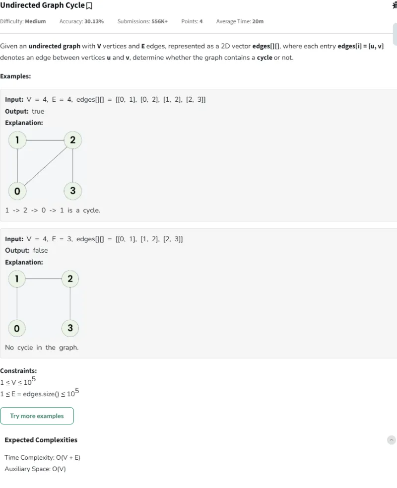

#### Passed

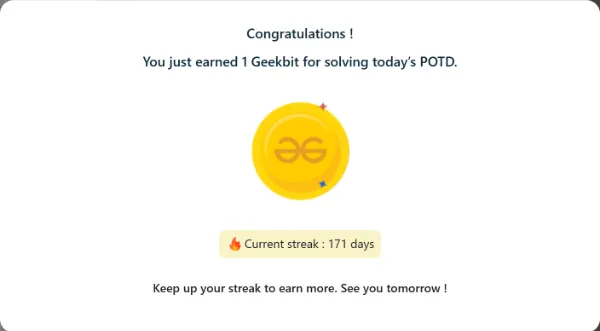

### Problema Día 172: Find the number of islands

#### Description

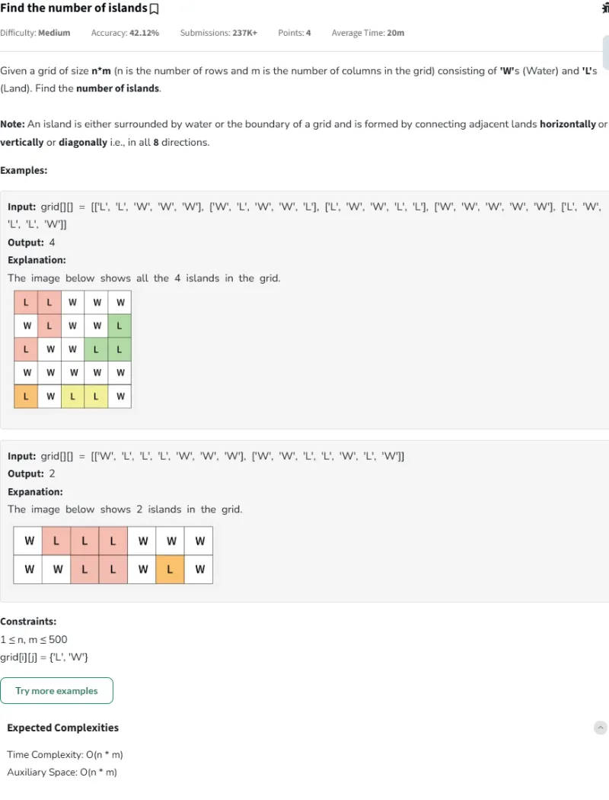

#### Passed

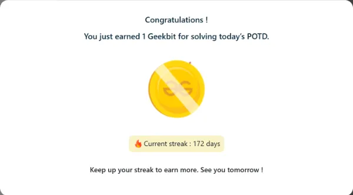

### Problema Día 173: Topological sort

#### Description

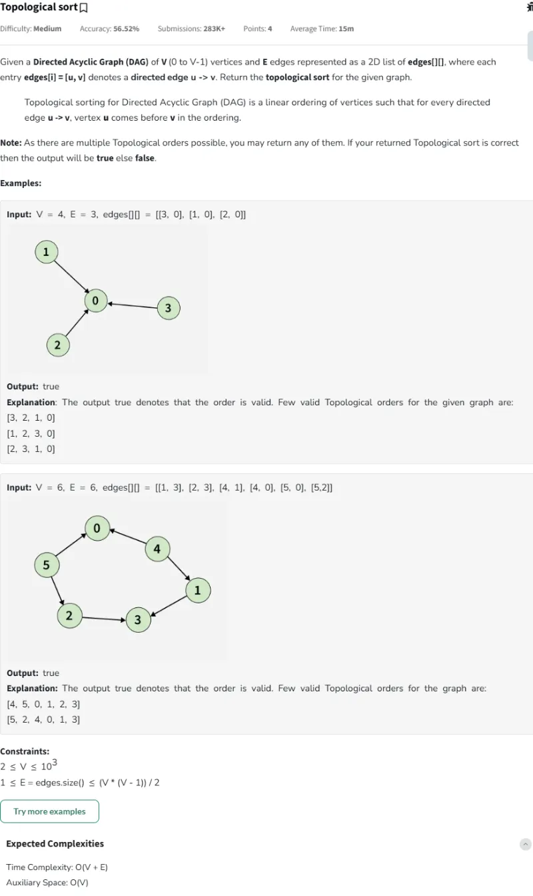

#### Passed

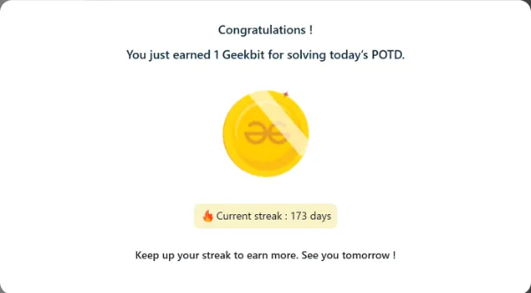

### Problema Día 174: Directed Graph Cycle

#### Description

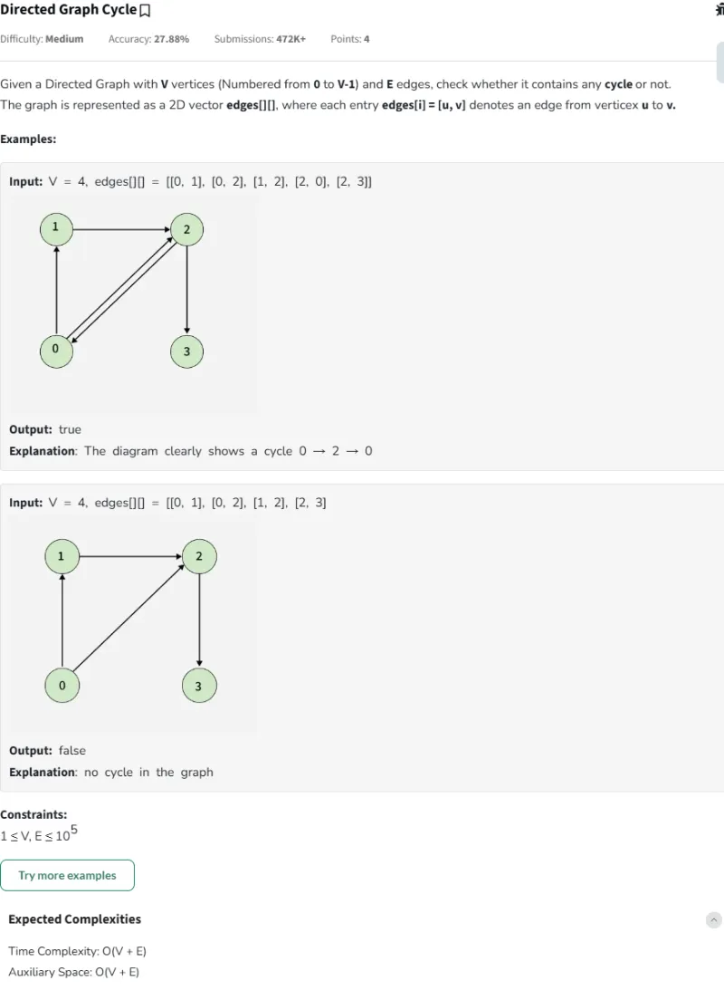

#### Passed

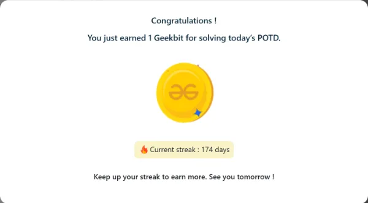

### Problema Día 175: Bridge edge in a graph

#### Description

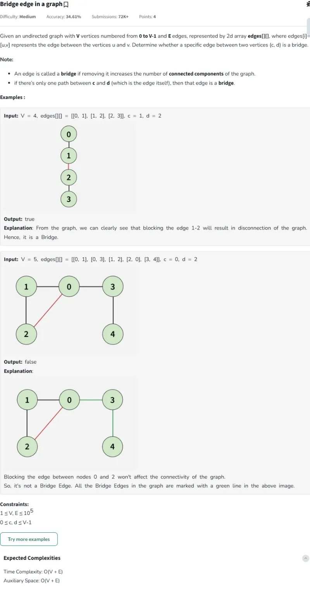

#### Passed

### Problema Día 176: Articulation Point - II

#### Description

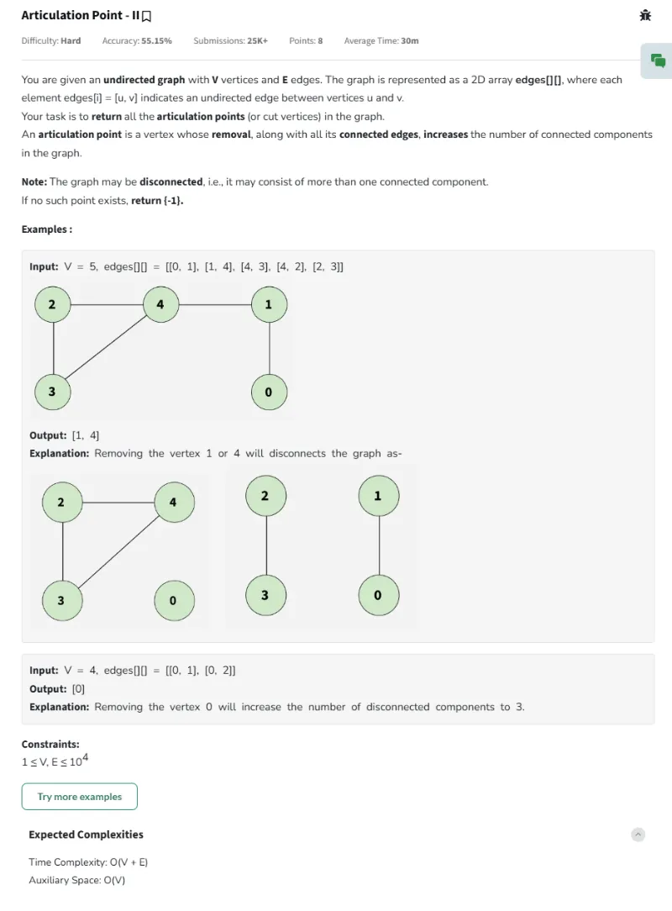

#### Passed

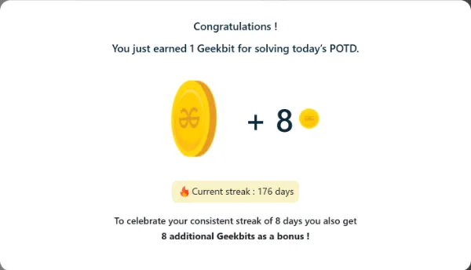

### Problema Día 177: Minimum cost to connect all houses in a city

#### Description

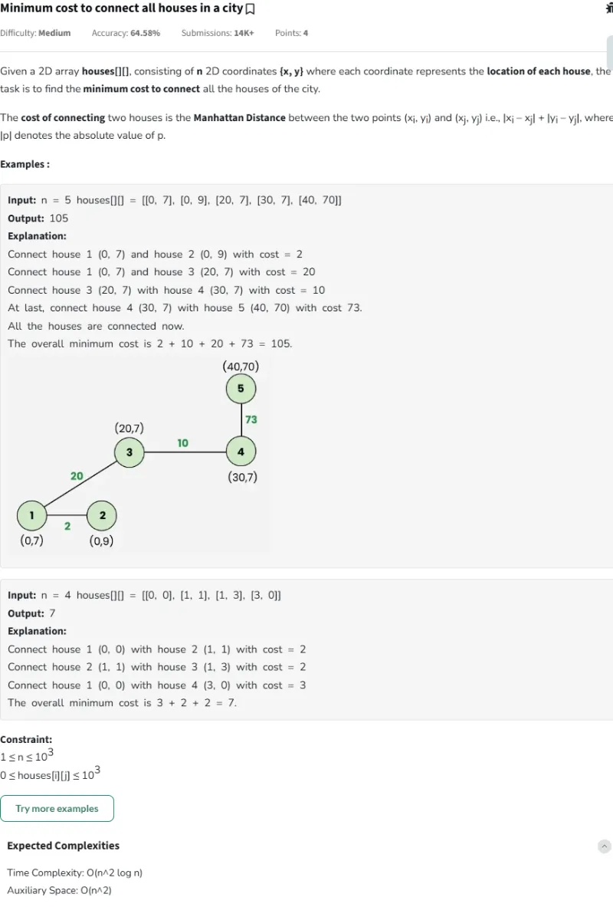

#### Passed

### Problema Día 178: Dijkstra Algorithm

#### Description

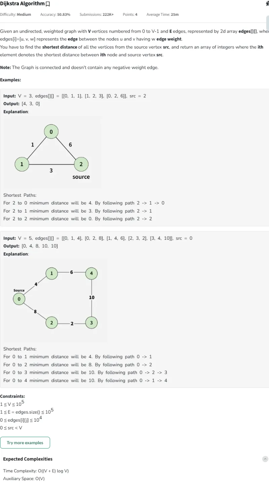

#### Passed

### Problema Día 179: Flood fill Algorithm

#### Description

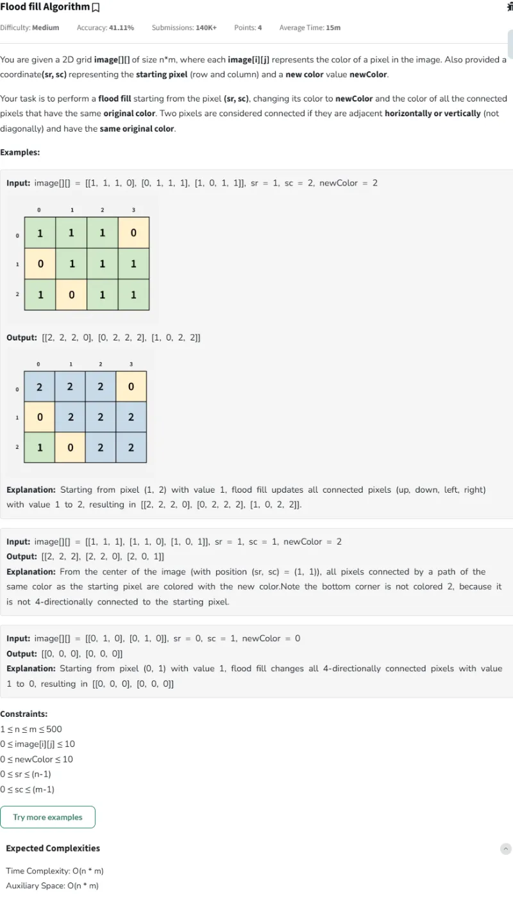

#### Passed

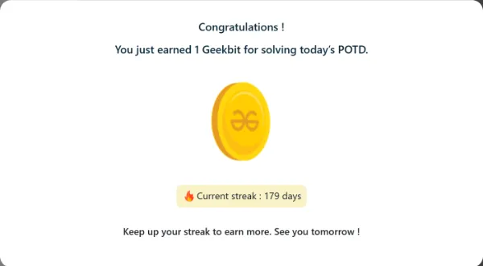

### Problema Día 180: Clone an Undirected Graph

#### Description

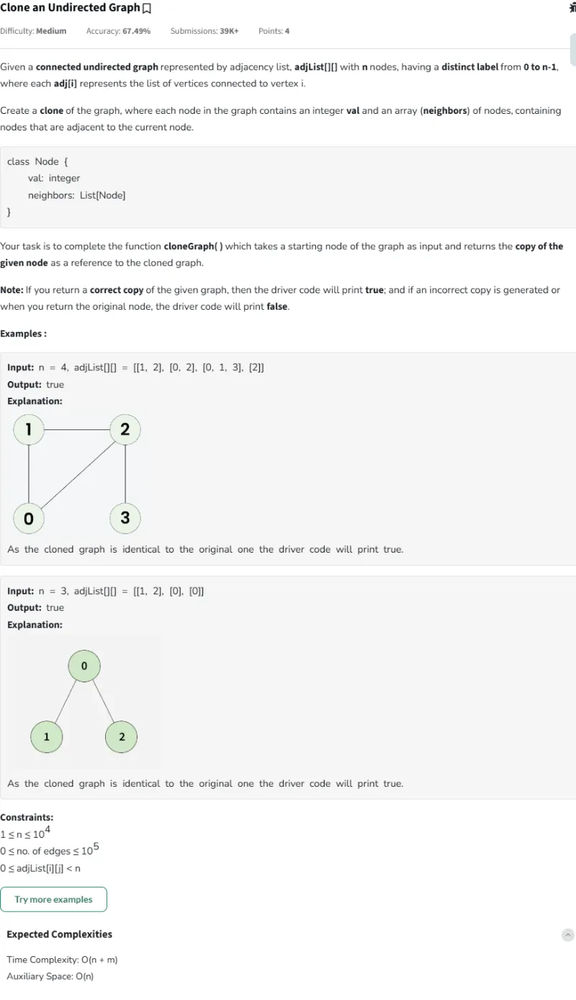

#### Passed

