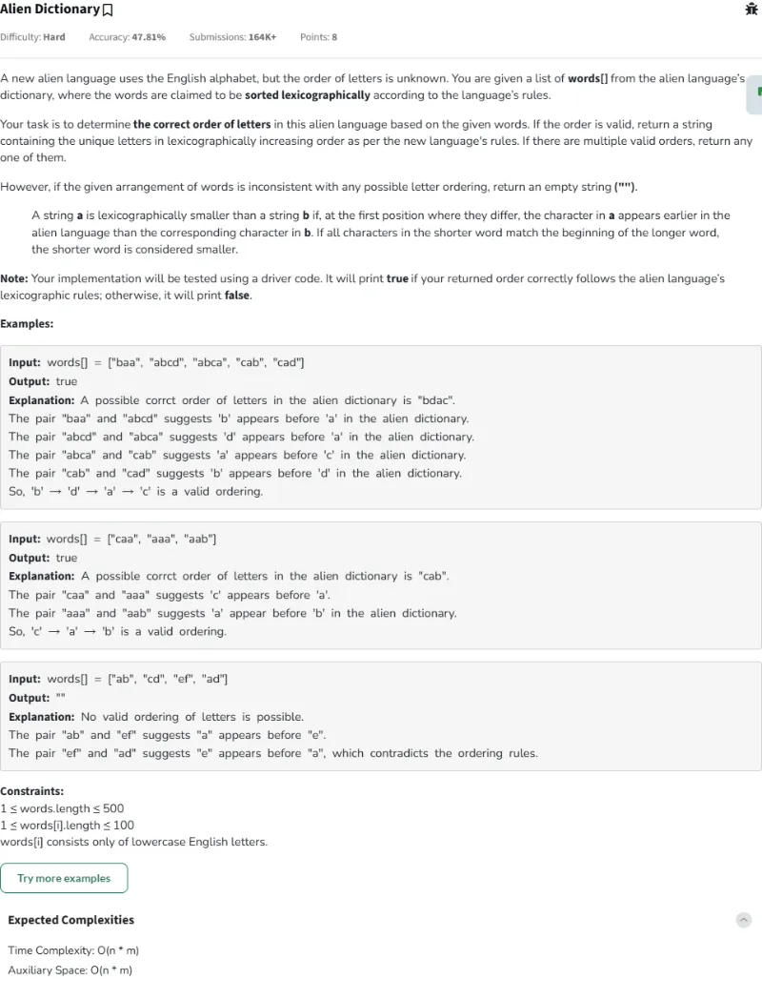
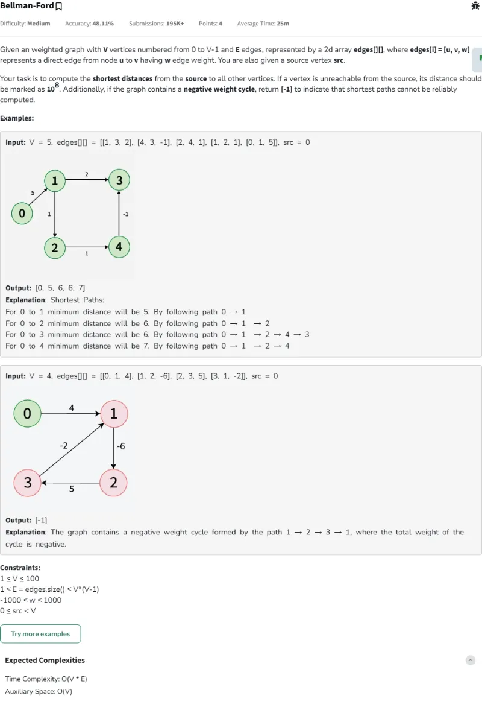
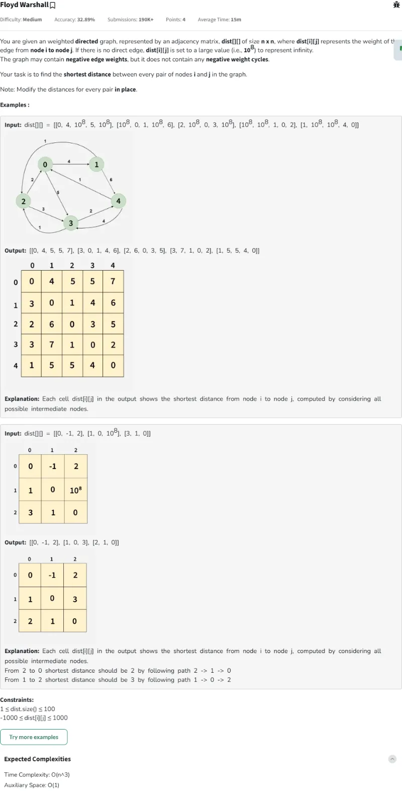
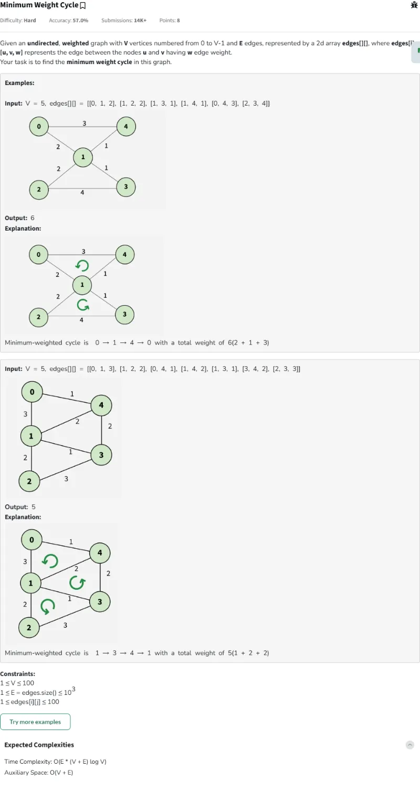
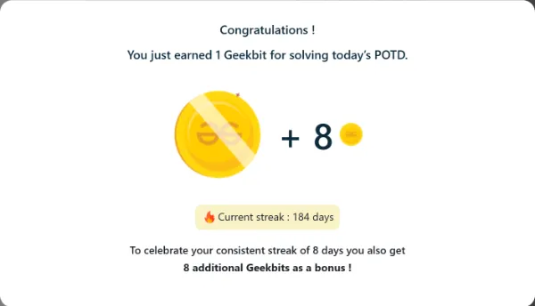
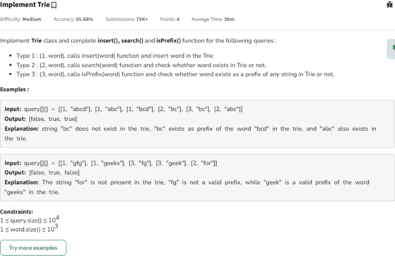
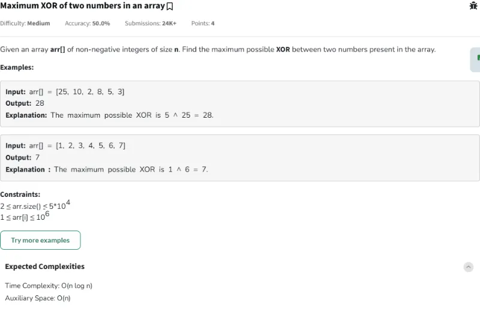

# Resolución de los Problemas del día 181 al día 190

## Tabla de Contenido

- [Resolución de los Problemas del día 181 al día 190](#resolución-de-los-problemas-del-día-181-al-día-190)
  - [Tabla de Contenido](#tabla-de-contenido)
  - [Problemas](#problemas)
    - [Problema Día 181: Alien Dictionary](#problema-día-181-alien-dictionary)
      - [Description](#description)
      - [Passed](#passed)
    - [Problema Día 182: Bellman-Ford](#problema-día-182-bellman-ford)
      - [Description](#description-1)
      - [Passed](#passed-1)
    - [Problema Día 183: Floyd Warshall](#problema-día-183-floyd-warshall)
      - [Description](#description-2)
      - [Passed](#passed-2)
    - [Problema Día 184: Minimum Weight Cycle](#problema-día-184-minimum-weight-cycle)
      - [Description](#description-3)
      - [Passed](#passed-3)
    - [Problema Día 185: Implement Trie](#problema-día-185-implement-trie)
      - [Description](#description-4)
      - [Passed](#passed-4)
    - [Problema Día 186: Maximum XOR of two numbers in an array](#problema-día-186-maximum-xor-of-two-numbers-in-an-array)
      - [Description](#description-5)
      - [Passed](#passed-5)
    - [Problema Día 187: Find Only Repetitive Element from 1 to n-1](#problema-día-187-find-only-repetitive-element-from-1-to-n-1)
      - [Description](#description-6)
      - [Passed](#passed-6)
    - [Problema Día 188: Missing in Array](#problema-día-188-missing-in-array)
      - [Description](#description-7)
      - [Passed](#passed-7)
    - [Problema Día 189: Unique Number I](#problema-día-189-unique-number-i)
      - [Description](#description-8)
      - [Passed](#passed-8)
    - [Problema Día 190: Unique Number II](#problema-día-190-unique-number-ii)
      - [Description](#description-9)
      - [Passed](#passed-9)

## Problemas

### Problema Día 181: Alien Dictionary

#### Description

#### Passed

### Problema Día 182: Bellman-Ford

#### Description

#### Passed

### Problema Día 183: Floyd Warshall

#### Description

#### Passed

### Problema Día 184: Minimum Weight Cycle

#### Description

#### Passed

### Problema Día 185: Implement Trie

#### Description

#### Passed

### Problema Día 186: Maximum XOR of two numbers in an array

#### Description

#### Passed

### Problema Día 187: Find Only Repetitive Element from 1 to n-1

#### Description

#### Passed

### Problema Día 188: Missing in Array

#### Description

#### Passed

### Problema Día 189: Unique Number I

#### Description

#### Passed

### Problema Día 190: Unique Number II

#### Description

#### Passed

