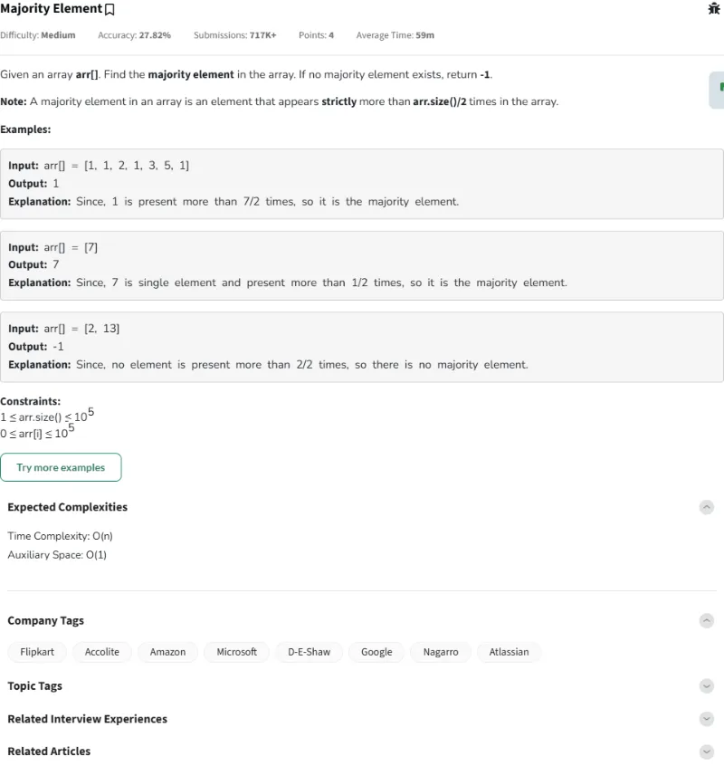
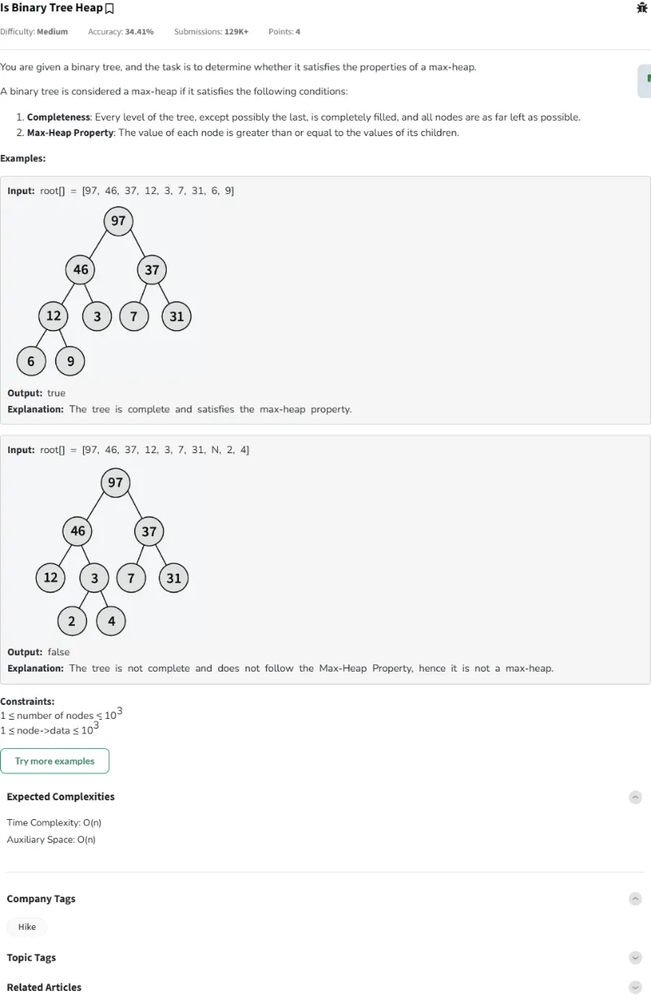
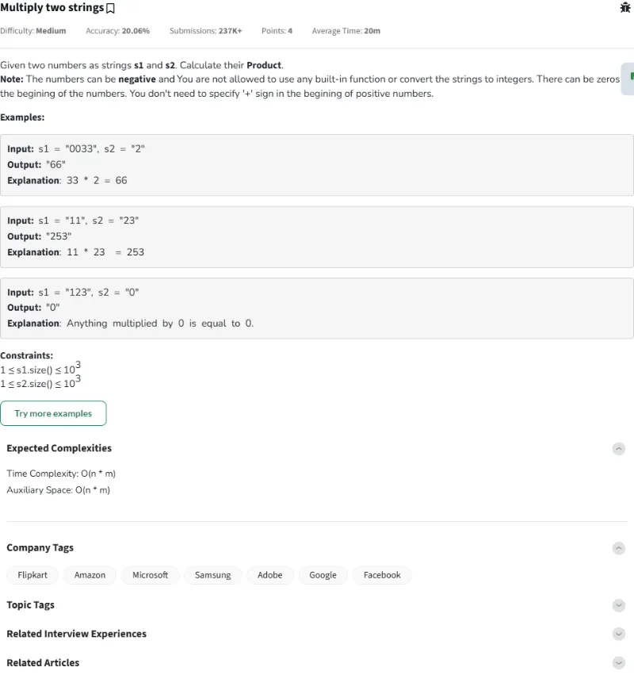
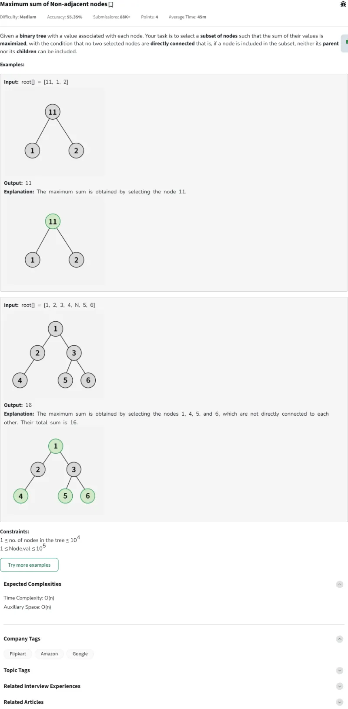
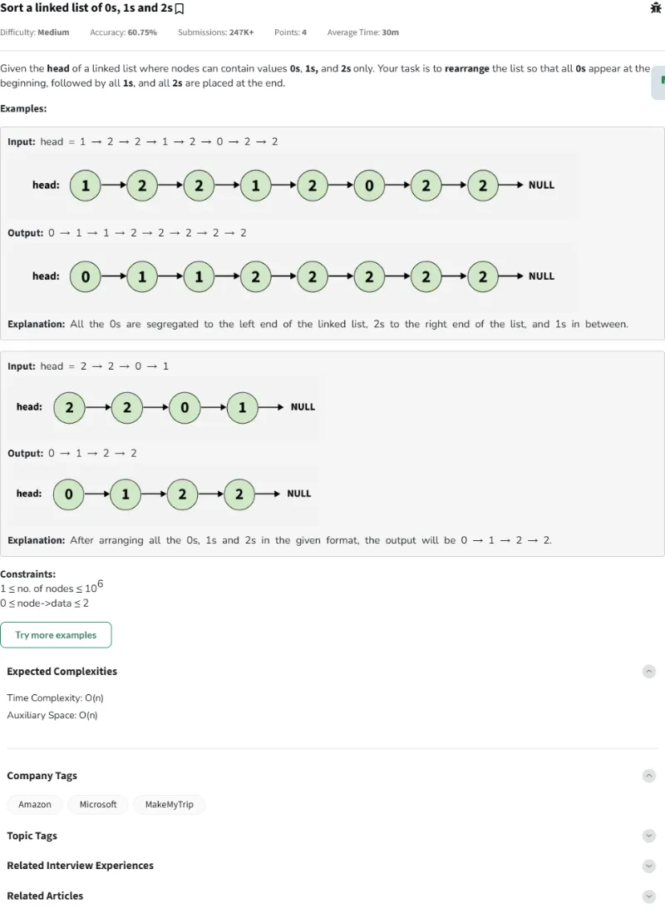
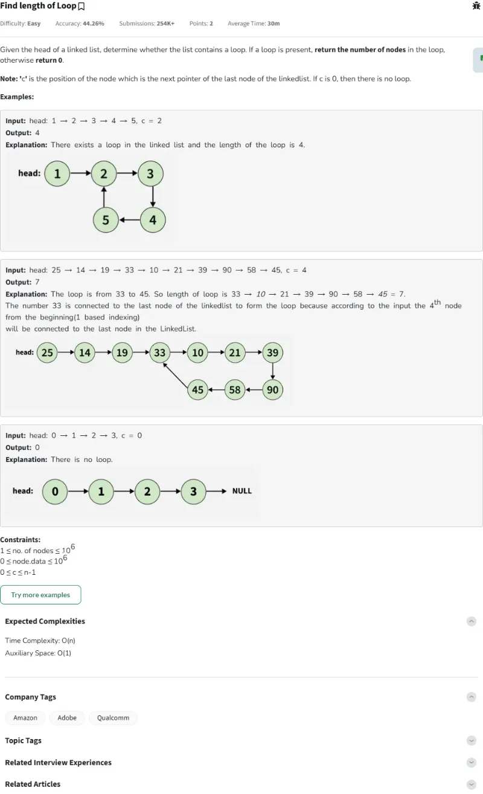
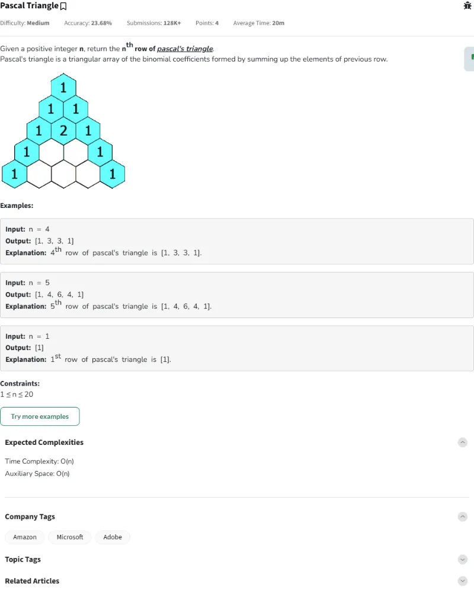
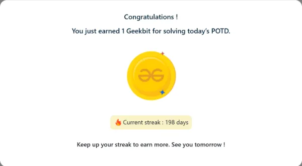
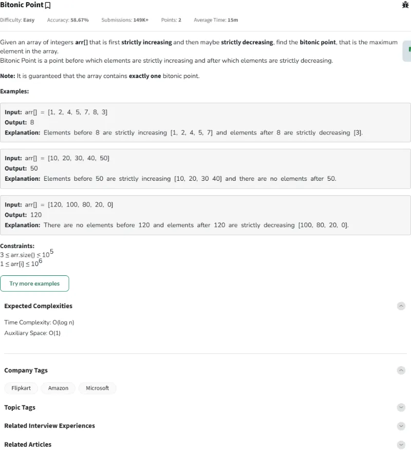
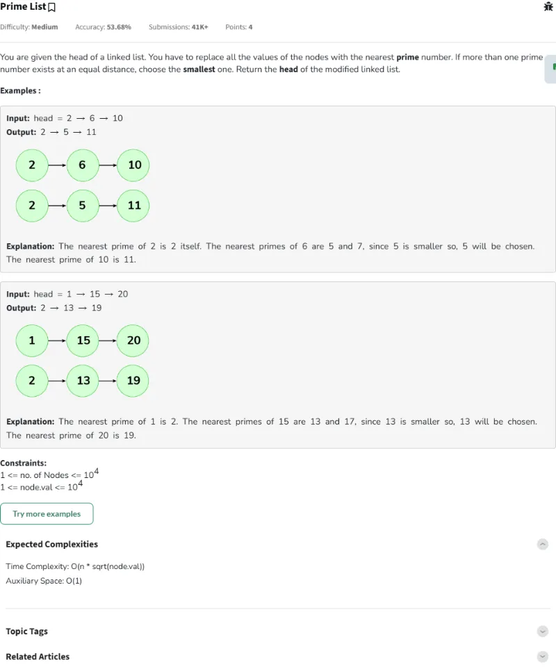

# Resolución de los Problemas del día 191 al día 200

## Tabla de Contenido

- [Resolución de los Problemas del día 191 al día 200](#resolución-de-los-problemas-del-día-191-al-día-200)
  - [Tabla de Contenido](#tabla-de-contenido)
  - [Problemas](#problemas)
    - [Problema Día 191: Unique Number III](#problema-día-191-unique-number-iii)
      - [Description](#description)
      - [Passed](#passed)
    - [Problema Día 192: Majority Element](#problema-día-192-majority-element)
      - [Description](#description-1)
      - [Passed](#passed-1)
    - [Problema Día 193: Is Binary Tree Heap](#problema-día-193-is-binary-tree-heap)
      - [Description](#description-2)
      - [Passed](#passed-2)
    - [Problema Día 194: Multiply two strings](#problema-día-194-multiply-two-strings)
      - [Description](#description-3)
      - [Passed](#passed-3)
    - [Problema Día 195: Maximum sum of Non-adjacent nodes](#problema-día-195-maximum-sum-of-non-adjacent-nodes)
      - [Description](#description-4)
      - [Passed](#passed-4)
    - [Problema Día 196: Sort a linked list of 0s, 1s and 2s](#problema-día-196-sort-a-linked-list-of-0s-1s-and-2s)
      - [Description](#description-5)
      - [Passed](#passed-5)
    - [Problema Día 197: Find length of Loop](#problema-día-197-find-length-of-loop)
      - [Description](#description-6)
      - [Passed](#passed-6)
    - [Problema Día 198: Pascal Triangle](#problema-día-198-pascal-triangle)
      - [Description](#description-7)
      - [Passed](#passed-7)
    - [Problema Día 199: Bitonic Point](#problema-día-199-bitonic-point)
      - [Description](#description-8)
      - [Passed](#passed-8)
    - [Problema Día 200: Prime List](#problema-día-200-prime-list)
      - [Description](#description-9)
      - [Passed](#passed-9)

## Problemas

### Problema Día 191: Unique Number III

#### Description

#### Passed

### Problema Día 192: Majority Element

#### Description

#### Passed

### Problema Día 193: Is Binary Tree Heap

#### Description

#### Passed

### Problema Día 194: Multiply two strings

#### Description

#### Passed

### Problema Día 195: Maximum sum of Non-adjacent nodes

#### Description

#### Passed

### Problema Día 196: Sort a linked list of 0s, 1s and 2s

#### Description

#### Passed

### Problema Día 197: Find length of Loop

#### Description

#### Passed

### Problema Día 198: Pascal Triangle

#### Description

#### Passed

### Problema Día 199: Bitonic Point

#### Description

#### Passed

### Problema Día 200: Prime List

#### Description

#### Passed

