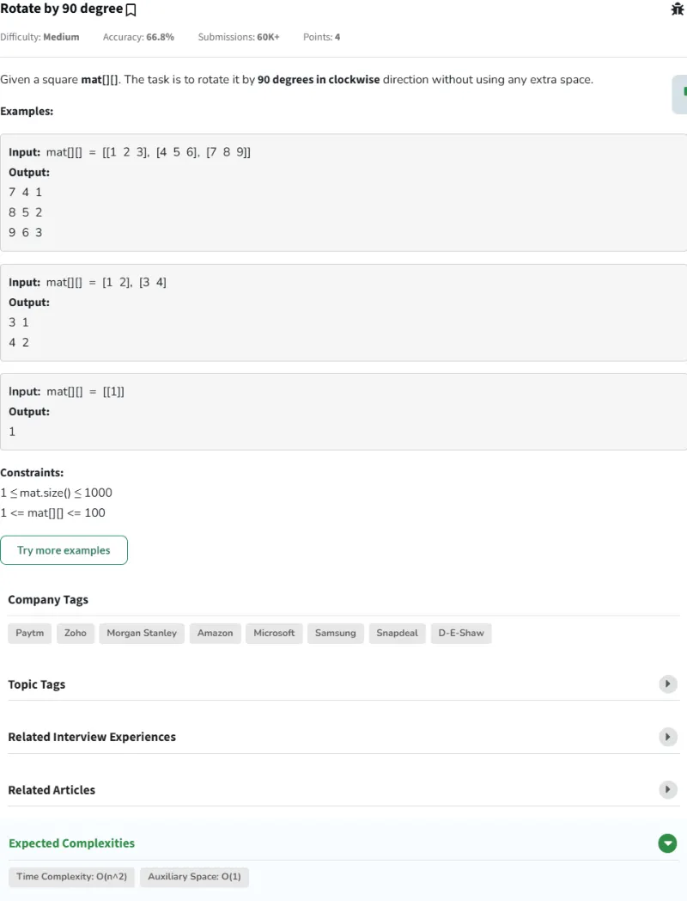
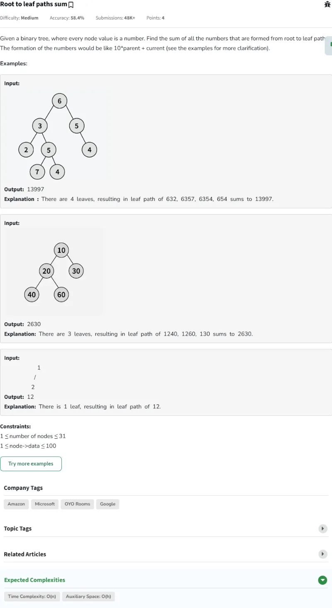
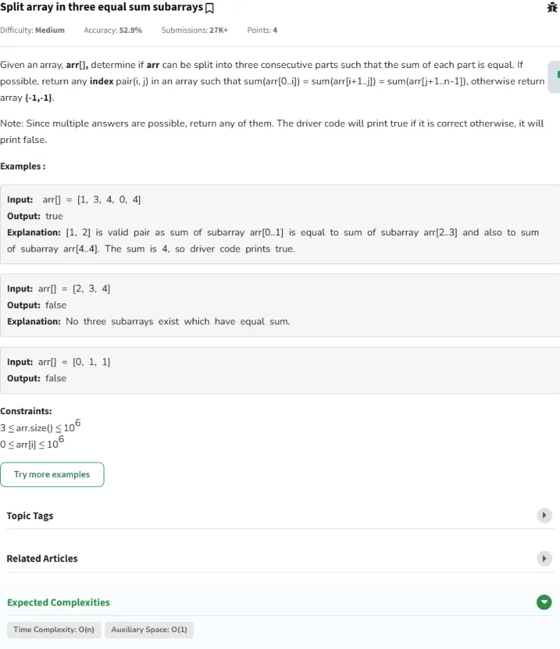
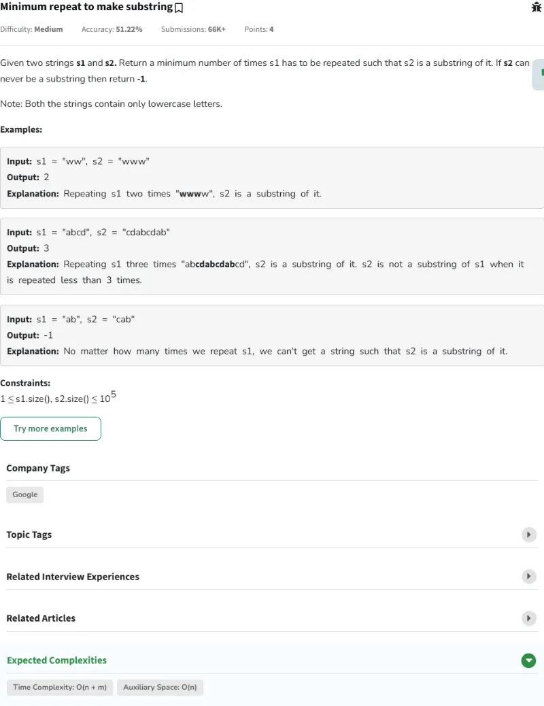
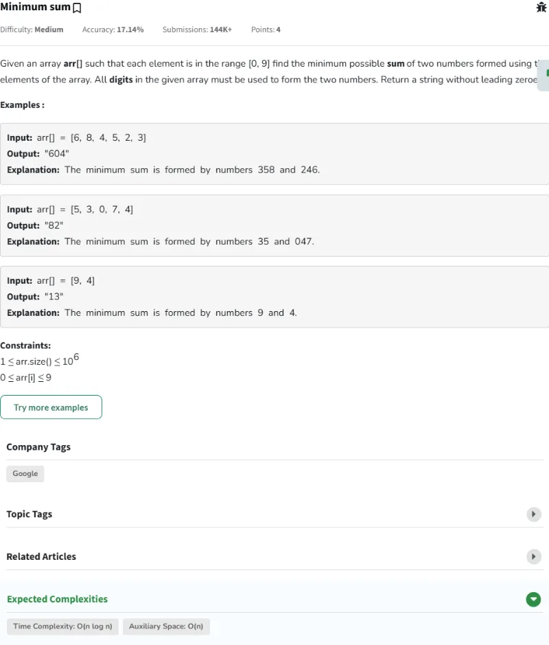
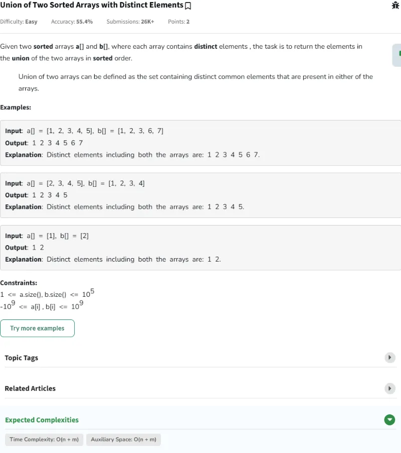
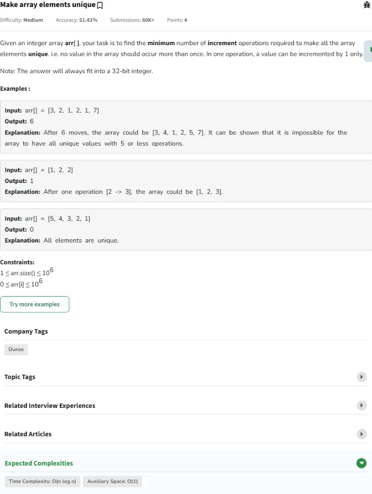
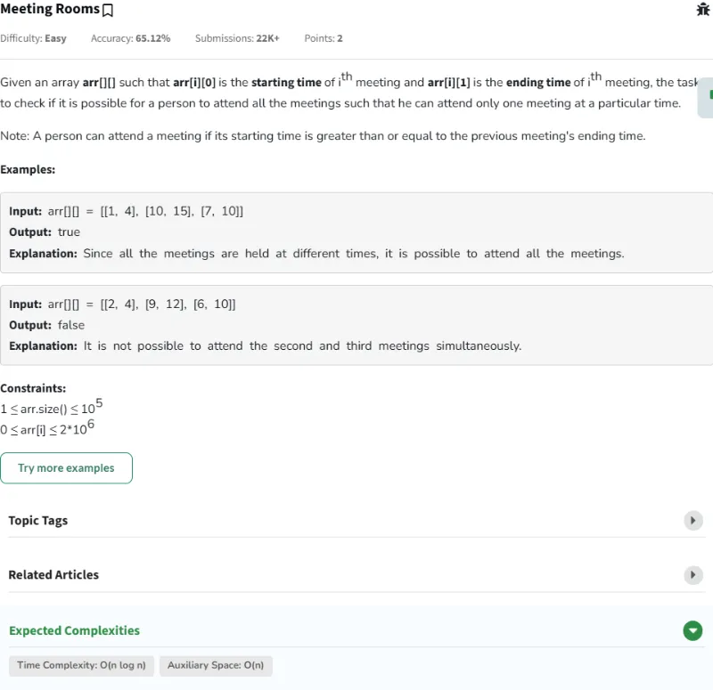
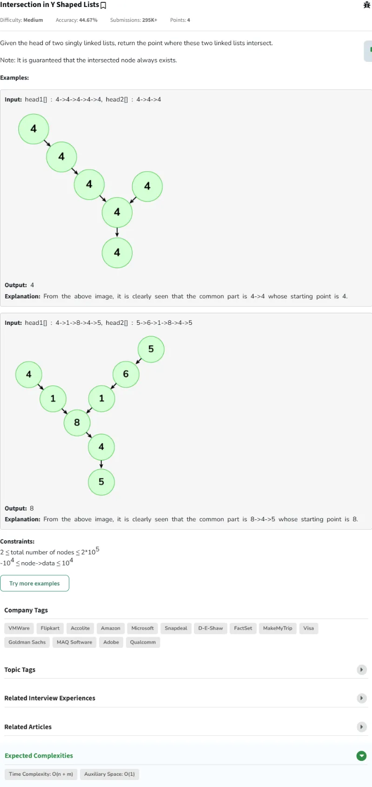
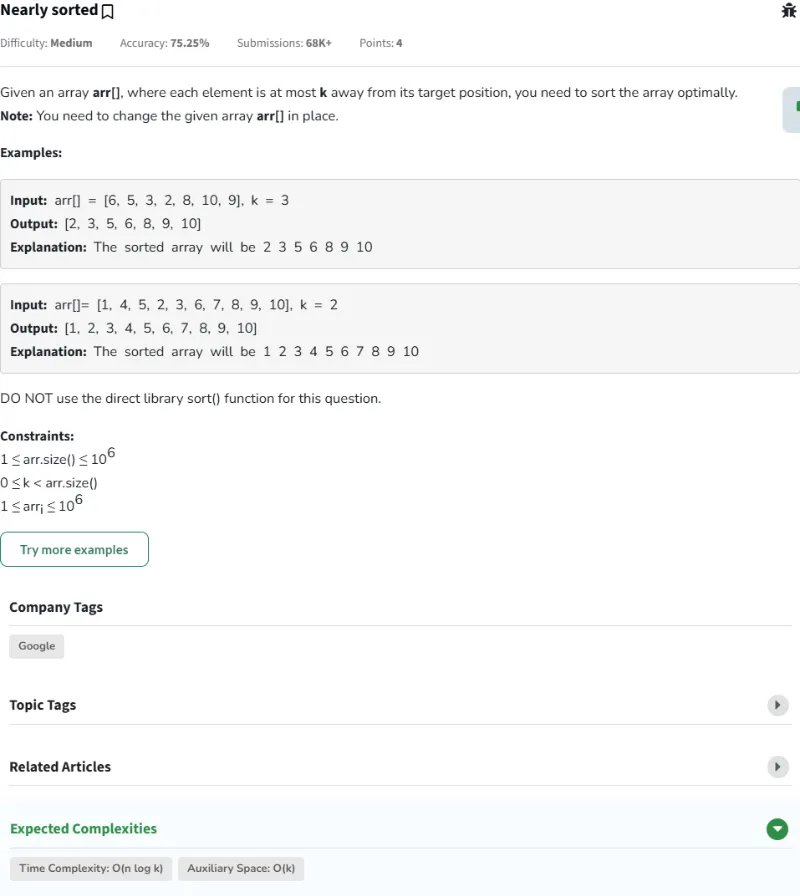

# Resolución de los Problemas del día 21 al día 30

## Tabla de Contenidos

- [Resolución de los Problemas del día 21 al día 30](#resolución-de-los-problemas-del-día-21-al-día-30)
  - [Tabla de Contenidos](#tabla-de-contenidos)
  - [Problemas](#problemas)
    - [Problema Día 21: Rotate by 90 degree](#problema-día-21-rotate-by-90-degree)
      - [Description](#description)
      - [Passed](#passed)
    - [Problema Día 22: Root to leaf paths sum](#problema-día-22-root-to-leaf-paths-sum)
      - [Description](#description-1)
      - [Passed](#passed-1)
    - [Problema Día 23: Split array in three equal sum subarrays](#problema-día-23-split-array-in-three-equal-sum-subarrays)
      - [Description](#description-2)
      - [Passed](#passed-2)
    - [Problema Día 24: Minimum repeat to make substring](#problema-día-24-minimum-repeat-to-make-substring)
      - [Description](#description-3)
      - [Passed](#passed-3)
    - [Problema Día 25: Minimum sum](#problema-día-25-minimum-sum)
      - [Description](#description-4)
      - [Passed](#passed-4)
    - [Problema Día 26: Union of Two Sorted Arrays with Distinct Elements](#problema-día-26-union-of-two-sorted-arrays-with-distinct-elements)
      - [Description](#description-5)
      - [Passed](#passed-5)
    - [Problema Día 27: Make array elements unique](#problema-día-27-make-array-elements-unique)
      - [Description](#description-6)
      - [Passed](#passed-6)
    - [Problema Día 28: Meeting Rooms](#problema-día-28-meeting-rooms)
      - [Description](#description-7)
      - [Passed](#passed-7)
    - [Problema Día 29: Intersection Point in Y Shaped Linked Lists](#problema-día-29-intersection-point-in-y-shaped-linked-lists)
      - [Description](#description-8)
      - [Passed](#passed-8)
    - [Problema Día 30: Nearly sorted](#problema-día-30-nearly-sorted)
      - [Description](#description-9)
      - [Passed](#passed-9)

## Problemas

### Problema Día 21: Rotate by 90 degree

#### Description

#### Passed

### Problema Día 22: Root to leaf paths sum

#### Description

#### Passed

### Problema Día 23: Split array in three equal sum subarrays

#### Description

#### Passed

### Problema Día 24: Minimum repeat to make substring

#### Description

#### Passed

### Problema Día 25: Minimum sum

#### Description

#### Passed

### Problema Día 26: Union of Two Sorted Arrays with Distinct Elements

#### Description

#### Passed

### Problema Día 27: Make array elements unique

#### Description

#### Passed

### Problema Día 28: Meeting Rooms

#### Description

#### Passed

### Problema Día 29: Intersection Point in Y Shaped Linked Lists

#### Description

#### Passed

### Problema Día 30: Nearly sorted

#### Description

#### Passed

