# Resolución de los Problemas del día 41 al día 50

## Tabla de Contenidos

- [Resolución de los Problemas del día 41 al día 50](#resolución-de-los-problemas-del-día-41-al-día-50)
  - [Tabla de Contenidos](#tabla-de-contenidos)
  - [Problemas](#problemas)
    - [Problema Día 41: Maximum Product Subarray](#problema-día-41-maximum-product-subarray)
      - [Description](#description)
      - [Passed](#passed)
    - [Problema Día 42: Max Circular Subarray Sum](#problema-día-42-max-circular-subarray-sum)
      - [Description](#description-1)
      - [Passed](#passed-1)
    - [Problema Día 43: Smallest Positive Missing Number](#problema-día-43-smallest-positive-missing-number)
      - [Description](#description-2)
      - [Passed](#passed-2)
    - [Problema Día 44: Implement Atoi](#problema-día-44-implement-atoi)
      - [Description](#description-3)
      - [Passed](#passed-3)
    - [Problema Día 45: Add Binary Strings](#problema-día-45-add-binary-strings)
      - [Description](#description-4)
      - [Passed](#passed-4)
    - [Problema Día 46: Anagram](#problema-día-46-anagram)
      - [Description](#description-5)
      - [Passed](#passed-5)
    - [Problema Día 47: Non Repeating Character](#problema-día-47-non-repeating-character)
      - [Description](#description-6)
      - [Passed](#passed-6)
    - [Problema Día 48: Search Pattern (KMP-Algorithm)](#problema-día-48-search-pattern-kmp-algorithm)
      - [Description](#description-7)
      - [Passed](#passed-7)
    - [Problema Día 49: Min Chars to Add for Palindrome](#problema-día-49-min-chars-to-add-for-palindrome)
      - [Description](#description-8)
      - [Passed](#passed-8)
    - [Problema Día 50: Strings Rotations of Each Other](#problema-día-50-strings-rotations-of-each-other)
      - [Description](#description-9)
      - [Passed](#passed-9)

## Problemas

### Problema Día 41: Maximum Product Subarray

#### Description

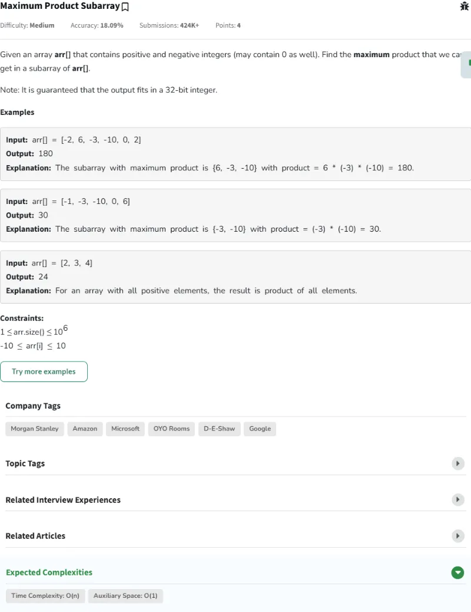

#### Passed

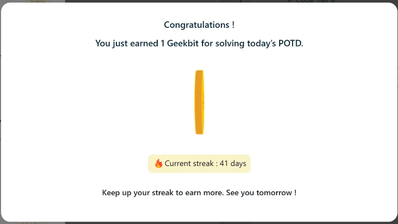

### Problema Día 42: Max Circular Subarray Sum

#### Description

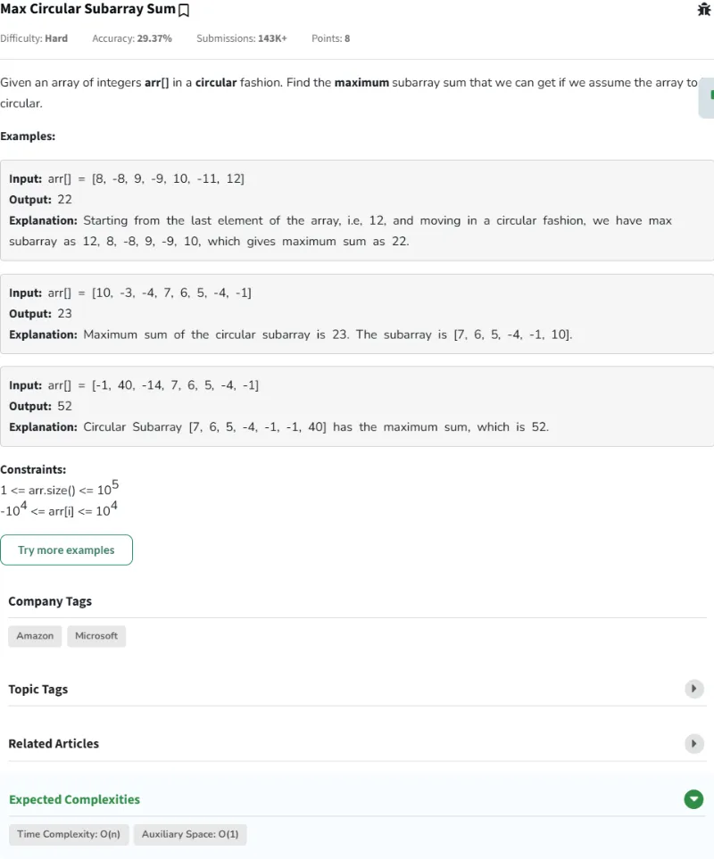

#### Passed

### Problema Día 43: Smallest Positive Missing Number

#### Description

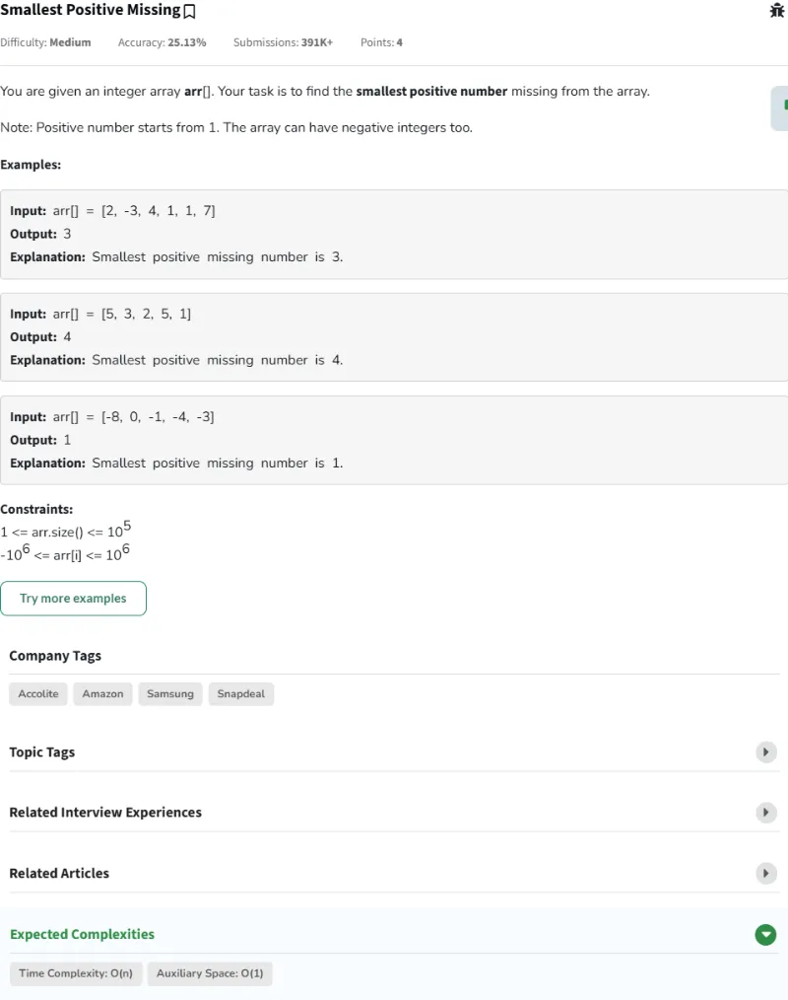

#### Passed

### Problema Día 44: Implement Atoi

#### Description

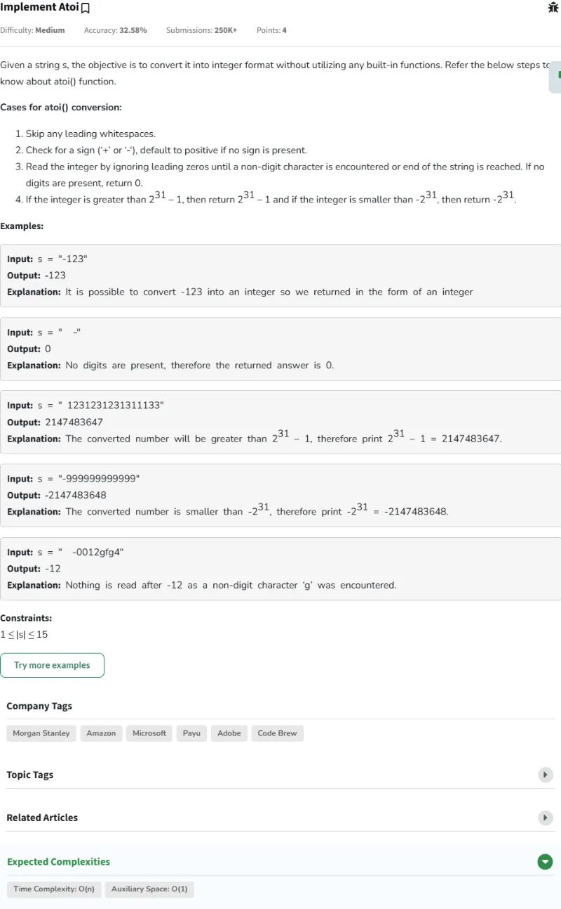

#### Passed

### Problema Día 45: Add Binary Strings

#### Description

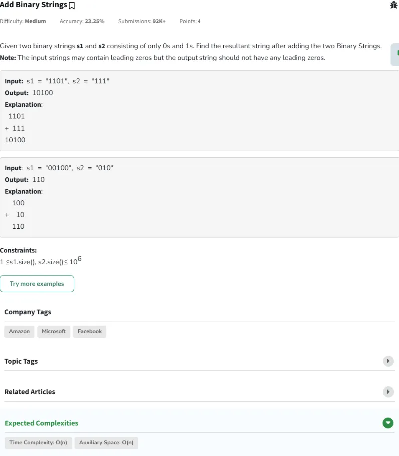

#### Passed

### Problema Día 46: Anagram

#### Description

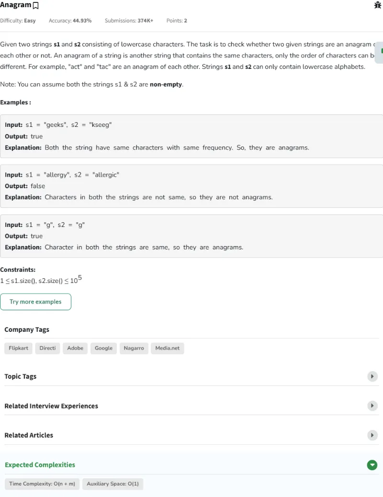

#### Passed

### Problema Día 47: Non Repeating Character

#### Description

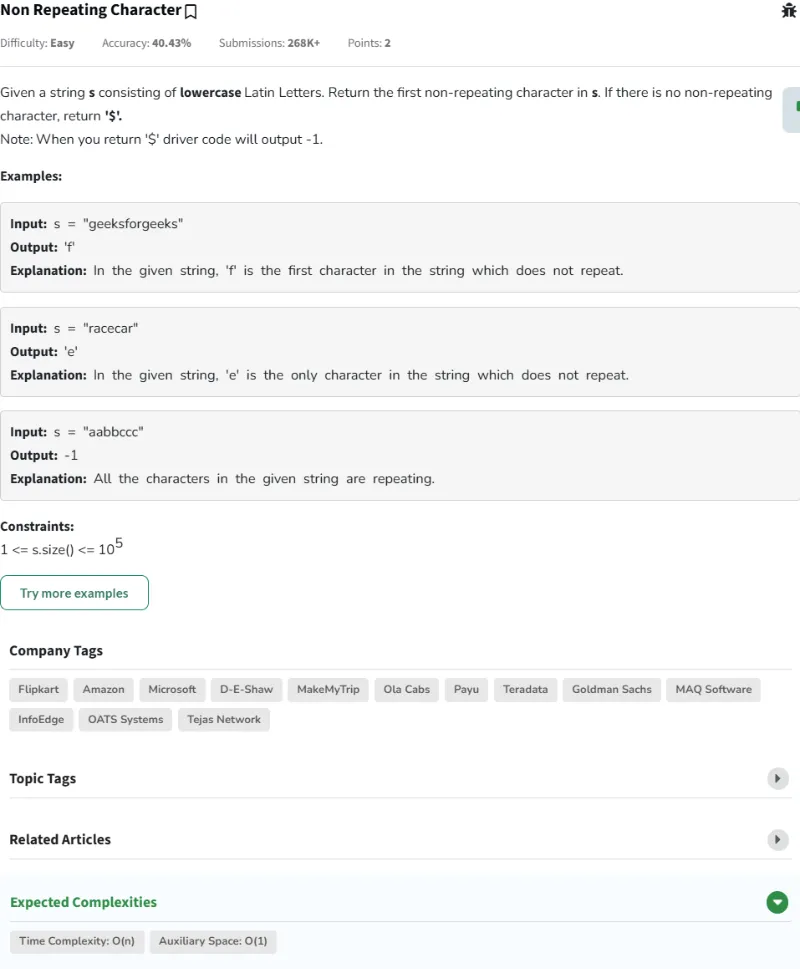

#### Passed

### Problema Día 48: Search Pattern (KMP-Algorithm)

#### Description

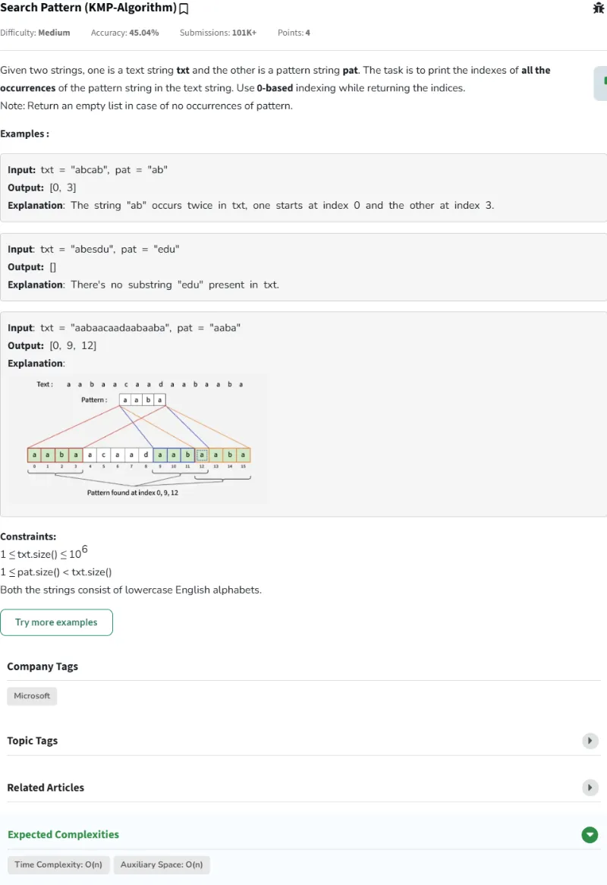

#### Passed

### Problema Día 49: Min Chars to Add for Palindrome

#### Description

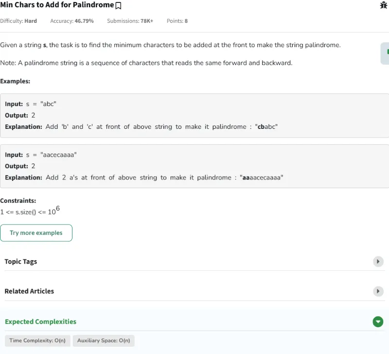

#### Passed

### Problema Día 50: Strings Rotations of Each Other

#### Description

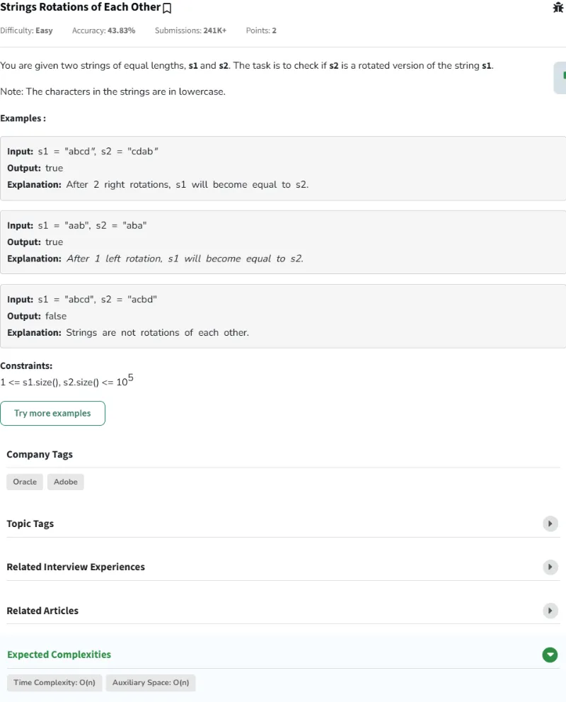

#### Passed

