# Resolución de los Problemas del día 61 al día 70

## Tabla de Contenidos

- [Resolución de los Problemas del día 61 al día 70](#resolución-de-los-problemas-del-día-61-al-día-70)
  - [Tabla de Contenidos](#tabla-de-contenidos)
  - [Problemas](#problemas)
    - [Problema Día 61: Peak element](#problema-día-61-peak-element)
      - [Description](#description)
      - [Passed](#passed)
    - [Problema Día 62: Kth element of two Arrays](#problema-día-62-kth-element-of-two-arrays)
      - [Description](#description-1)
      - [Passed](#passed-1)
    - [Problema Día 63: Aggressive Cows](#problema-día-63-aggressive-cows)
      - [Description](#description-2)
      - [Passed](#passed-2)
    - [Problema Día 64: Allocate Minimum Pages](#problema-día-64-allocate-minimum-pages)
      - [Description](#description-3)
      - [Passed](#passed-3)
    - [Problema Día 65: Kth Missing Positive Number in a Sorted Array](#problema-día-65-kth-missing-positive-number-in-a-sorted-array)
      - [Description](#description-4)
      - [Passed](#passed-4)
    - [Problema Día 66: Spirally traversing a matrix](#problema-día-66-spirally-traversing-a-matrix)
      - [Description](#description-5)
      - [Passed](#passed-5)
    - [Problema Día 67: Rotate by 90 degree](#problema-día-67-rotate-by-90-degree)
      - [Description](#description-6)
      - [Passed](#passed-6)
    - [Problema Día 68: Search in a Row-Column sorted matrix](#problema-día-68-search-in-a-row-column-sorted-matrix)
      - [Description](#description-7)
      - [Passed](#passed-7)
    - [Problema Día 69: Search in a row-wise sorted matrix](#problema-día-69-search-in-a-row-wise-sorted-matrix)
      - [Description](#description-8)
      - [Passed](#passed-8)
    - [Problema Día 70: Search in a sorted Matrix](#problema-día-70-search-in-a-sorted-matrix)
      - [Description](#description-9)
      - [Passed](#passed-9)

## Problemas

### Problema Día 61: Peak element

#### Description

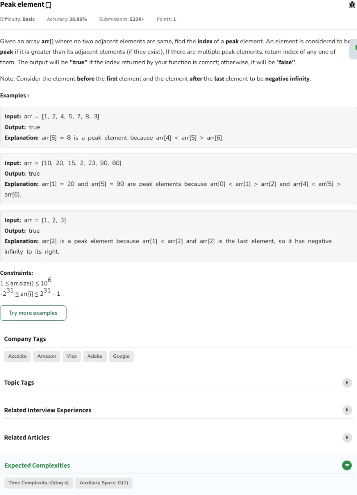

#### Passed

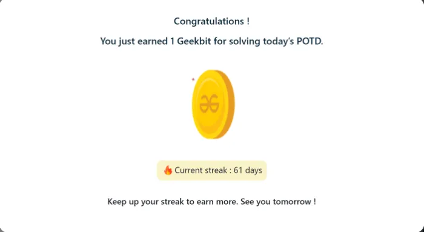

### Problema Día 62: Kth element of two Arrays

#### Description

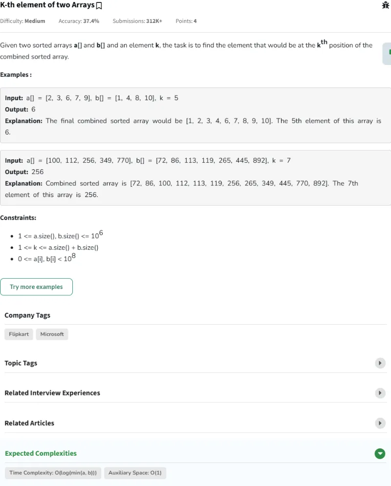

#### Passed

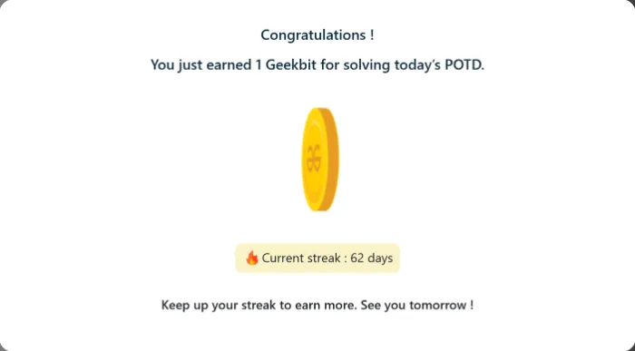

### Problema Día 63: Aggressive Cows

#### Description

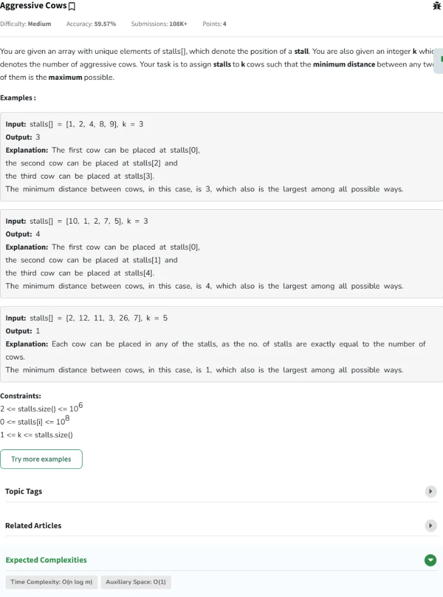

#### Passed

### Problema Día 64: Allocate Minimum Pages

#### Description

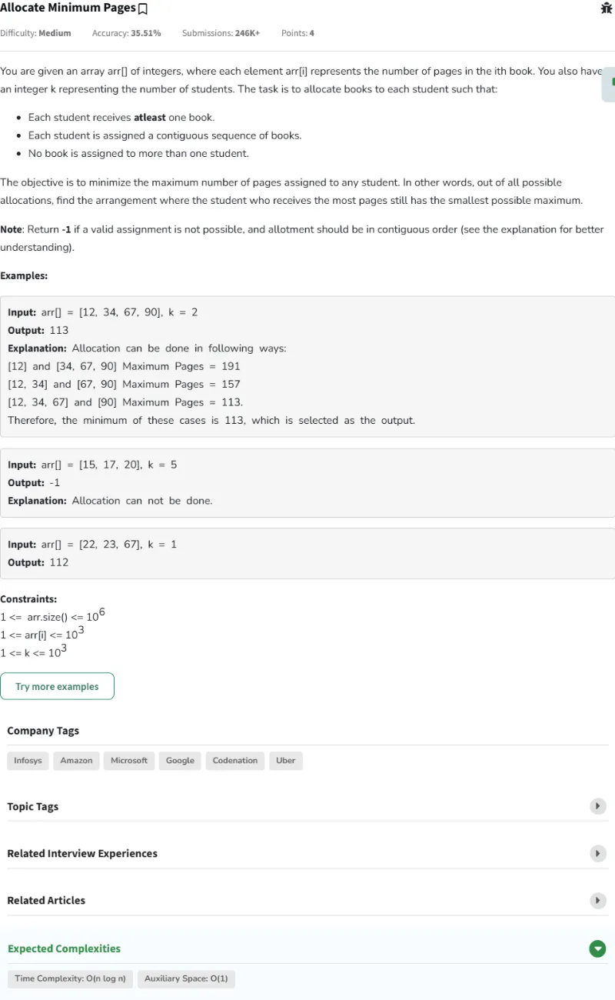

#### Passed

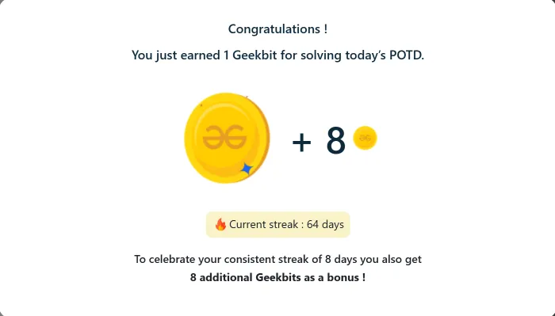

### Problema Día 65: Kth Missing Positive Number in a Sorted Array

#### Description

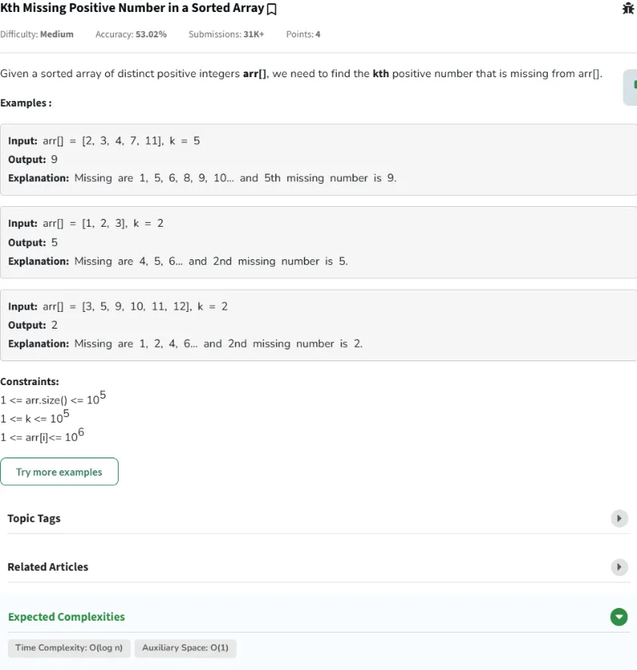

#### Passed

### Problema Día 66: Spirally traversing a matrix

#### Description

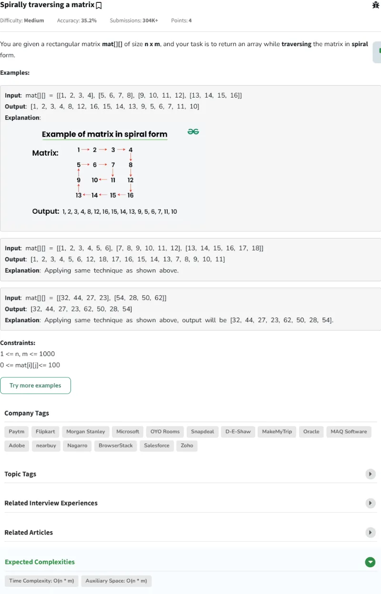

#### Passed

### Problema Día 67: Rotate by 90 degree

#### Description

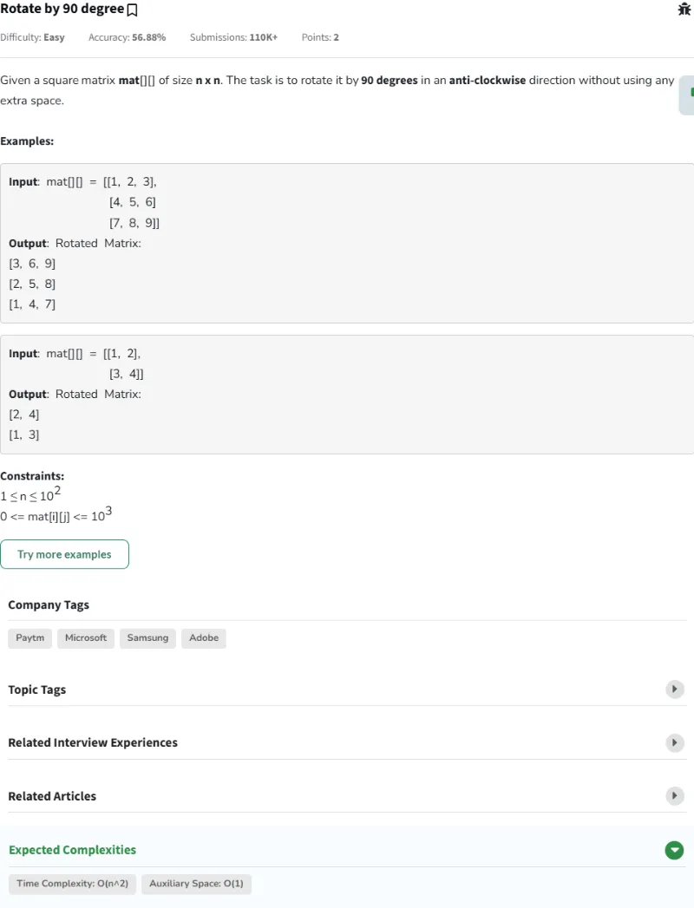

#### Passed

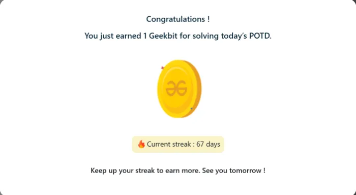

### Problema Día 68: Search in a Row-Column sorted matrix

#### Description

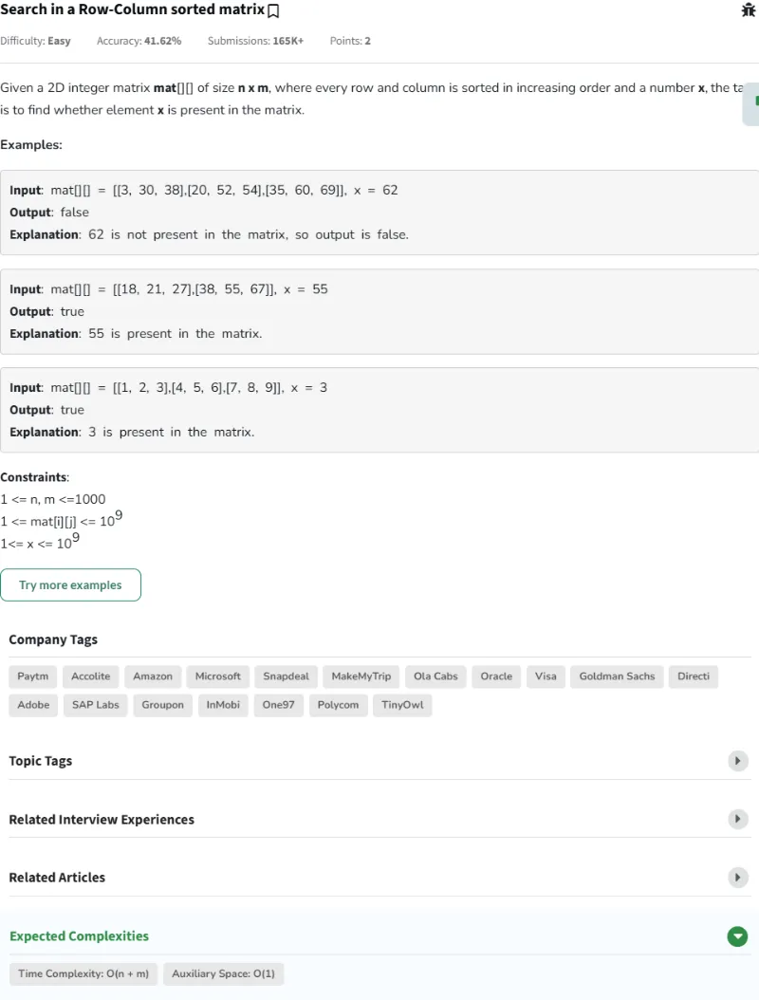

#### Passed

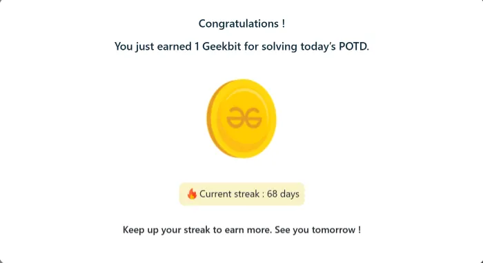

### Problema Día 69: Search in a row-wise sorted matrix

#### Description

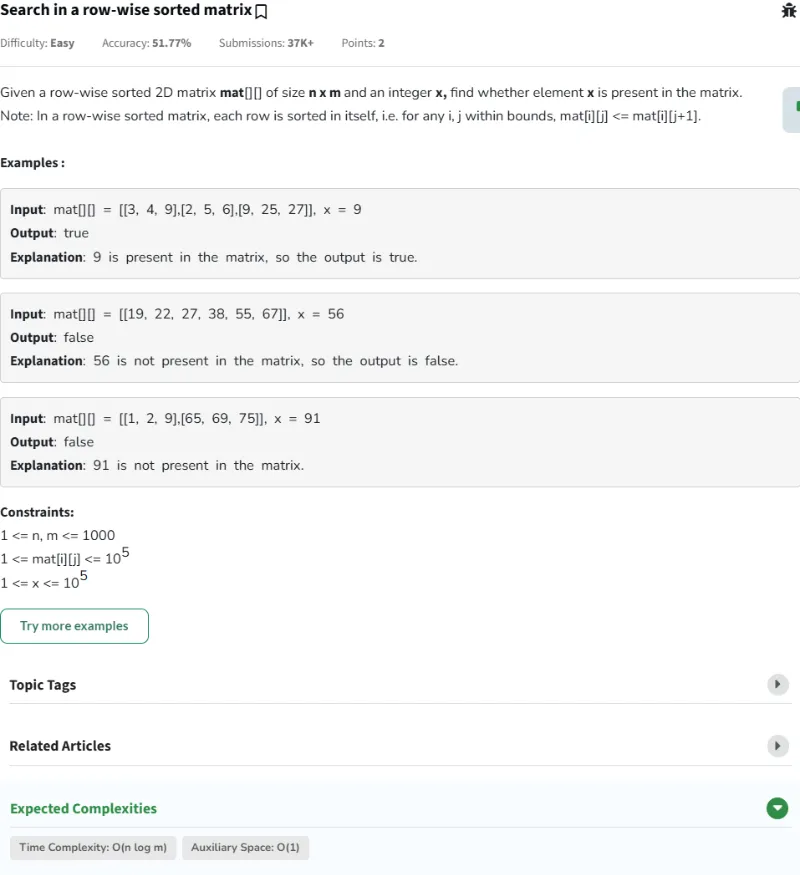

#### Passed

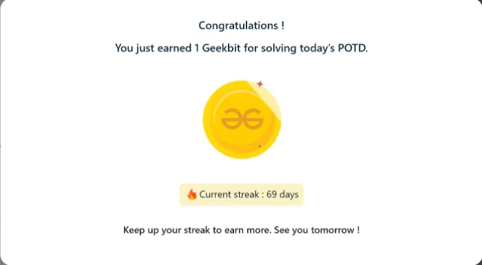

### Problema Día 70: Search in a sorted Matrix

#### Description

#### Passed

