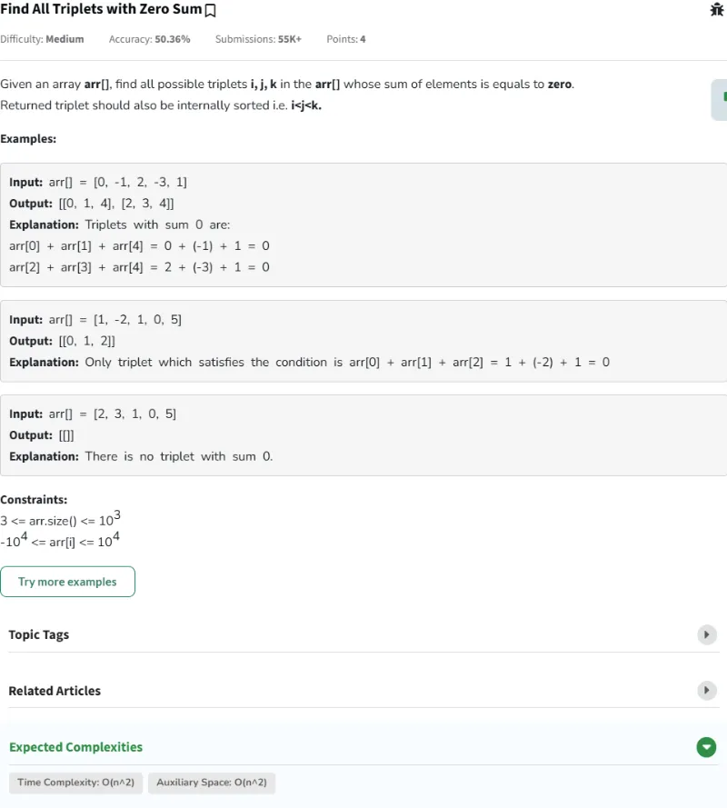

# Resolución de los Problemas del día 71 al día 80

## Tabla de Contenidos

- [Resolución de los Problemas del día 71 al día 80](#resolución-de-los-problemas-del-día-71-al-día-80)
  - [Tabla de Contenidos](#tabla-de-contenidos)
  - [Problemas](#problemas)
    - [Problema Día 71: Set Matrix Zeroes](#problema-día-71-set-matrix-zeroes)
      - [Description](#description)
      - [Passed](#passed)
    - [Problema Día 72: Two Sum - Pair with Given Sum](#problema-día-72-two-sum---pair-with-given-sum)
      - [Description](#description-1)
      - [Passed](#passed-1)
    - [Problema Día 73: Count pairs with given sum](#problema-día-73-count-pairs-with-given-sum)
      - [Description](#description-2)
      - [Passed](#passed-2)
    - [Problema Día 74: Find All Triplets with Zero Sum](#problema-día-74-find-all-triplets-with-zero-sum)
      - [Description](#description-3)
      - [Passed](#passed-3)
    - [Problema Día 75: Intersection of Two arrays with Duplicate Elements](#problema-día-75-intersection-of-two-arrays-with-duplicate-elements)
      - [Description](#description-4)
      - [Passed](#passed-4)
    - [Problema Día 76: Union of Arrays with Duplicates](#problema-día-76-union-of-arrays-with-duplicates)
      - [Description](#description-5)
      - [Passed](#passed-5)
    - [Problema Día 77: Longest Consecutive Subsequence](#problema-día-77-longest-consecutive-subsequence)
      - [Description](#description-6)
      - [Passed](#passed-6)
    - [Problema Día 78: Print Anagrams Together](#problema-día-78-print-anagrams-together)
      - [Description](#description-7)
      - [Passed](#passed-7)
    - [Problema Día 79: Subarrays with sum K](#problema-día-79-subarrays-with-sum-k)
      - [Description](#description-8)
      - [Passed](#passed-8)
    - [Problema Día 80: Count Subarrays with given XOR](#problema-día-80-count-subarrays-with-given-xor)
      - [Description](#description-9)
      - [Passed](#passed-9)

## Problemas

### Problema Día 71: Set Matrix Zeroes

#### Description

#### Passed

### Problema Día 72: Two Sum - Pair with Given Sum

#### Description

#### Passed

### Problema Día 73: Count pairs with given sum

#### Description

#### Passed

### Problema Día 74: Find All Triplets with Zero Sum

#### Description

#### Passed

### Problema Día 75: Intersection of Two arrays with Duplicate Elements

#### Description

#### Passed

### Problema Día 76: Union of Arrays with Duplicates

#### Description

#### Passed

### Problema Día 77: Longest Consecutive Subsequence

#### Description

#### Passed

### Problema Día 78: Print Anagrams Together

#### Description

#### Passed

### Problema Día 79: Subarrays with sum K

#### Description

#### Passed

### Problema Día 80: Count Subarrays with given XOR

#### Description

#### Passed

