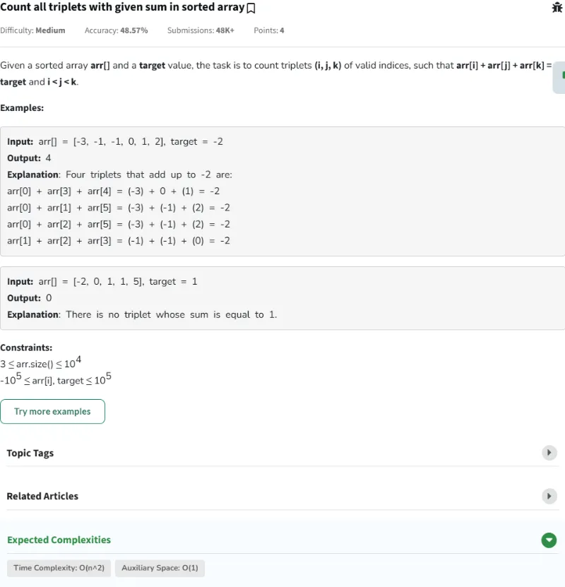
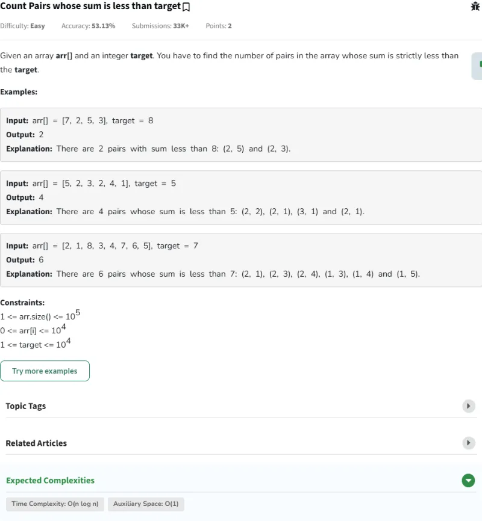
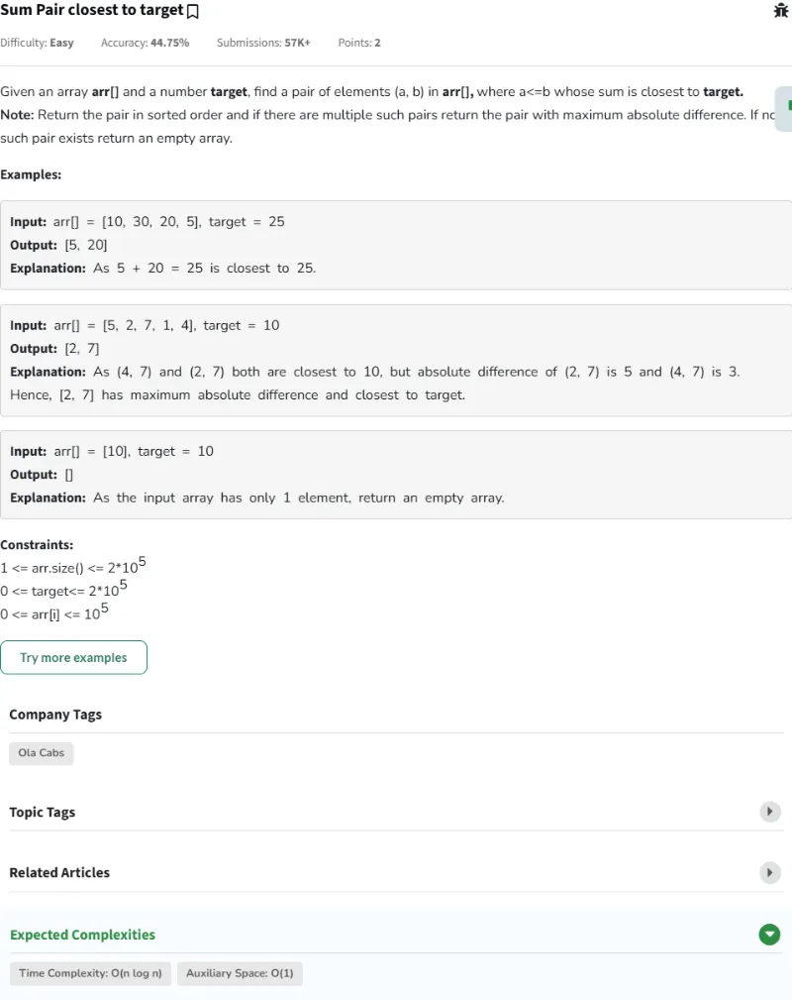
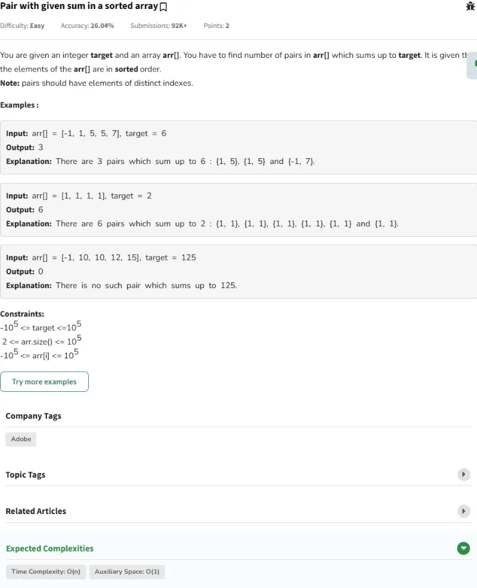
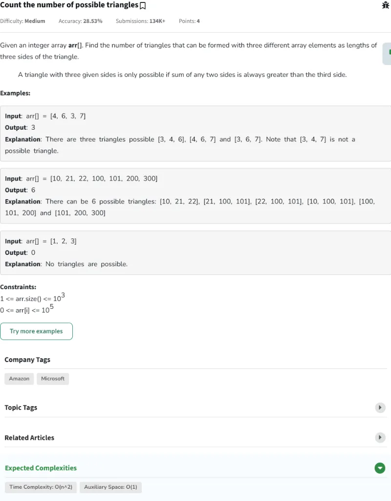
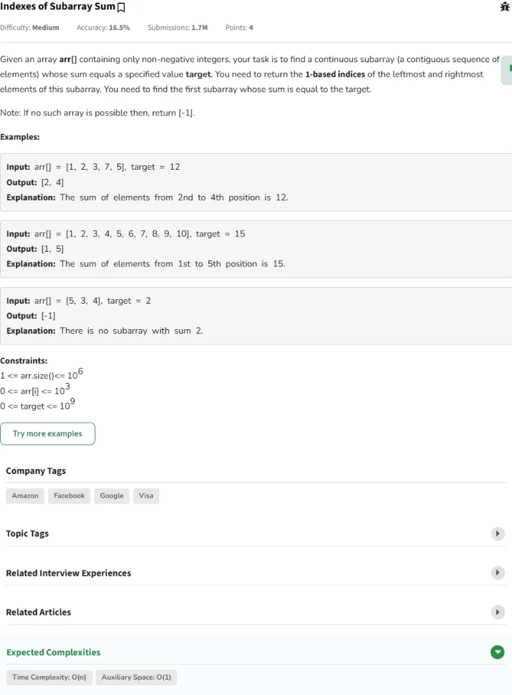
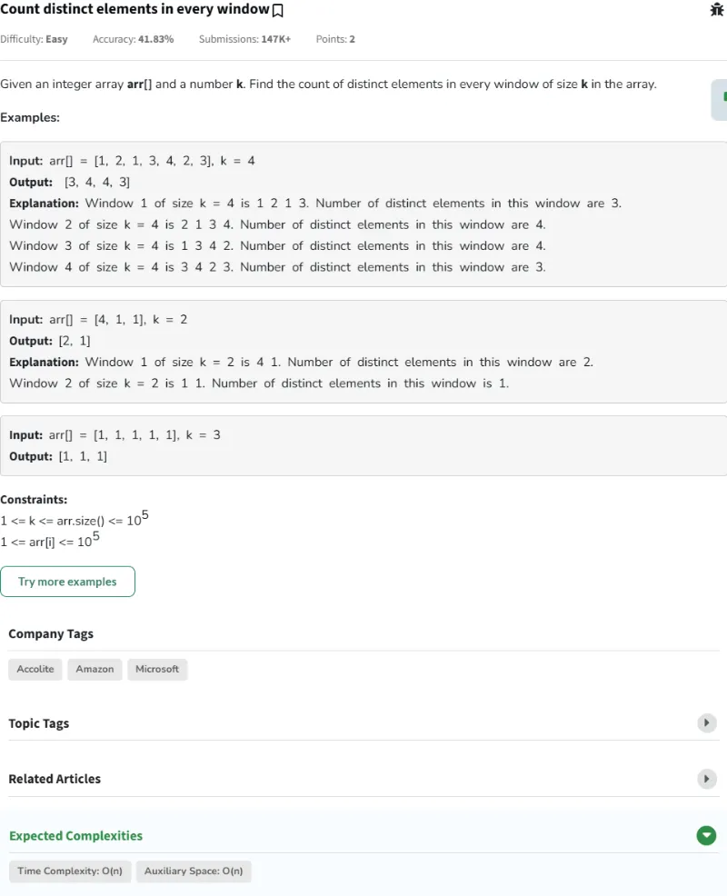
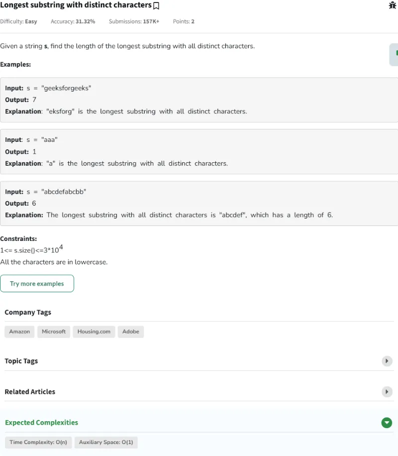
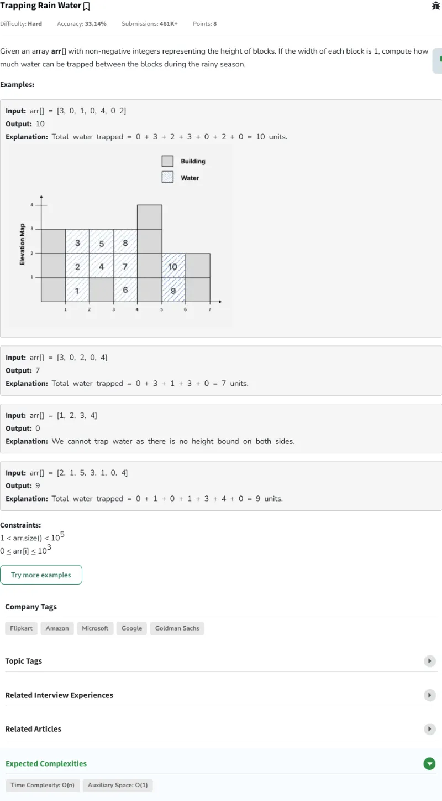
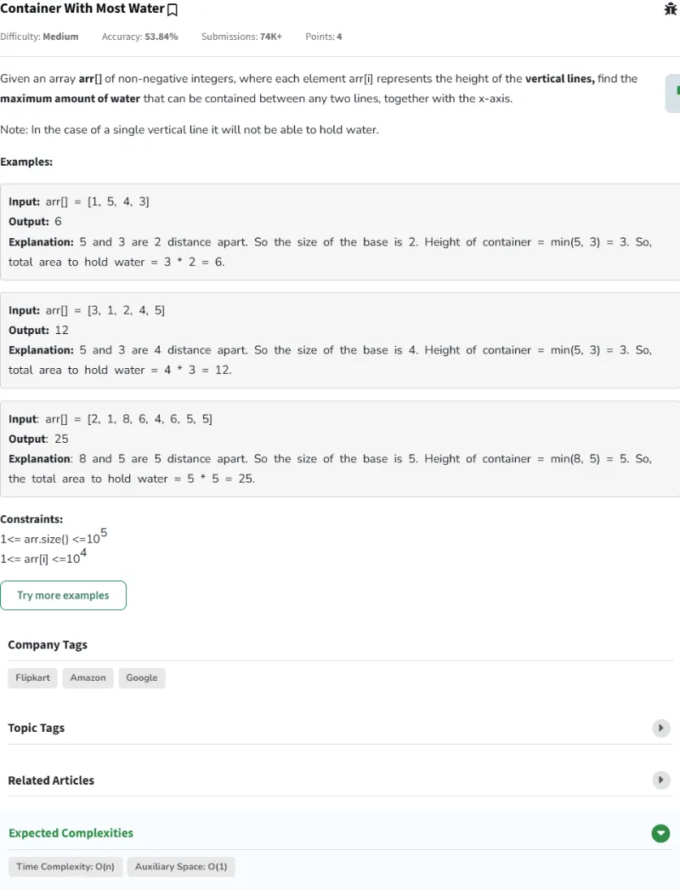

# Resolución de los Problemas del día 81 al día 90

## Tabla de Contenidos

- [Resolución de los Problemas del día 81 al día 90](#resolución-de-los-problemas-del-día-81-al-día-90)
  - [Tabla de Contenidos](#tabla-de-contenidos)
  - [Problemas](#problemas)
    - [Problema Día 81: Count all triplets with given sum in sorted array](#problema-día-81-count-all-triplets-with-given-sum-in-sorted-array)
      - [Description](#description)
      - [Passed](#passed)
    - [Problema Día 82: Count Pairs whose sum is less than target](#problema-día-82-count-pairs-whose-sum-is-less-than-target)
      - [Description](#description-1)
      - [Passed](#passed-1)
    - [Problema Día 83: Sum Pair closest to target](#problema-día-83-sum-pair-closest-to-target)
      - [Description](#description-2)
      - [Passed](#passed-2)
    - [Problema Día 84: Pair with given sum in a sorted array](#problema-día-84-pair-with-given-sum-in-a-sorted-array)
      - [Description](#description-3)
      - [Passed](#passed-3)
    - [Problema Día 85: Count the number of possible triangles](#problema-día-85-count-the-number-of-possible-triangles)
      - [Description](#description-4)
      - [Passed](#passed-4)
    - [Problema Día 86: Indexes of Subarray Sum](#problema-día-86-indexes-of-subarray-sum)
      - [Description](#description-5)
      - [Passed](#passed-5)
    - [Problema Día 87: Count distinct elements in every window](#problema-día-87-count-distinct-elements-in-every-window)
      - [Description](#description-6)
      - [Passed](#passed-6)
    - [Problema Día 88: Longest substring with distinct characters](#problema-día-88-longest-substring-with-distinct-characters)
      - [Description](#description-7)
      - [Passed](#passed-7)
    - [Problema Día 89: Trapping Rain Water](#problema-día-89-trapping-rain-water)
      - [Description](#description-8)
      - [Passed](#passed-8)
    - [Problema Día 90: Container With Most Water](#problema-día-90-container-with-most-water)
      - [Description](#description-9)
      - [Passed](#passed-9)

## Problemas

### Problema Día 81: Count all triplets with given sum in sorted array

#### Description

#### Passed

### Problema Día 82: Count Pairs whose sum is less than target

#### Description

#### Passed

### Problema Día 83: Sum Pair closest to target

#### Description

#### Passed

### Problema Día 84: Pair with given sum in a sorted array

#### Description

#### Passed

### Problema Día 85: Count the number of possible triangles

#### Description

#### Passed

### Problema Día 86: Indexes of Subarray Sum

#### Description

#### Passed

### Problema Día 87: Count distinct elements in every window

#### Description

#### Passed

### Problema Día 88: Longest substring with distinct characters

#### Description

#### Passed

### Problema Día 89: Trapping Rain Water

#### Description

#### Passed

### Problema Día 90: Container With Most Water

#### Description

#### Passed

