# Resolución de los Problemas del día 91 al día 100

## Tabla de Contenidos

- [Resolución de los Problemas del día 91 al día 100](#resolución-de-los-problemas-del-día-91-al-día-100)
  - [Tabla de Contenidos](#tabla-de-contenidos)
  - [Problemas](#problemas)
    - [Problema Día 91: Equilibrium Point](#problema-día-91-equilibrium-point)
      - [Description](#description)
      - [Passed](#passed)
    - [Problema Día 92: Longest Subarray with Sum K](#problema-día-92-longest-subarray-with-sum-k)
      - [Description](#description-1)
      - [Passed](#passed-1)
    - [Problema Día 93: Largest subarray of 0's and 1's](#problema-día-93-largest-subarray-of-0s-and-1s)
      - [Description](#description-2)
      - [Passed](#passed-2)
    - [Problema Día 94: Product array puzzle](#problema-día-94-product-array-puzzle)
      - [Description](#description-3)
      - [Passed](#passed-3)
    - [Problema Día 95: Reverse a linked list](#problema-día-95-reverse-a-linked-list)
      - [Description](#description-4)
      - [Passed](#passed-4)
    - [Problema Día 96: Rotate a Linked List](#problema-día-96-rotate-a-linked-list)
      - [Description](#description-5)
      - [Passed](#passed-5)
    - [Problema Día 97: Merge two sorted linked lists](#problema-día-97-merge-two-sorted-linked-lists)
      - [Description](#description-6)
      - [Passed](#passed-6)
    - [Problema Día 98: Linked List Group Reverse](#problema-día-98-linked-list-group-reverse)
      - [Description](#description-7)
      - [Passed](#passed-7)
    - [Problema Día 99: Add Number Linked Lists](#problema-día-99-add-number-linked-lists)
      - [Description](#description-8)
      - [Passed](#passed-8)
    - [Problema Día 100: Clone List with Next and Random](#problema-día-100-clone-list-with-next-and-random)
      - [Description](#description-9)
      - [Passed](#passed-9)

## Problemas

### Problema Día 91: Equilibrium Point

#### Description

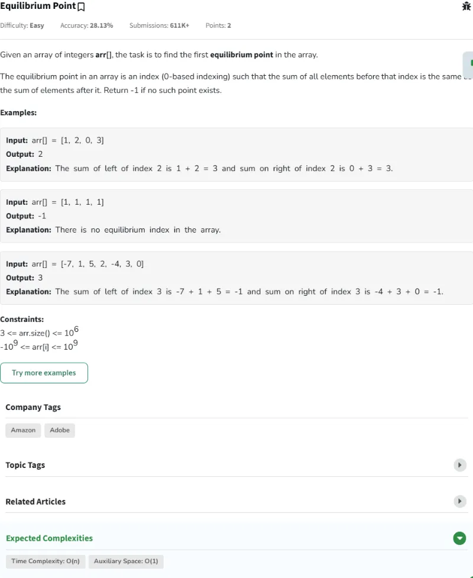

#### Passed

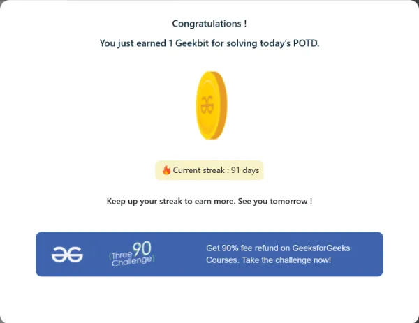

### Problema Día 92: Longest Subarray with Sum K

#### Description

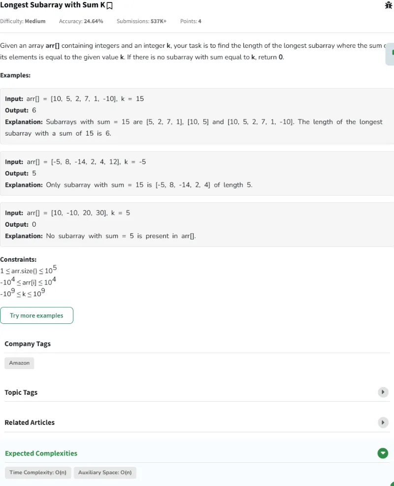

#### Passed

### Problema Día 93: Largest subarray of 0's and 1's

#### Description

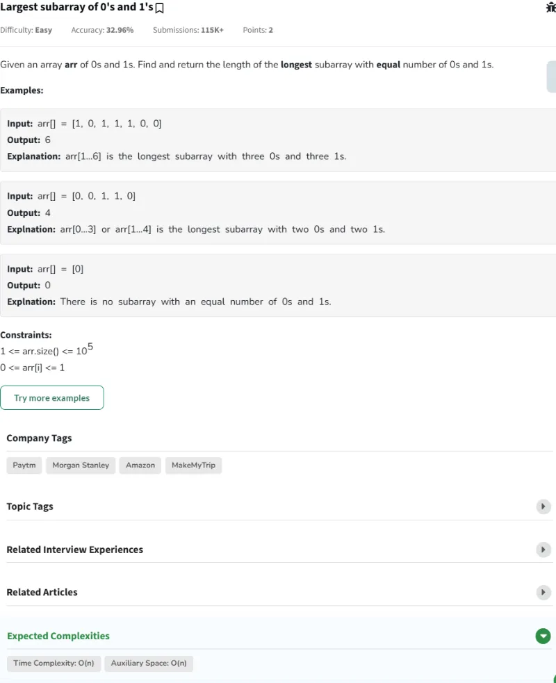

#### Passed

### Problema Día 94: Product array puzzle

#### Description

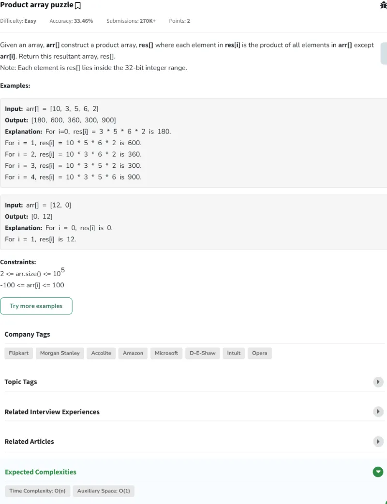

#### Passed

### Problema Día 95: Reverse a linked list

#### Description

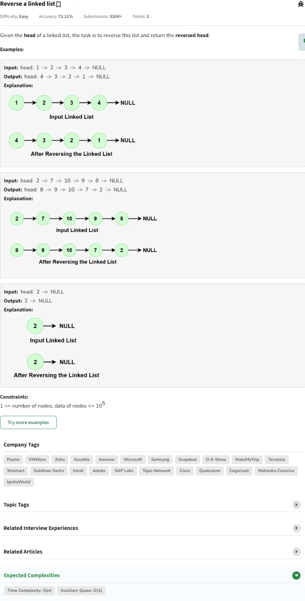

#### Passed

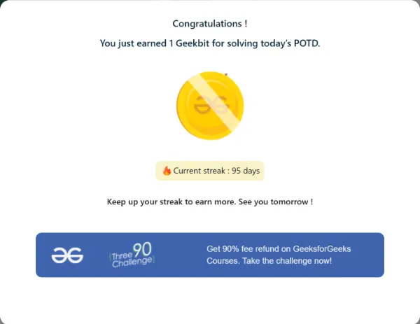

### Problema Día 96: Rotate a Linked List

#### Description

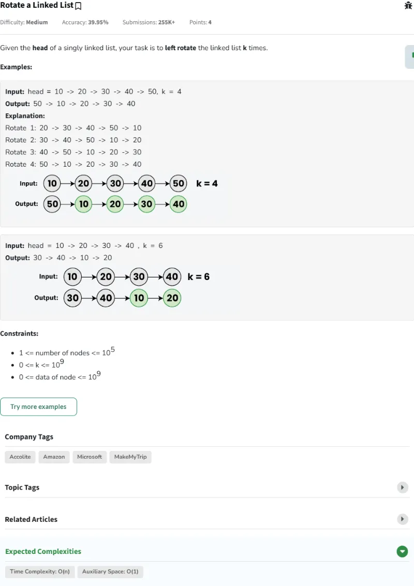

#### Passed

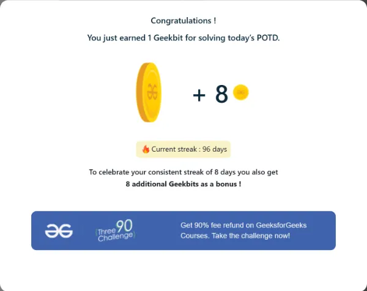

### Problema Día 97: Merge two sorted linked lists

#### Description

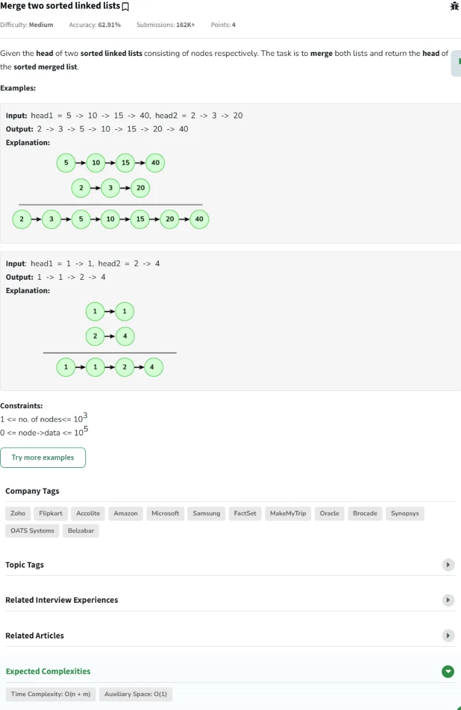

#### Passed

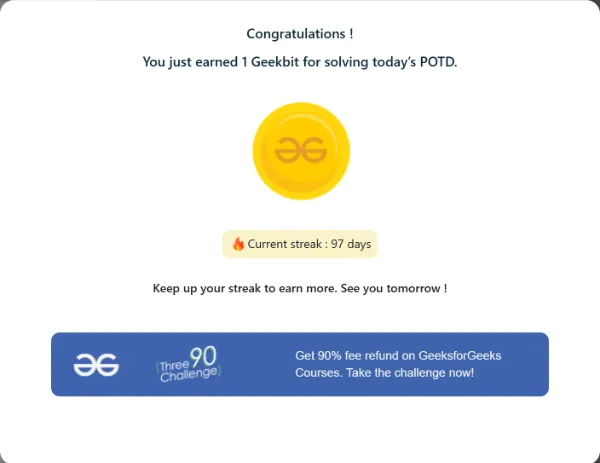

### Problema Día 98: Linked List Group Reverse

#### Description

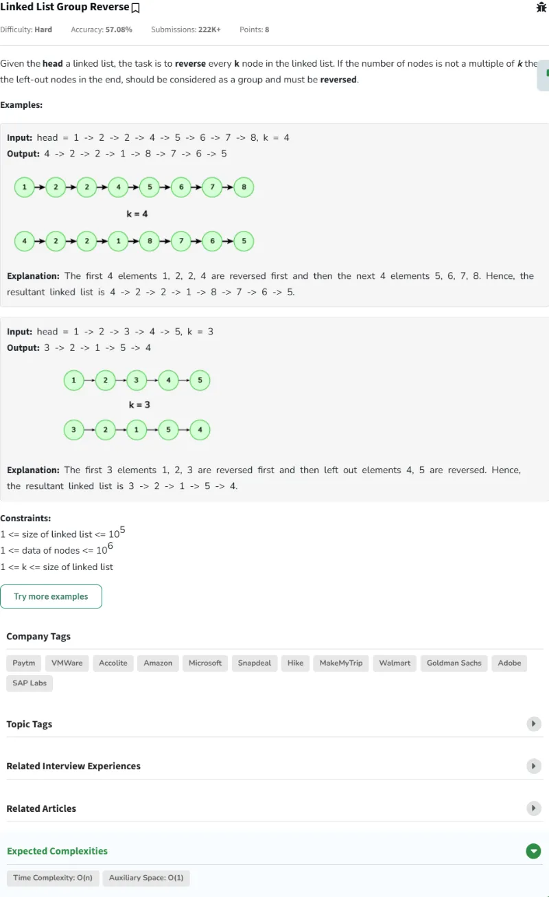

#### Passed

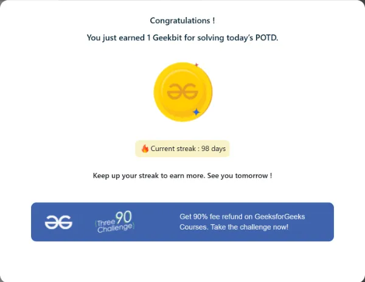

### Problema Día 99: Add Number Linked Lists

#### Description

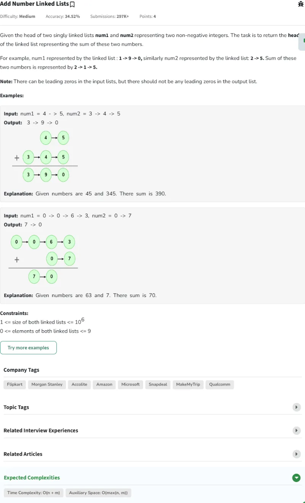

#### Passed

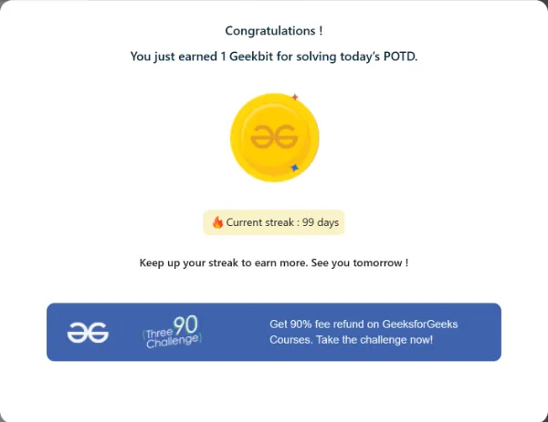

### Problema Día 100: Clone List with Next and Random

#### Description

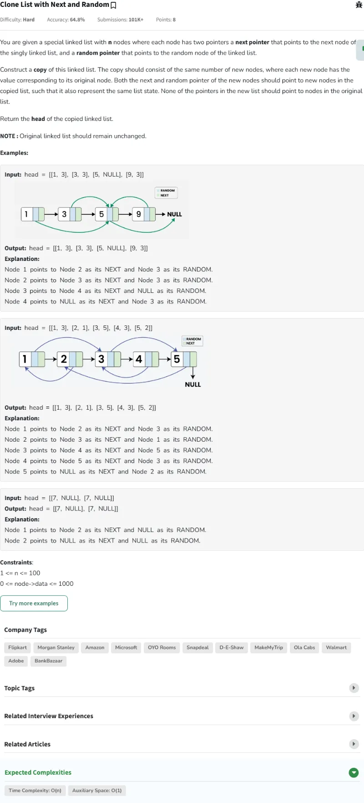

#### Passed

